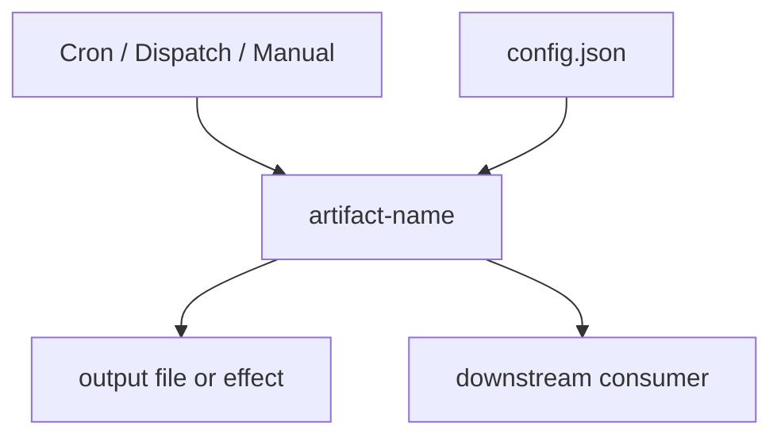

# Concern Audit Methodology

> Repeatable methodology for auditing, classifying, and governing any repo concern.
> Generalised from the GitHub Actions audit brief. Applicable to: actions, scripts, components, data files, skills, automations, pages, templates — any category of repo artifact.
> **Recommendation:** This should become a registered skill (`/audit-concern`) once validated against 2+ real audits.

---

## When to use

- Auditing a category of repo artifact that has grown organically and needs governance
- Consolidating overlapping/duplicate artifacts within a concern
- Designing a framework for a concern that doesn't have one yet
- Aligning a concern to existing repo standards (script types, component categories)
- Building a self-documenting catalog for a concern

## When NOT to use

- Single-file fixes (just fix it)
- Already-governed concerns with working frameworks (iterate on those instead)
- Quick lookups (use Grep/Glob)

---

## Inputs (fill before running)

```
CONCERN:              [github-actions | scripts | components | data-files | skills | automations | pages | templates | other]
CONCERN_LABEL:        [human-readable name, e.g. "GitHub Actions"]
REPO_LOCATION:        [primary folder, e.g. ".github/workflows/"]
RELATED_LOCATIONS:    [folders that feed or consume this concern, e.g. ".github/scripts/", "operations/scripts/dispatch/"]
WORKSPACE:            [working folder for outputs, e.g. ".github/workspace/"]
EXISTING_FRAMEWORK:   [path to any existing governance framework, or "none"]
ALIGNED_FRAMEWORK:    [framework to align to, e.g. "script-framework.md types + concerns", or "design from scratch"]
OUTPUT_FORMAT:        [mdx catalog pages | markdown reports | both]
```

---

## Phase 1: External Research — Best Practice

**Goal:** Understand what good looks like outside this repo.

**Method:** Web search + synthesis. NOT a link dump.

**Deliverable:** `{workspace}/research/01-best-practice.md`

**Content:**
1. Industry best practices for this concern type (3-5 authoritative sources)
2. Documentation best practices for this concern type (how to document it)
3. Governance patterns (how mature projects organise and enforce standards for this concern)
4. Anti-patterns (what to avoid — from real-world failures)
5. Recommendations for this repo (synthesised, not just listed)

**Gate:** Present findings. Human confirms direction before internal research.

---

## Phase 2: Internal Research — Repo State

**Goal:** Understand the current state, existing standards, and gaps.

**Method:** Repo scan + cross-reference with frameworks.

**Deliverable:** `{workspace}/research/02-repo-state.md`

**Content:**
1. **Inventory** — count and list all artifacts in this concern (paths, names, last modified)
2. **Existing standards** — what governance/framework exists? Is it enforced? What does it miss?
3. **Alignment check** — how does current state compare to the aligned framework? What's compliant, what's not?
4. **Dependency map** — what does each artifact depend on? What depends on it?
5. **Gaps and risks** — stale artifacts, unmaintained items, missing documentation, fragile dependencies
6. **Consolidation candidates** — overlapping artifacts that could be merged
7. **Gold standard** — which artifacts are already good? (feed into `.claude/references/`)

**Gate:** Present findings. Human confirms scope of audit.

---

## Phase 3: Audit — Classify, Trace, Map

**Goal:** Systematic classification and dependency tracing of every artifact.

**Method:** Agent-delegated batch audit. One agent per batch of artifacts.

**Deliverable:** `{workspace}/audit/03-audit-report.md` + per-artifact data

### 3a. Classification

For each artifact, determine:

| Field | Values | Source |
|---|---|---|
| **name** | artifact identifier | filename |
| **type** | aligned to framework types (e.g., audit/generator/validator/remediator/dispatch/automation) | classification test from framework |
| **concern** | aligned to framework concerns (e.g., content/components/governance/ai) | content analysis |
| **status** | active / stale / legacy / deprecated / broken | last modified + usage analysis |
| **consolidation** | standalone / consolidate-with-[name] / replace-with-[name] | overlap analysis |
| **risk** | low / medium / high + reason | dependency + maintenance analysis |

### 3b. Dependency Tracing

For each artifact, trace:
- **Triggers** — what causes it to run (cron, dispatch, manual, hook, other artifact)
- **Inputs** — what it reads (config files, data files, env vars, other artifacts)
- **Outputs** — what it produces (files, reports, side effects)
- **Dependants** — what breaks if this artifact changes or disappears
- **Fragile dependencies** — single points of failure, undocumented assumptions

### 3c. Pipeline Mapping

For each artifact (or group), produce a mermaid diagram:


**Gate:** Present audit report. Human confirms classifications and consolidation candidates.

---

## Phase 4: Template Design — Per-Artifact Documentation

**Goal:** Design a standard documentation page for each artifact in this concern.

**Method:** Co-design with human. Template must be MDX-compatible.

**Deliverable:** `{workspace}/templates/artifact-template.mdx`

### Template structure (adapt per concern):

```mdx
---
title: '{artifact-name}'
sidebarTitle: '{short-name}'
description: '{one-line description}'
pageType: reference
purpose: reference
audience: internal
concern: '{concern from classification}'
type: '{type from classification}'
status: '{status from classification}'
lastVerified: '{date}'
---

## Purpose
{one paragraph: what this artifact does and why it exists}

## Pipeline
{mermaid diagram from Phase 3c}

## Configuration
{inputs, env vars, flags}

## Triggers
{what causes it to run}

## Dependencies
{what it depends on, what depends on it}

## Status & Governance
| Field | Value |
|---|---|
| Type | {type} |
| Concern | {concern} |
| Status | {status} |
| Consolidation | {standalone / consolidate recommendation} |
| Risk | {risk level + reason} |
| Framework | {link to governing framework} |

## Related
{links to related artifacts, framework docs, etc.}
```

**Gate:** Template approved before generating pages.

---

## Phase 5: Framework Design — Governance Canonical

**Goal:** Design or extend the governance framework for this concern.

**Method:** Co-design with human. Build on existing framework patterns (script-framework.md, component-framework-canonical.md).

**Deliverable:** `{workspace}/framework/framework-canonical.md`

### Framework structure (adapt per concern):

1. **Overview** — what this concern covers, how it fits in the repo
2. **Taxonomy** — classification model (types × concerns × niches, or equivalent)
3. **Classification tests** — "If X, then type Y" — positive and negative
4. **Required metadata** — JSDoc tags, frontmatter fields, or equivalent
5. **Folder structure** — where artifacts live, naming conventions
6. **Enforcement tiers** — hard gate (blocks commit) / soft gate (warns in PR) / self-heal (cron auto-fix)
7. **Lifecycle** — how artifacts are created, modified, deprecated, archived
8. **Documentation requirements** — what self-documentation each artifact must have
9. **Consolidation rules** — when to merge, when to keep separate
10. **Error handling** — self-remediation patterns, issue creation, alerting

**Gate:** Framework approved before restructuring.

---

## Phase 6: Build — Generate Catalog + Restructure

**Goal:** Generate per-artifact documentation pages, catalog index, and restructure folders.

**Method:** Agent-delegated batch generation.

**Deliverables:**
- `{workspace}/catalog/` — per-artifact MDX pages from template
- `{workspace}/catalog/index.mdx` — searchable catalog index (SearchTable)
- Framework canonical document (final)
- Restructured folder (if approved)

### Catalog index pattern:
```jsx
import { SearchTable } from '/snippets/components/wrappers/tables/SearchTable.jsx'
import catalogData from './catalog-data.json'

<SearchTable
  headerList={['Name', 'Type', 'Concern', 'Status', 'Risk', 'Consolidation']}
  itemsList={catalogData}
  searchColumns={['Name', 'Type', 'Concern']}
  categoryColumn="Type"
  filterColumns={['Concern', 'Status']}
/>
```

**Gate:** Review catalog. Approve restructure plan before moving files.

---

## Phase 7: Reference + Governance Integration

**Goal:** Feed results back into the knowledge system.

**Deliverables:**
- Add gold standard exemplar(s) to `.claude/references/{concern}/exemplars.md`
- Add best-practice collation to `.claude/references/{concern}/best-practice.md`
- Add extracted patterns to `.claude/references/{concern}/patterns.md`
- Add self-documenting pipeline to framework canonical
- Update governance index (`docs-guide/policies/governance-index.mdx`)

---

## Phase summary

| Phase | Output | Gate |
|---|---|---|
| 1. External research | `01-best-practice.md` | Human confirms direction |
| 2. Internal research | `02-repo-state.md` | Human confirms scope |
| 3. Audit | `03-audit-report.md` + per-artifact data | Human confirms classifications |
| 4. Template design | `artifact-template.mdx` | Human approves template |
| 5. Framework design | `framework-canonical.md` | Human approves framework |
| 6. Build | Catalog + index + restructure | Human approves restructure |
| 7. Reference integration | `.claude/references/` updates | Done |

---

## Composability with existing skills

This methodology chains existing skills:
- **Phase 1-2:** `/research` (agent-delegated investigation)
- **Phase 3:** `/dispatch` (batch audit agents) + custom audit logic
- **Phase 4-5:** `/design` (first-principles co-creation)
- **Phase 6:** `/build` (agent-delegated execution)
- **Phase 7:** Manual integration

When promoted to a skill, `/audit-concern` would orchestrate this chain with the inputs block as parameters.

---

## Validation

**Validated against:** GitHub Actions Governance thread (2026-03-30). Phases 1-3 completed, producing `actions-best-practices-report.md`, `actions-repo-analysis-report.md`, and `actions-audit.json`. See `research/exemplars.md` for analysis of the repo report as an exemplar.
