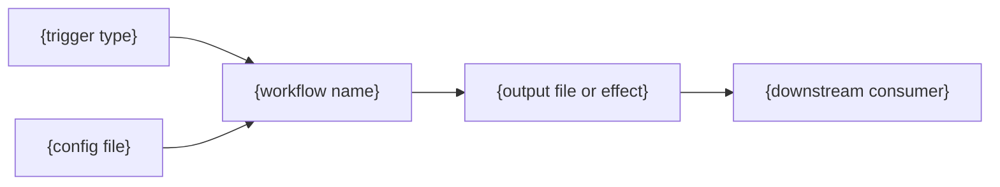

{/*
================================================================================
ACTION DOCUMENTATION TEMPLATE
================================================================================
Governance: .github/workspace/framework-canonical.md
Catalog:    .github/workspace/actions-library/catalog-index.mdx
Data:       .github/workspace/actions-audit.json
================================================================================

USAGE:
- One file per workflow, named to match the workflow filename (kebab-case .mdx)
- Populate from actions-audit.json data + workflow file inspection
- Pipeline diagram generated from dependency-map.md or traced manually
- Status values: active | stale | legacy | placeholder | broken
- Consolidation values: none | merge-with-[name] | deprecate-candidate | extract-script
================================================================================
*/}

---
title: '{Action Name}'
sidebarTitle: '{Short Name}'
description: '{One-line: what this action does and why}'
pageType: reference
purpose: reference
audience: internal
status: '{active | stale | legacy | placeholder | broken}'
lastVerified: '{YYYY-MM-DD}'
keywords:
  - livepeer
  - github-actions
  - '{type}'
  - '{concern}'
---

import { CustomDivider } from '/snippets/components/elements/spacing/Divider.jsx'

{/* Classification */}

| Field | Value |
|---|---|
| **File** | `.github/workflows/{filename}.yml` |
| **Type** | `{automation | generator | validator | audit | remediator | dispatch}` |
| **Concern** | `{content | components | governance | ai}` |
| **Niche** | `{specific sub-concern}` |
| **Pipeline** | `{P2 | P3 | P4 | P5 | P5-auto | P6 | manual | event-driven}` |
| **Enforcement** | `{hard-gate | soft-gate | self-heal | none}` |
| **Status** | <Badge color="{green | yellow | red}">{status}</Badge> |

<CustomDivider />

{/* Purpose */}

## Purpose

{One paragraph: what this workflow does, why it exists, what breaks if it stops running.}

<CustomDivider />

{/* Pipeline */}

## Pipeline

<CustomDivider />

{/* Triggers */}

## Triggers

| Trigger | Details |
|---|---|
| {trigger type} | {schedule / event filter / branch / path filter} |

<CustomDivider />

{/* Configuration */}

## Configuration

| Input | Type | Default | Description |
|---|---|---|---|
| {input name} | {type} | {default} | {what it controls} |

**Environment variables:** {list or "None"}

**Secrets:** {list or "None"}

<CustomDivider />

{/* Dependencies */}

## Dependencies

**Upstream (requires):**
- {config files, scripts, env vars, other workflows}

**Downstream (consumed by):**
- {pages, components, other workflows, validators}

**Scripts:**
- `{.github/scripts/script-name.js}` : {what it does}

<CustomDivider />

{/* Issues */}

## Known Issues

{Bulleted list of bugs from audit, or "None identified."}

{/* Governance Notes */}

## Governance Notes

| Field | Value |
|---|---|
| **Consolidation** | `{none | merge-with-[name] | deprecate-candidate | extract-script}` |
| **Dry-run** | {Yes / No} |
| **Concurrency** | {Yes / No} |
| **Error reporting** | {summary | issue-creation | artifact | none} |
| **Auto-commit** | {Yes / No} |
