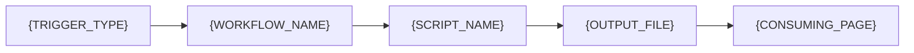

{/*
================================================================================
ACTION DOCUMENTATION TEMPLATE
================================================================================
Governance:  .github/workspace/framework-canonical.md
Decisions:   .github/workspace/reports-audits/decisions-log.mdx
Catalog:     .github/workspace/actions-library/catalog-index.mdx
Data:        .github/workspace/actions-audit.json
Gold std:    .github/workspace/actions-library/integrations/update-contract-addresses.mdx
================================================================================

USAGE:
- One file per workflow
- Place in concern subfolder: integrations/, copy/, maintenance/, health/,
  discoverability/, governance/
- File named to match workflow (kebab-case .mdx)
- Populate from actions-audit.json + workflow file inspection
- Pipeline diagram: trace triggers, scripts, data files, consuming pages
- Remove sections that do not apply (e.g. Inputs if none, Secrets if none)

NAMING (D-ACT-04):
  type-concern-function-name.yml
  Types:    automation, audit, dispatch, generator, remediator, validator, interface
  Concerns: integrations, copy, maintenance, health, discoverability, governance
  Verbs:    update, generate, check, scan, repair, dispatch, label, index,
            intake, close, assign
================================================================================
*/}

---
title: '{ACTION_NAME}'
sidebarTitle: '{SHORT_NAME}'
description: '{One line: what this action does and why it exists.}'
pageType: reference
purpose: reference
audience: internal
status: '{active | stale | placeholder | broken}'
lastVerified: '{YYYY-MM-DD}'
keywords:
  - livepeer
  - github-actions
  - '{TYPE}'
  - '{CONCERN}'
  - '{NAME_SLUG}'
---

import { CustomDivider } from '/snippets/components/elements/spacing/Divider.jsx'

## Classification

| Field | Value |
|---|---|
| **Current file** | `.github/workflows/CURRENT_FILENAME.yml` |
| **New name** | `TYPE-CONCERN-VERB-NAME.yml` |
| **Type** | `TYPE` |
| **Concern** | `CONCERN` |
| **Pipeline tag** | `PIPELINE_TAG` |
| **Enforcement** | Hard gate / Soft gate / Self-managing / Advisory / Manual / Event-driven |
| **Status** | Active / Stale / Placeholder / Broken |

<CustomDivider />

## Purpose

{/* REPLACE: What this workflow does, where it gets its data, what it produces,
and what breaks if it stops running. Two paragraphs max. Reference the script
JSDoc @description if one exists. */}

<CustomDivider />

## Pipeline

{/* REPLACE: Mermaid diagram showing triggers on the left, workflow in the
middle, scripts/APIs it calls, data files it produces, and pages/systems that
consume those files on the right. Use ELK layout for complex diagrams. Colour
data files blue (#1565c0), report-only outputs orange (#f57f17), flagged items
red (#d32f2f). Add a Note for any consuming page not in docs.json navigation. */}

<CustomDivider />

## Triggers

{/* INSTRUCTIONS: Remove trigger rows that do not apply. Most workflows have 1-3 triggers. */}

| Trigger | Details |
|---|---|
| `TRIGGER_TYPE` | CRON_EXPRESSION / EVENT_TYPES / BRANCH_FILTER |

<CustomDivider />

## Inputs

{/* INSTRUCTIONS: Include this section only if the workflow has workflow_dispatch
inputs. Remove the entire section if there are no configurable inputs. */}

| Input | Type | Default | Description |
|---|---|---|---|
| `INPUT_NAME` | boolean / string / choice | `DEFAULT` | DESCRIPTION |

<CustomDivider />

## Secrets and Permissions

{/* INSTRUCTIONS: Include this section only if the workflow uses secrets beyond
GITHUB_TOKEN or has explicit permissions declared. Remove if standard. */}

| Secret | Purpose |
|---|---|
| `SECRET_NAME` | PURPOSE |

**Permissions:** `PERMISSIONS`

<CustomDivider />

## Dependencies

{/* INSTRUCTIONS: For Scripts, use "None (inline only)" if no external script.
Remove Config if none. Remove Data files if it produces no files (e.g.
validators). Remove Consumed by if no downstream consumers (e.g. audits). */}

**Scripts:**
- `SCRIPT_PATH` : DESCRIPTION

**Config:**
- `CONFIG_PATH` : DESCRIPTION

**Data files produced:**
- `OUTPUT_PATH` : DESCRIPTION

**Consumed by:**

| Page | In nav? |
|---|---|
| `PAGE_PATH` | Yes / No |

<CustomDivider />

## Known Issues

{/* INSTRUCTIONS: Bulleted list from audit bug registry and flags.jsonl.
Prefix each with priority (P0/P1/P2) and source.
Use "None identified." if clean. */}

- **PRIORITY (SOURCE):** DESCRIPTION

<CustomDivider />

## Governance Notes

| Field | Value |
|---|---|
| **Consolidation** | Stays separate / Merge into TARGET / Deprecate |
| **Dry-run** | Yes / No |
| **Concurrency** | Yes / No (should add) |
| **Error reporting** | Step summary / Issue creation / Artifact / None (should add) |
| **Auto-commit** | Yes (targeted: N files) / Yes (broad) / No |
| **Bot identity** | github-actions[bot] / Other / Not applicable |
| **Commit message** | PATTERN or N/A |
