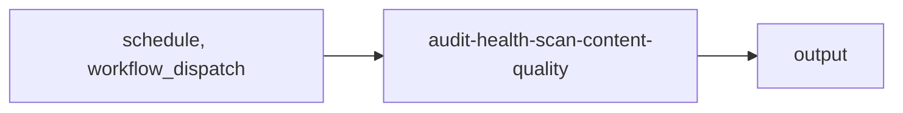

import { CustomDivider } from '/snippets/components/elements/spacing/Divider.jsx'

## Classification

| Field | Value |
|---|---|
| **Current file** | `.github/workflows/audit-health-scan-content-quality.yml` |
| **New name** | `audit-health-scan-content-quality.yml` |
| **Type** | `audit` |
| **Concern** | `health` |
| **Pipeline tag** | P5 (scheduled, read-only) |
| **Status** | active |

<CustomDivider />

## Purpose

{/* TODO: Write purpose paragraph from workflow and script inspection */}

<CustomDivider />

## Pipeline

{/* TODO: Add Mermaid diagram tracing triggers, scripts, data files, consuming pages */}

<CustomDivider />

## Triggers

| Trigger | Details |
|---|---|
| `schedule` | See workflow file |
| `workflow_dispatch` | See workflow file |

<CustomDivider />

## Dependencies

**Scripts:**
- `operations/scripts/audits/content/quality/docs-quality-and-freshness-audit.js`
- `operations/scripts/audits/components/documentation/audit-component-usage.js`
- `operations/scripts/generators/components/library/generate-component-registry.js`
- `operations/scripts/audits/components/library/scan-component-imports.js`
- `operations/scripts/remediators/components/library/repair-component-metadata.js`
- `operations/scripts/validators/components/library/component-layout-governance.js`

<CustomDivider />

## Known Issues

None identified.

<CustomDivider />

## Governance Notes

| Field | Value |
|---|---|
| **Permissions** | Declared |
| **Concurrency** | No |
| **Auto-commit** | No |
| **Inline script** | No |
