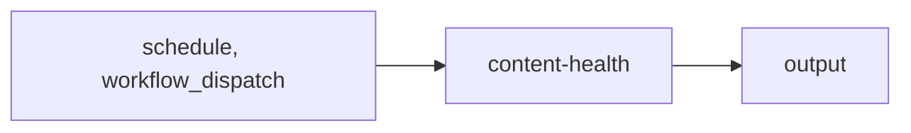

import { CustomDivider } from '/snippets/components/elements/spacing/Divider.jsx'

## Classification

| Field | Value |
|---|---|
| **Current file** | `.github/workflows/content-health.yml` |
| **New name** | `audit-health-scan-content-quality.yml` |
| **Type** | `audit` |
| **Concern** | `health` |
| **Pipeline tag** | P5 (scheduled, read-only) |
| **Status** | active |

<CustomDivider />

## Purpose

{/* TODO: Write purpose paragraph from workflow and script inspection */}

<CustomDivider />

## Pipeline

{/* TODO: Add Mermaid diagram tracing triggers, scripts, data files, consuming pages */}

<CustomDivider />

## Triggers

| Trigger | Details |
|---|---|
| `schedule` | See workflow file |
| `workflow_dispatch` | See workflow file |

<CustomDivider />

## Dependencies

**Scripts:**
- `operations/scripts/docs-quality-and-freshness-audit.js`
- `operations/scripts/audit-component-usage.js`
- `operations/scripts/generators/components/library/generate-component-registry.js`
- `operations/scripts/audits/components/library/scan-component-imports.js`
- `operations/scripts/remediators/components/library/repair-component-metadata.js`
- `operations/scripts/validators/components/library/component-layout-governance.js`

**Canonical repo-root quality owners consumed alongside this workflow:**
- `tools/lib/docs/frontmatter-taxonomy.js`
- `operations/tests/unit/frontmatter-taxonomy.test.js`
- `operations/scripts/validators/content/structure/lint-structure.js`
- `operations/tests/unit/quality.test.js`
- `operations/tests/unit/spelling.test.js`
- `operations/tests/unit/style-guide.test.js`

<CustomDivider />

## Known Issues

- All 6 steps have continue-on-error masking failures
- Script paths may be stale from restructure
- This workflow is not the canonical owner for frontmatter taxonomy or link remediation. It consumes health signals; repo-root ownership stays with the dedicated validators/audits listed above.

**Review flags:** continue-on-error masking all failures

<CustomDivider />

## Governance Notes

| Field | Value |
|---|---|
| **Consolidation** | Stays separate |
| **Dry-run** | No |
| **Concurrency** | No |
| **Error reporting** | continue-on-error-all |
| **Auto-commit** | No |
