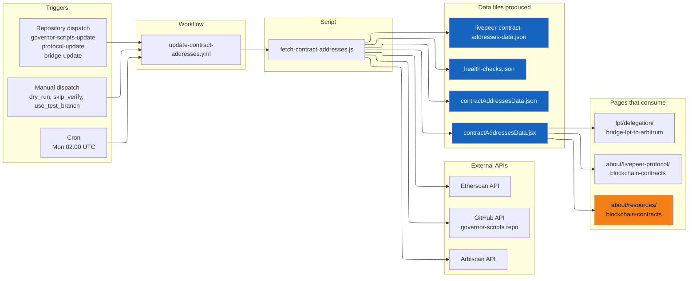

import { CustomDivider } from '/snippets/components/elements/spacing/Divider.jsx'

## Classification

| Field | Value |
|---|---|
| **Current file** | `.github/workflows/update-contract-addresses.yml` |
| **New name** | `automation-integrations-update-contract-addresses.yml` |
| **Type** | `automation` |
| **Concern** | `integrations` |
| **Pipeline tag** | `P5-auto` (scheduled + auto-commit) |
| **Enforcement** | Self-managing (cron + event-driven) |
| **Status** | Active |

<CustomDivider />

## Purpose

Builds the canonical Livepeer contract registry from multiple sources: governor-scripts, a governed authority catalog (`contract-addresses-authority.json`), on-chain verification via RPC calls to Arbitrum and Ethereum L1, and explorer enrichment via Arbiscan/Etherscan APIs. Emits grouped lifecycle data (active, paused, legacy, migration residual) for documentation pages and widget consumers.

If this workflow stops running, contract addresses on the live site become stale. If a protocol upgrade deploys new contracts, users could interact with outdated addresses until the next manual update.

This is the **gold standard** automation workflow in this repo: explicit permissions, dry-run support, on-chain verification, targeted git staging, and clean error handling.

<CustomDivider />

## Pipeline

<Note>
`about/resources/blockchain-contracts` (orange) is **not in docs.json navigation**. It may be a legacy page. The canonical page is `about/livepeer-protocol/blockchain-contracts`.
</Note>

<CustomDivider />

## Triggers

| Trigger | Details |
|---|---|
| `schedule` | Weekly Monday 02:00 UTC |
| `repository_dispatch` | Events: `governor-scripts-update`, `protocol-update`, `bridge-update` |
| `workflow_dispatch` | Manual with inputs: `dry_run`, `skip_verify`, `use_test_branch` |

<CustomDivider />

## Inputs

| Input | Type | Default | Description |
|---|---|---|---|
| `dry_run` | boolean | `false` | Show changes without writing to repo |
| `skip_verify` | boolean | `false` | Skip Arbiscan/Etherscan address verification |
| `use_test_branch` | boolean | `false` | Write to `TEST_BRANCH` (docs-v2-dev) instead of `DEPLOY_BRANCH` |

<CustomDivider />

## Secrets and Permissions

| Secret | Purpose |
|---|---|
| `GITHUB_TOKEN` | Checkout repo + fetch governor-scripts |
| `ARBISCAN_API_KEY` | Verify contract addresses on Arbitrum |
| `ETHERSCAN_API_KEY` | Verify contract addresses on Ethereum L1 |

**Permissions:** `contents: write`

<CustomDivider />

## Dependencies

**Script:**
- `.github/scripts/fetch-contract-addresses.js` : Builds contract registry from governor-scripts, authority catalog, on-chain RPC, and explorer APIs

**Config:**
- `operations/scripts/config/contract-addresses-authority.json` : Governed authority catalog for address metadata and lifecycle state

**Data files produced:**
- `snippets/data/contract-addresses/contractAddressesData.jsx` : JSX export consumed by MDX pages
- `snippets/data/contract-addresses/contractAddressesData.json` : Raw JSON
- `snippets/data/contract-addresses/_health-checks.json` : Verification results
- `snippets/composables/pages/canonical/livepeer-contract-addresses-data.json` : Composable page data

**Consumed by:**

| Page | In nav? |
|---|---|
| `v2/about/livepeer-protocol/blockchain-contracts.mdx` | Yes |
| `v2/about/resources/blockchain-contracts.mdx` | **No** (possible legacy) |
| `v2/lpt/delegation/bridge-lpt-to-arbitrum.mdx` | Yes |

<CustomDivider />

## Known Issues

- **P0 (flags.jsonl):** This workflow has never been dispatched. It exists only on `docs-v2-dev`. GitHub Actions only indexes workflows on the default/production branch. Must cherry-pick workflow + fetch script to `docs-v2` then manual dispatch with `--dry-run` to verify
- No generate/verify pair exists. No PR-time validator checks whether contract data is stale

<CustomDivider />

## Governance Notes

| Field | Value |
|---|---|
| **Consolidation** | Stays separate (gold standard, complex verification) |
| **Dry-run** | Yes |
| **Concurrency** | No (should add) |
| **Error reporting** | None (should add step summary) |
| **Auto-commit** | Yes (targeted: 4 specific files) |
| **Bot identity** | github-actions[bot] |
| **Commit message** | `chore: update contract addresses from governor-scripts [skip ci]` |
