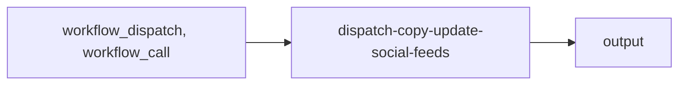

import { CustomDivider } from '/snippets/components/elements/spacing/Divider.jsx'

## Classification

| Field | Value |
|---|---|
| **Current file** | `.github/workflows/dispatch-copy-update-social-feeds.yml` |
| **New name** | `dispatch-copy-update-social-feeds.yml` |
| **Type** | `dispatch` |
| **Concern** | `copy` |
| **Pipeline tag** | reusable |
| **Status** | active |

<CustomDivider />

## Purpose

{/* TODO: Write purpose paragraph from workflow and script inspection */}

<CustomDivider />

## Pipeline

{/* TODO: Add Mermaid diagram tracing triggers, scripts, data files, consuming pages */}

<CustomDivider />

## Triggers

| Trigger | Details |
|---|---|
| `workflow_dispatch` | See workflow file |
| `workflow_call` | See workflow file |

<CustomDivider />

## Dependencies

**Scripts:**
- `operations/scripts/integrators/copy/social-feeds/fetch-forum-data.js`
- `operations/scripts/integrators/copy/social-feeds/fetch-ghost-blog-data.js`
- `operations/scripts/integrators/copy/social-feeds/fetch-youtube-data.js`
- `operations/scripts/integrators/copy/social-feeds/fetch-github-discussions.js`
- `operations/scripts/integrators/copy/social-feeds/fetch-github-releases.js`
- `operations/scripts/integrators/copy/social-feeds/fetch-discord-announcements.js`
- `operations/scripts/integrators/copy/social-feeds/fetch-rss-blog-data.js`
- `operations/scripts/integrators/maintenance/release/update-livepeer-release.js`

<CustomDivider />

## Known Issues

None identified.

<CustomDivider />

## Governance Notes

| Field | Value |
|---|---|
| **Permissions** | Declared |
| **Concurrency** | No |
| **Auto-commit** | Yes |
| **Inline script** | No |
