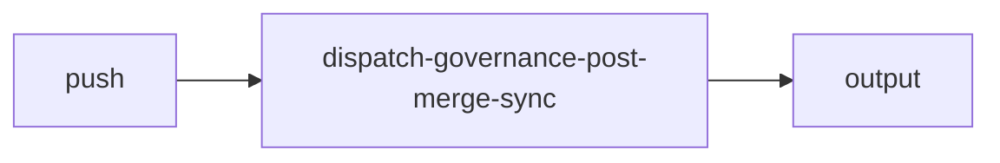

import { CustomDivider } from '/snippets/components/elements/spacing/Divider.jsx'

## Classification

| Field | Value |
|---|---|
| **Current file** | `.github/workflows/dispatch-governance-post-merge-sync.yml` |
| **New name** | `dispatch-governance-post-merge-sync.yml` |
| **Type** | `dispatch` |
| **Concern** | `governance` |
| **Pipeline tag** | P4 (post-merge, auto-commit) |
| **Status** | active |

<CustomDivider />

## Purpose

{/* TODO: Write purpose paragraph from workflow and script inspection */}

<CustomDivider />

## Pipeline

{/* TODO: Add Mermaid diagram tracing triggers, scripts, data files, consuming pages */}

<CustomDivider />

## Triggers

| Trigger | Details |
|---|---|
| `push` | See workflow file |

<CustomDivider />

## Dependencies

**Scripts:**
- `operations/scripts/dispatch/governance/pipelines/governance-pipeline.js`

<CustomDivider />

## Known Issues

- References undefined inputs.use_test_branch
- Uses python3 for JSON parsing

**Review flags:** Dead code (undefined input). Python3 dependency

<CustomDivider />

## Governance Notes

| Field | Value |
|---|---|
| **Consolidation** | Stays separate |
| **Dry-run** | No |
| **Concurrency** | No |
| **Error reporting** | basic |
| **Auto-commit** | No |
