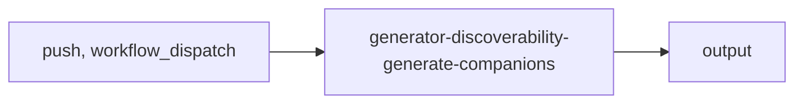

import { CustomDivider } from '/snippets/components/elements/spacing/Divider.jsx'

## Classification

| Field | Value |
|---|---|
| **Current file** | `.github/workflows/generator-discoverability-generate-companions.yml` |
| **New name** | `generator-discoverability-generate-companions.yml` |
| **Type** | `generator` |
| **Concern** | `discoverability` |
| **Pipeline tag** | P4 (post-merge, auto-commit) |
| **Status** | active |

<CustomDivider />

## Purpose

{/* TODO: Write purpose paragraph from workflow and script inspection */}

<CustomDivider />

## Pipeline

{/* TODO: Add Mermaid diagram tracing triggers, scripts, data files, consuming pages */}

<CustomDivider />

## Triggers

| Trigger | Details |
|---|---|
| `push` | See workflow file |
| `workflow_dispatch` | See workflow file |

<CustomDivider />

## Dependencies

**Scripts:**
- `operations/scripts/generators/content/reference/generate-glossary-companions.js`

<CustomDivider />

## Known Issues

None identified.

<CustomDivider />

## Governance Notes

| Field | Value |
|---|---|
| **Permissions** | Declared |
| **Concurrency** | No |
| **Auto-commit** | Yes |
| **Inline script** | No |
