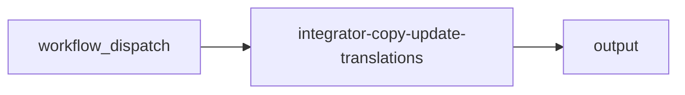

import { CustomDivider } from '/snippets/components/elements/spacing/Divider.jsx'

## Classification

| Field | Value |
|---|---|
| **Current file** | `.github/workflows/integrator-copy-update-translations.yml` |
| **New name** | `integrator-copy-update-translations.yml` |
| **Type** | `integrator` |
| **Concern** | `copy` |
| **Pipeline tag** | Manual (workflow_dispatch) |
| **Status** | active |

<CustomDivider />

## Purpose

{/* TODO: Write purpose paragraph from workflow and script inspection */}

<CustomDivider />

## Pipeline

{/* TODO: Add Mermaid diagram tracing triggers, scripts, data files, consuming pages */}

<CustomDivider />

## Triggers

| Trigger | Details |
|---|---|
| `workflow_dispatch` | See workflow file |

<CustomDivider />

## Dependencies

**Scripts:**
- `operations/scripts/automations/content/language-translation/translate-docs.js`
- `operations/scripts/automations/content/language-translation/generate-localized-docs-json.js`
- `operations/scripts/generators/content/catalogs/generate-docs-index.js`
- `operations/scripts/automations/content/language-translation/validate-generated.js`
- `operations/tests/unit/docs-navigation.test.js`

<CustomDivider />

## Known Issues

- PR add-paths hardcodes v2/es,fr,cn but input defaults es,fr,de — mismatch

**Review flags:** Path mismatch bug

<CustomDivider />

## Governance Notes

| Field | Value |
|---|---|
| **Consolidation** | Stays separate |
| **Dry-run** | Yes |
| **Concurrency** | Yes |
| **Error reporting** | robust |
| **Auto-commit** | No |
