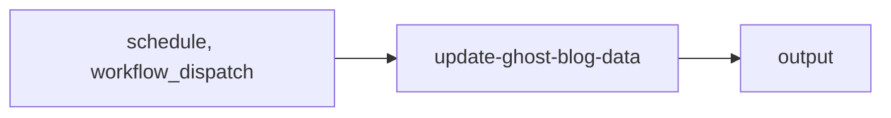

import { CustomDivider } from '/snippets/components/elements/spacing/Divider.jsx'

## Classification

| Field | Value |
|---|---|
| **Current file** | `.github/workflows/update-ghost-blog-data.yml` |
| **New name** | `integrator-copy-update-social-feeds.yml` |
| **Type** | `integrator` |
| **Concern** | `copy` |
| **Pipeline tag** | P5-auto (scheduled + auto-commit) |
| **Status** | active |

<CustomDivider />

## Purpose

{/* TODO: Write purpose paragraph from workflow and script inspection */}

<CustomDivider />

## Pipeline

{/* TODO: Add Mermaid diagram tracing triggers, scripts, data files, consuming pages */}

<CustomDivider />

## Triggers

| Trigger | Details |
|---|---|
| `schedule` | See workflow file |
| `workflow_dispatch` | See workflow file |

<CustomDivider />

## Dependencies

**Scripts:**
- `.github/scripts/fetch-ghost-blog-data.js`

<CustomDivider />

## Known Issues

- CRITICAL: Missing permissions: contents: write — push will fail

**Review flags:** Merge into single matrix dispatcher (D-ACT-03). P0: missing permissions

<CustomDivider />

## Governance Notes

| Field | Value |
|---|---|
| **Consolidation** | Identical structure — merge into unified data-fetch dispatcher |
| **Dry-run** | No |
| **Concurrency** | No |
| **Error reporting** | none |
| **Auto-commit** | Yes |
