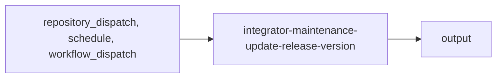

import { CustomDivider } from '/snippets/components/elements/spacing/Divider.jsx'

## Classification

| Field | Value |
|---|---|
| **Current file** | `.github/workflows/integrator-maintenance-update-release-version.yml` |
| **New name** | `integrator-maintenance-update-release-version.yml` |
| **Type** | `integrator` |
| **Concern** | `maintenance` |
| **Pipeline tag** | P5-auto (scheduled + auto-commit) |
| **Status** | active |

<CustomDivider />

## Purpose

{/* TODO: Write purpose paragraph from workflow and script inspection */}

<CustomDivider />

## Pipeline

{/* TODO: Add Mermaid diagram tracing triggers, scripts, data files, consuming pages */}

<CustomDivider />

## Triggers

| Trigger | Details |
|---|---|
| `repository_dispatch` | See workflow file |
| `schedule` | See workflow file |
| `workflow_dispatch` | See workflow file |

<CustomDivider />

## Dependencies

**Scripts:**
None (inline only)

<CustomDivider />

## Known Issues

- Uses grep -oP (GNU grep, not macOS compatible)
- sed replacement may malform file

**Review flags:** Inline script extraction candidate

<CustomDivider />

## Governance Notes

| Field | Value |
|---|---|
| **Consolidation** | Stays separate |
| **Dry-run** | No |
| **Concurrency** | No |
| **Error reporting** | basic |
| **Auto-commit** | Yes |
