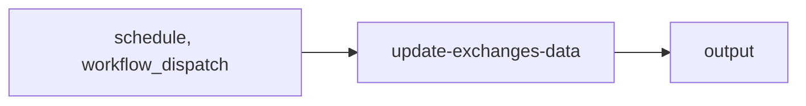

import { CustomDivider } from '/snippets/components/elements/spacing/Divider.jsx'

## Classification

| Field | Value |
|---|---|
| **Current file** | `.github/workflows/update-exchanges-data.yml` |
| **New name** | `update-exchanges-data.yml` |
| **Type** | `integrator` |
| **Concern** | `maintenance` |
| **Pipeline tag** | P5-auto (scheduled + auto-commit) |
| **Status** | active |

<CustomDivider />

## Purpose

{/* TODO: Write purpose paragraph from workflow and script inspection */}

<CustomDivider />

## Pipeline

{/* TODO: Add Mermaid diagram tracing triggers, scripts, data files, consuming pages */}



<CustomDivider />

## Triggers

| Trigger | Details |
|---|---|
| `schedule` | See workflow file |
| `workflow_dispatch` | See workflow file |

<CustomDivider />

## Dependencies

**Scripts:**
- `operations/scripts/integrators/maintenance/data-feeds/fetch-exchanges-data.js`

**CLI equivalent:**
```bash
node operations/scripts/integrators/maintenance/data-feeds/fetch-exchanges-data.js --dry-run
```

<CustomDivider />

## Known Issues

None identified.


<CustomDivider />

## Governance Notes

| Field | Value |
|---|---|
| **Permissions** | Declared |
| **Concurrency** | No |
| **Auto-commit** | Yes |
| **Inline script** | No |
