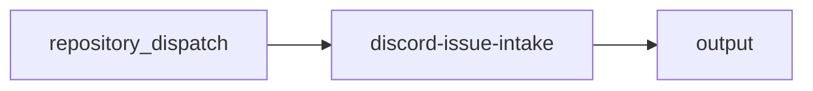

import { CustomDivider } from '/snippets/components/elements/spacing/Divider.jsx'

## Classification

| Field | Value |
|---|---|
| **Current file** | `.github/workflows/discord-issue-intake.yml` |
| **New name** | `interface-governance-intake-discord-issues.yml` |
| **Type** | `interface` |
| **Concern** | `governance` |
| **Pipeline tag** | Event-driven (repository_dispatch / issues) |
| **Status** | active |

<CustomDivider />

## Purpose

{/* TODO: Write purpose paragraph from workflow and script inspection */}

<CustomDivider />

## Pipeline

{/* TODO: Add Mermaid diagram tracing triggers, scripts, data files, consuming pages */}

<CustomDivider />

## Triggers

| Trigger | Details |
|---|---|
| `repository_dispatch` | See workflow file |

<CustomDivider />

## Dependencies

**Scripts:**
None (inline only)

<CustomDivider />

## Known Issues

None identified.

**Review flags:** 261 lines inline

<CustomDivider />

## Governance Notes

| Field | Value |
|---|---|
| **Consolidation** | Stays separate |
| **Dry-run** | No |
| **Concurrency** | No |
| **Error reporting** | robust |
| **Auto-commit** | No |
