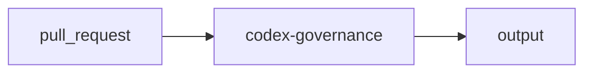

import { CustomDivider } from '/snippets/components/elements/spacing/Divider.jsx'

## Classification

| Field | Value |
|---|---|
| **Current file** | `.github/workflows/codex-governance.yml` |
| **New name** | `validator-governance-check-codex-compliance.yml` |
| **Type** | `validator` |
| **Concern** | `governance` |
| **Pipeline tag** | P2 (hard gate, blocks merge) |
| **Status** | active |

<CustomDivider />

## Purpose

{/* TODO: Write purpose paragraph from workflow and script inspection */}

<CustomDivider />

## Pipeline

{/* TODO: Add Mermaid diagram tracing triggers, scripts, data files, consuming pages */}

<CustomDivider />

## Triggers

| Trigger | Details |
|---|---|
| `pull_request` | See workflow file |

<CustomDivider />

## Dependencies

**Scripts:**
- `operations/scripts/validators/governance/compliance/validate-codex-task-contract.js`
- `operations/scripts/check-codex-pr-overlap.js`

<CustomDivider />

## Known Issues

- check-codex-pr-overlap.js path may be stale (moved to dispatch/ai/codex/)

**Review flags:** Hard gate P2. Script path may be stale

<CustomDivider />

## Governance Notes

| Field | Value |
|---|---|
| **Consolidation** | Stays separate |
| **Dry-run** | No |
| **Concurrency** | No |
| **Error reporting** | none |
| **Auto-commit** | No |
