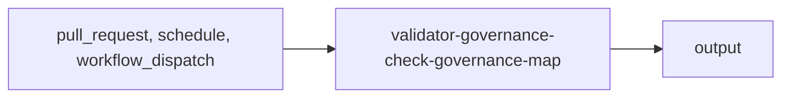

import { CustomDivider } from '/snippets/components/elements/spacing/Divider.jsx'

## Classification

| Field | Value |
|---|---|
| **Current file** | `.github/workflows/validator-governance-check-governance-map.yml` |
| **New name** | `validator-governance-check-governance-map.yml` |
| **Type** | `validator` |
| **Concern** | `governance` |
| **Pipeline tag** | P3 (soft gate, advisory) |
| **Status** | active |

<CustomDivider />

## Purpose

{/* TODO: Write purpose paragraph from workflow and script inspection */}

<CustomDivider />

## Pipeline

{/* TODO: Add Mermaid diagram tracing triggers, scripts, data files, consuming pages */}

<CustomDivider />

## Triggers

| Trigger | Details |
|---|---|
| `pull_request` | See workflow file |
| `schedule` | See workflow file |
| `workflow_dispatch` | See workflow file |

<CustomDivider />

## Dependencies

**Scripts:**
- `operations/scripts/validators/governance/compliance/check-governance-markers.js`
- `operations/scripts/generators/governance/map/generate-governance-map.js`
- `operations/scripts/remediators/governance/compliance/repair-governance-artifacts.js`

<CustomDivider />

## Known Issues

None identified.

<CustomDivider />

## Governance Notes

| Field | Value |
|---|---|
| **Permissions** | Declared |
| **Concurrency** | No |
| **Auto-commit** | Yes |
| **Inline script** | Yes (extraction candidate) |
