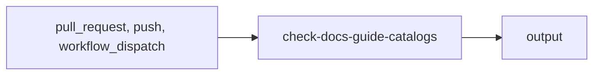

import { CustomDivider } from '/snippets/components/elements/spacing/Divider.jsx'

## Classification

| Field | Value |
|---|---|
| **Current file** | `.github/workflows/check-docs-guide-catalogs.yml` |
| **New name** | `validator-maintenance-check-docs-guide-catalogs.yml` |
| **Type** | `validator` |
| **Concern** | `maintenance` |
| **Pipeline tag** | P3 (soft gate, advisory) |
| **Status** | active |

<CustomDivider />

## Purpose

{/* TODO: Write purpose paragraph from workflow and script inspection */}

<CustomDivider />

## Pipeline

{/* TODO: Add Mermaid diagram tracing triggers, scripts, data files, consuming pages */}

<CustomDivider />

## Triggers

| Trigger | Details |
|---|---|
| `pull_request` | See workflow file |
| `push` | See workflow file |
| `workflow_dispatch` | See workflow file |

<CustomDivider />

## Dependencies

**Scripts:**
- `operations/scripts/generators/components/library/generate-component-registry.js`
- `operations/scripts/generators/components/documentation/generate-component-docs.js`
- `operations/scripts/validators/components/library/check-component-health.js`
- `operations/scripts/generators/components/library/generate-component-examples.js`
- `operations/scripts/generators/governance/catalogs/generate-docs-guide-indexes.js`
- `operations/scripts/generators/governance/catalogs/generate-docs-guide-pages-index.js`
- `operations/tests/unit/quality.test.js`

<CustomDivider />

## Known Issues

None identified.

<CustomDivider />

## Governance Notes

| Field | Value |
|---|---|
| **Consolidation** | Stays separate |
| **Dry-run** | No |
| **Concurrency** | No |
| **Error reporting** | none |
| **Auto-commit** | No |
