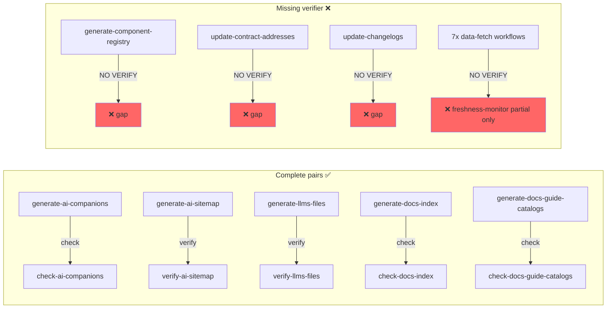
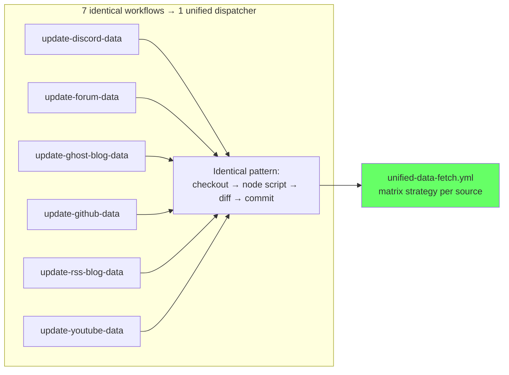
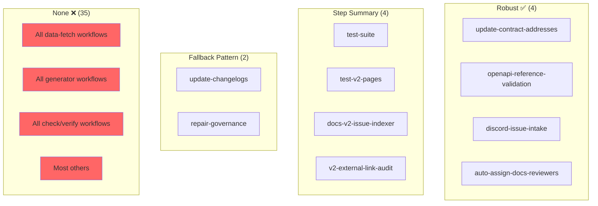
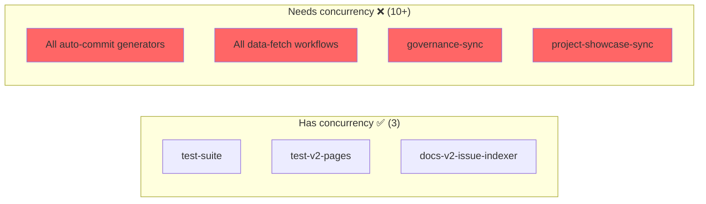

# GitHub Actions Dependency Map

> Generated: 2026-03-31
> Source: actions-audit.json

---

## System Overview

```mermaid
%%{init: {'flowchart': {'defaultRenderer': 'elk'}}}%%
graph TD
    subgraph Triggers
        CRON[⏰ Cron schedules]
        PUSH[📤 Push to docs-v2]
        PR[🔀 Pull request]
        DISPATCH[🎯 Manual dispatch]
        REPO_DISPATCH[📡 Repository dispatch]
        ISSUES[🏷️ Issue events]
    end

    subgraph "Data Fetch Pipelines (P5-auto)"
        WF_DISCORD[update-discord-data]
        WF_FORUM[update-forum-data]
        WF_GHOST[update-ghost-blog-data]
        WF_GITHUB[update-github-data]
        WF_RSS[update-rss-blog-data]
        WF_YOUTUBE[update-youtube-data]
        WF_CONTRACTS[update-contract-addresses]
        WF_CHANGELOGS[update-changelogs]
        WF_RELEASE[update-livepeer-release]
        WF_SHOWCASE[project-showcase-sync]
    end

    subgraph "Generators (P4 post-merge)"
        WF_GEN_COMPANIONS[generate-ai-companions]
        WF_GEN_SITEMAP[generate-ai-sitemap]
        WF_GEN_REGISTRY[generate-component-registry]
        WF_GEN_CATALOGS[generate-docs-guide-catalogs]
        WF_GEN_INDEX[generate-docs-index]
        WF_GEN_LLMS[generate-llms-files]
    end

    subgraph "Validators (P2/P3)"
        WF_CHECK_COMPANIONS[check-ai-companions]
        WF_CHECK_CATALOGS[check-docs-guide-catalogs]
        WF_CHECK_INDEX[check-docs-index]
        WF_VERIFY_SITEMAP[verify-ai-sitemap]
        WF_VERIFY_LLMS[verify-llms-files]
        WF_BROKEN[broken-links]
        WF_TEST[test-suite]
        WF_TEST_V2[test-v2-pages]
        WF_CODEX[codex-governance]
        WF_OPENAPI[openapi-reference-validation]
    end

    subgraph "Audits & Monitoring (P5)"
        WF_HEALTH[content-health]
        WF_FRESHNESS[freshness-monitor]
        WF_LINKS[v2-external-link-audit]
    end

    subgraph "Governance (P4/P6)"
        WF_GOV_SYNC[governance-sync]
        WF_REPAIR[repair-governance]
    end

    subgraph "Issue/PR Management"
        WF_LABEL[issue-auto-label]
        WF_INDEXER[docs-v2-issue-indexer]
        WF_INTAKE[discord-issue-intake]
        WF_CLOSE[close-linked-issues]
        WF_ASSIGN[auto-assign-docs-reviewers]
    end

    subgraph Scripts[".github/scripts/"]
        S_CONTRACTS[fetch-contract-addresses.js]
        S_DISCORD[fetch-discord-announcements.js]
        S_FORUM[fetch-forum-data.js]
        S_GHOST[fetch-ghost-blog-data.js]
        S_DISCUSSIONS[fetch-github-discussions.js]
        S_RELEASES[fetch-github-releases.js]
        S_RSS[fetch-rss-blog-data.js]
        S_YOUTUBE[fetch-youtube-data.js]
        S_CHANGELOG[generate-changelog.js]
        S_SHOWCASE[project-showcase-sync.js]
    end

    subgraph Config["Config files"]
        CFG_SOCIAL[product-social-config.json]
        CFG_CONTRACTS[contract-addresses-supplement.json]
    end

    subgraph Data["Data files"]
        D_CONTRACTS[contractAddressesData.jsx]
        D_DISCORD[discordData.jsx]
        D_FORUM[forumData.jsx]
        D_GHOST[ghostBlogData.jsx]
        D_DISCUSSIONS[githubDiscussionsData.jsx]
        D_RELEASES[githubReleasesData.jsx]
        D_RSS[blogData.jsx]
        D_YOUTUBE[youtubeData.jsx]
        D_CHANGELOG[changelog.mdx pages]
        D_SHOWCASE[showcaseData.jsx]
        D_GLOBALS[globals.jsx]
        D_INDEX[docs-index.json]
        D_REGISTRY[component-registry.json]
        D_CATALOGS[catalog MDX pages]
        D_COMPANIONS[companion JSON files]
        D_SITEMAP[sitemap-ai.xml]
        D_LLMS[llms.txt]
    end

    %% Trigger connections
    CRON --> WF_DISCORD & WF_FORUM & WF_GHOST & WF_GITHUB & WF_RSS & WF_YOUTUBE & WF_CONTRACTS & WF_CHANGELOGS & WF_RELEASE & WF_SHOWCASE & WF_HEALTH & WF_FRESHNESS & WF_LINKS & WF_REPAIR & WF_OPENAPI
    PUSH --> WF_GEN_COMPANIONS & WF_GEN_SITEMAP & WF_GEN_REGISTRY & WF_GEN_CATALOGS & WF_GEN_INDEX & WF_GEN_LLMS & WF_GOV_SYNC & WF_TEST
    PR --> WF_CHECK_COMPANIONS & WF_CHECK_CATALOGS & WF_CHECK_INDEX & WF_VERIFY_SITEMAP & WF_VERIFY_LLMS & WF_BROKEN & WF_TEST & WF_TEST_V2 & WF_CODEX & WF_OPENAPI & WF_ASSIGN
    REPO_DISPATCH --> WF_CONTRACTS & WF_CHANGELOGS & WF_RELEASE & WF_SHOWCASE & WF_INTAKE
    ISSUES --> WF_LABEL & WF_INDEXER

    %% Workflow → Script
    WF_CONTRACTS --> S_CONTRACTS
    WF_DISCORD --> S_DISCORD
    WF_FORUM --> S_FORUM
    WF_GHOST --> S_GHOST
    WF_GITHUB --> S_DISCUSSIONS & S_RELEASES
    WF_RSS --> S_RSS
    WF_YOUTUBE --> S_YOUTUBE
    WF_CHANGELOGS --> S_CHANGELOG
    WF_SHOWCASE --> S_SHOWCASE

    %% Script → Config
    S_CONTRACTS --> CFG_CONTRACTS
    S_DISCORD --> CFG_SOCIAL
    S_DISCUSSIONS --> CFG_SOCIAL
    S_RELEASES --> CFG_SOCIAL
    S_RSS --> CFG_SOCIAL
    S_YOUTUBE --> CFG_SOCIAL
    S_CHANGELOG --> CFG_SOCIAL

    %% Script → Data
    S_CONTRACTS --> D_CONTRACTS
    S_DISCORD --> D_DISCORD
    S_FORUM --> D_FORUM
    S_GHOST --> D_GHOST
    S_DISCUSSIONS --> D_DISCUSSIONS
    S_RELEASES --> D_RELEASES
    S_RSS --> D_RSS
    S_YOUTUBE --> D_YOUTUBE
    S_CHANGELOG --> D_CHANGELOG
    S_SHOWCASE --> D_SHOWCASE
    WF_RELEASE --> D_GLOBALS

    %% Generator → Data
    WF_GEN_COMPANIONS --> D_COMPANIONS
    WF_GEN_SITEMAP --> D_SITEMAP
    WF_GEN_REGISTRY --> D_REGISTRY
    WF_GEN_CATALOGS --> D_CATALOGS
    WF_GEN_INDEX --> D_INDEX
    WF_GEN_LLMS --> D_LLMS

    %% Generate/Verify pairs
    WF_GEN_COMPANIONS -.->|verify| WF_CHECK_COMPANIONS
    WF_GEN_SITEMAP -.->|verify| WF_VERIFY_SITEMAP
    WF_GEN_LLMS -.->|verify| WF_VERIFY_LLMS
    WF_GEN_INDEX -.->|verify| WF_CHECK_INDEX
    WF_GEN_CATALOGS -.->|verify| WF_CHECK_CATALOGS

    %% Governance pipeline
    WF_GOV_SYNC & WF_REPAIR --> |governance-pipeline.js| D_CATALOGS

    %% Monitoring targets
    WF_FRESHNESS -.->|monitors| D_FORUM & D_GHOST & D_DISCORD & D_GLOBALS
```

---

## Generate/Verify Pairs

---

## Data Fetch Pipeline (Consolidation Target)

---

## Execution Schedule (UTC)

```mermaid
gantt
    title Daily/Weekly Workflow Schedule
    dateFormat HH:mm
    axisFormat %H:%M

    section Daily
    update-forum-data           :00:00, 30m
    update-ghost-blog-data      :00:00, 30m
    sdk-generation              :00:00, 60m
    update-discord-data         :01:00, 30m
    update-github-data          :02:00, 30m
    update-rss-blog-data        :03:00, 30m
    v2-external-link-audit      :04:00, 60m
    openapi-reference-validation:04:35, 60m
    update-livepeer-release     :06:00, 30m
    freshness-monitor           :08:00, 30m

    section Every 6h
    docs-v2-issue-indexer       :00:00, 30m

    section Every 15min
    project-showcase-sync       :00:00, 15m

    section Weekly (Monday)
    update-changelogs           :00:00, 60m
    update-contract-addresses   :02:00, 60m
    repair-governance           :05:00, 60m
    content-health              :06:00, 60m

    section Weekly (Sunday)
    update-youtube-data         :00:00, 30m
    sync-large-assets           :00:00, 30m
```

---

## Error Handling Coverage

---

## Concurrency Coverage

