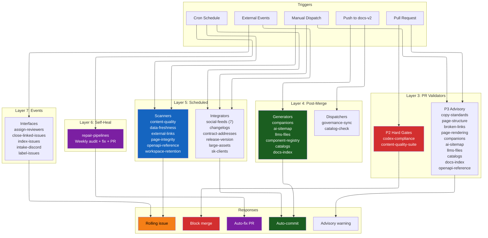
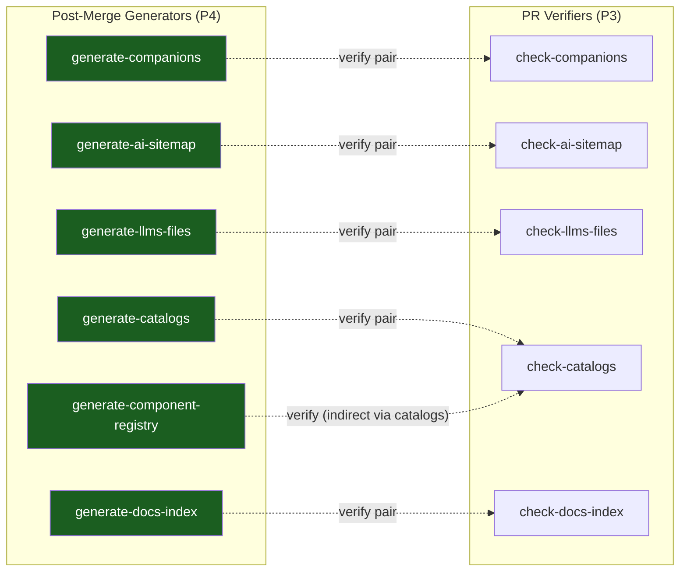
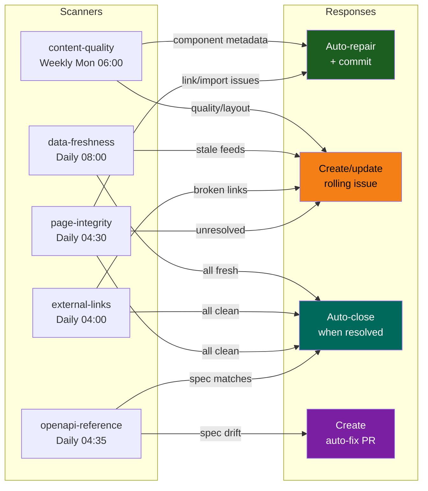

# Governance Architecture: Visual Maps

> Generated 2026-04-08 after full consolidation.
> 48 workflows renamed, 11 scripts migrated, all standards fixed.

---

## System Overview

---

## Workflows by Type

```mermaid
%%{init: {'flowchart': {'defaultRenderer': 'elk'}}}%%
graph LR
    subgraph "Validators (13)"
        V1["copy-check-content-quality-suite P2"]
        V2["governance-check-codex-compliance P2"]
        V3["brand-check-copy-standards P3"]
        V4["health-check-page-structure P3"]
        V5["health-check-broken-links P3"]
        V6["health-check-page-rendering P3"]
        V7["health-check-openapi-reference P3"]
        V8["discoverability-check-companions P3"]
        V9["discoverability-check-ai-sitemap P3"]
        V10["discoverability-check-llms-files P3"]
        V11["maintenance-check-catalogs P3"]
        V12["maintenance-check-docs-index P3"]
        V13["governance-check-governance-map P3"]
    end

    subgraph "Generators (7)"
        G1["discoverability-generate-companions P4"]
        G2["discoverability-generate-ai-sitemap P4"]
        G3["discoverability-generate-llms-files P4"]
        G4["maintenance-generate-component-registry P4"]
        G5["maintenance-generate-catalogs P4"]
        G6["maintenance-generate-docs-index P4"]
        G7["maintenance-generate-sdk-clients P5a"]
    end

    subgraph "Integrators (12)"
        I1["copy-update-discord-data"]
        I2["copy-update-forum-data"]
        I3["copy-update-ghost-blog-data"]
        I4["copy-update-github-data"]
        I5["copy-update-rss-blog-data"]
        I6["copy-update-youtube-data"]
        I7["copy-update-changelogs"]
        I8["copy-update-translations"]
        I9["maintenance-update-contract-addresses"]
        I10["maintenance-update-release-version"]
        I11["maintenance-update-large-assets"]
        I12["maintenance-update-contract-addresses-shadow"]
    end

    subgraph "Auditors (5)"
        A1["health-scan-content-quality"]
        A2["health-scan-data-freshness"]
        A3["health-scan-external-links"]
        A4["health-scan-page-integrity"]
        A5["governance-scan-workspace-retention"]
    end

    subgraph "Interfaces (5)"
        IF1["governance-assign-reviewers"]
        IF2["governance-close-linked-issues"]
        IF3["governance-index-issues"]
        IF4["governance-intake-discord-issues"]
        IF5["governance-label-issues"]
    end

    subgraph "Remediators (3)"
        R1["brand-repair-en-gb-style"]
        R2["discoverability-repair-seo-metadata"]
        R3["governance-repair-pipelines"]
    end

    subgraph "Dispatchers (3)"
        D1["copy-update-social-feeds reusable"]
        D2["governance-post-merge-sync"]
        D3["maintenance-check-catalogs reusable"]
    end

    style V1 fill:#d32f2f,color:#fff
    style V2 fill:#d32f2f,color:#fff
    style R3 fill:#7b1fa2,color:#fff
```

---

## Generate/Verify Pairs

---

## Scan-to-Act Routing

---

## Scripts by Type and Concern

```mermaid
%%{init: {'flowchart': {'defaultRenderer': 'elk'}}}%%
graph TB
    subgraph "operations/scripts/"
        subgraph "automations/ (45 scripts)"
            AC["content/ (37)"]
            AAI["ai/ (6)"]
            AG["governance/ (2)"]
        end

        subgraph "integrators/ (11 scripts)"
            IC["copy/ (9)\nsocial-feeds, changelogs, showcase"]
            IM["maintenance/ (2)\ncontracts, release"]
        end

        subgraph "generators/ (22 scripts)"
            GC["content/ (7)"]
            GG["governance/ (14)"]
            GCO["components/ (4)"]
            GAI["ai/ (1)"]
            GM["media/ (2)"]
        end

        subgraph "validators/ (33 scripts)"
            VC["content/ (19)"]
            VG["governance/ (17)"]
            VCO["components/ (6)"]
            VAI["ai/ (2)"]
        end

        subgraph "auditors/ (17 scripts)"
            AUC["content/ (13)"]
            AUG["governance/ (4)"]
            AUCO["components/ (2)"]
        end

        subgraph "dispatch/ (25 scripts)"
            DG["governance/ (25)\nhooks, pipelines, orchestrators"]
            DC["content/ (6)"]
            DAI["ai/ (4)"]
        end

        subgraph "remediators/ (17 scripts)"
            RC["content/ (15)"]
            RG["governance/ (5)"]
            RCO["components/ (1)"]
        end

        subgraph "interfaces/ (0 - pending extraction)"
            INT["governance/ (planned: 5 scripts)"]
        end

        subgraph "config/ (3)"
            CFG["mdx-sanitise, docs-path-sync, og-image-policy"]
        end
    end
```

---

## Workflow Count Summary

| Type | Count | Concerns covered |
|---|---|---|
| Validators | 13 | copy, brand, health, discoverability, maintenance, governance |
| Integrators | 12 | copy (8), maintenance (4) |
| Generators | 7 | discoverability (3), maintenance (4) |
| Auditors | 5 | health (4), governance (1) |
| Interfaces | 5 | governance (5) |
| Dispatchers | 3 | copy (1), governance (1), maintenance (1) |
| Remediators | 3 | brand (1), discoverability (1), governance (1) |
| Disabled | 1 | project-showcase-sync |
| **Total** | **49** | |

## Script Count Summary

| Type | Count | Top concerns |
|---|---|---|
| automations | 45 | content (37), ai (6), governance (2) |
| validators | 33 | content (19), governance (17), components (6) |
| dispatch | 25 | governance (25), content (6), ai (4) |
| generators | 22 | governance (14), content (7), components (4) |
| auditors | 17 | content (13), governance (4), components (2) |
| remediators | 17 | content (15), governance (5), components (1) |
| integrators | 11 | copy (9), maintenance (2) |
| interfaces | 0 | planned: governance (5) |
| config | 3 | shared utilities |
| **Total** | **~205** | |
