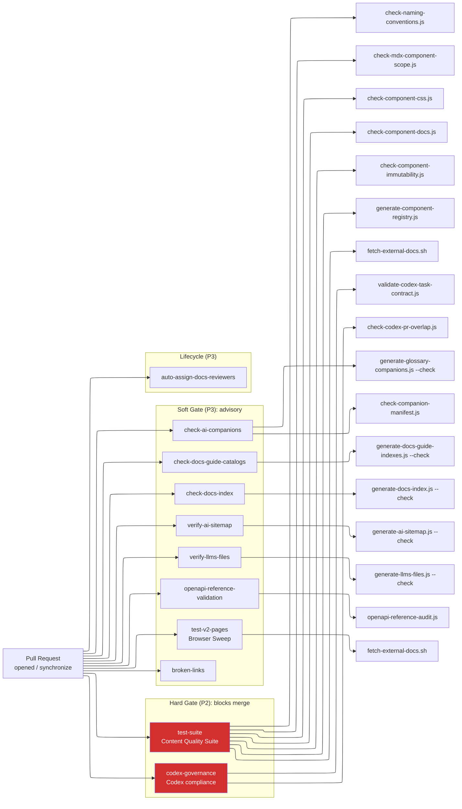
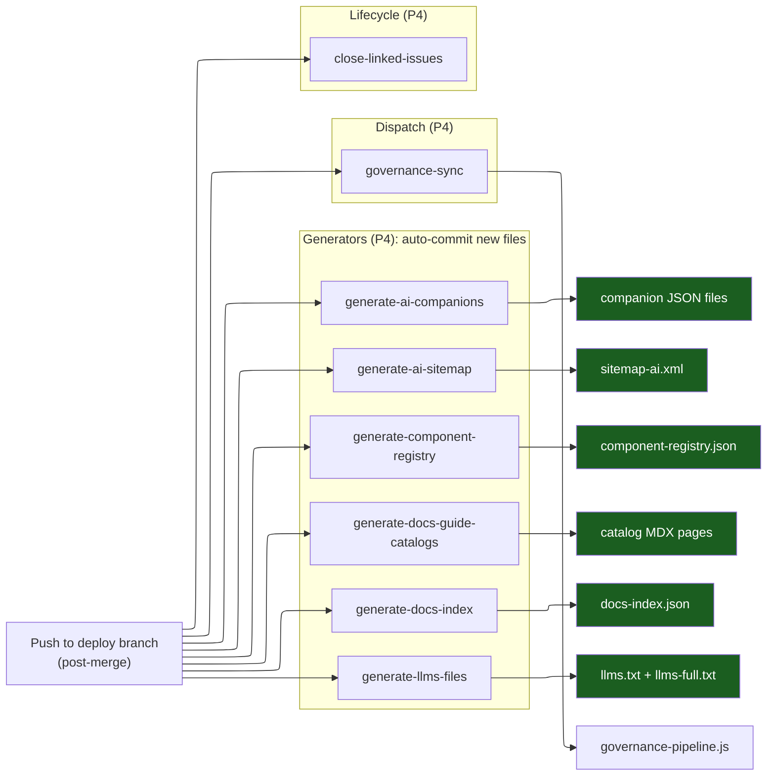
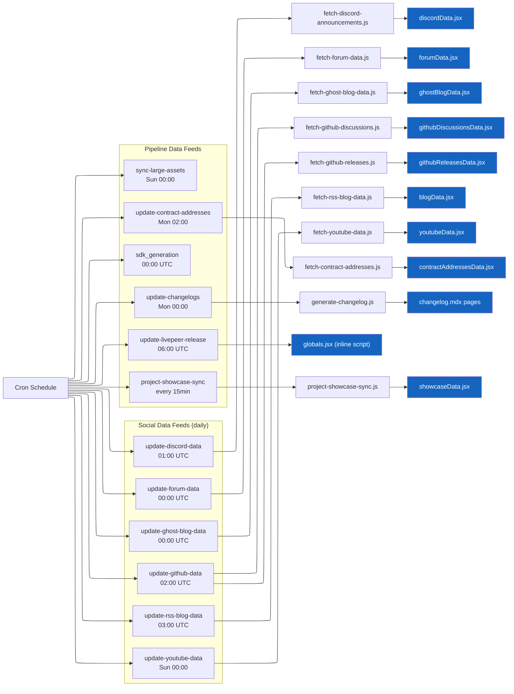
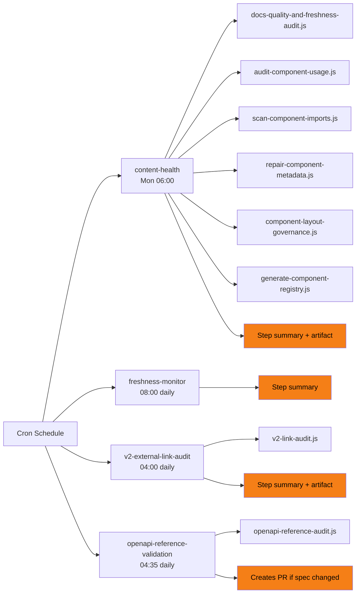
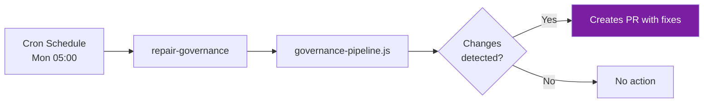
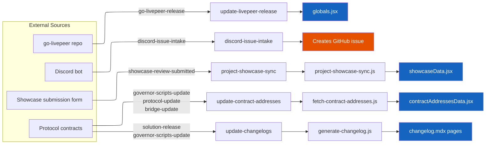
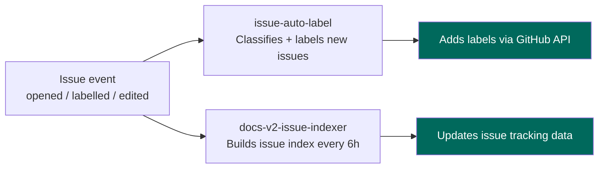
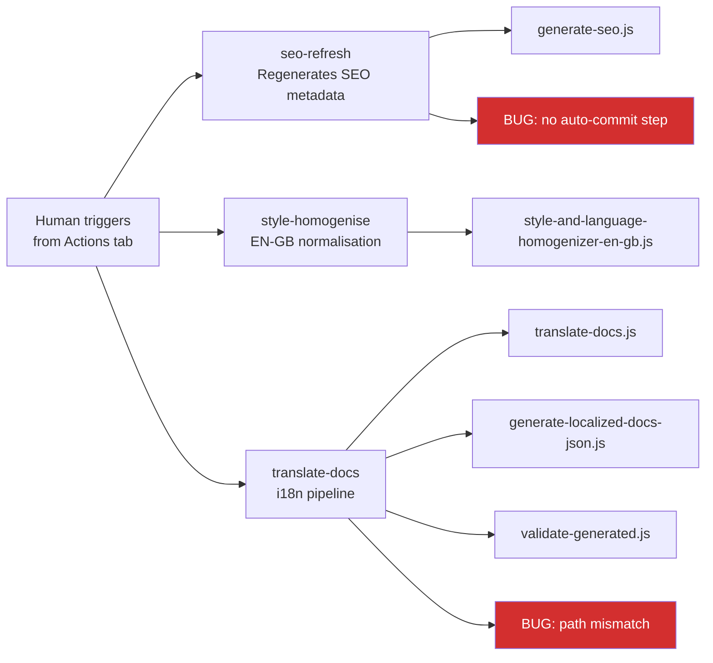

# GitHub Actions Governance: Outcomes

> Thread: GitHub Actions Governance
> Updated: 2026-03-31
> What the finished state looks like, visually.

---

## Aims

**What we are doing:** Bringing the 45 GitHub Actions workflows under the same governance model as our scripts and components. Every workflow gets classified, documented, and wired into a self-maintaining pipeline.

**Why:**

1. **Visibility.** Right now there is no single place to see what runs, when, why, or what it touches. The diagrams below fix that.
2. **Reliability.** 18 known bugs (5 at P0). Missing permissions, masked errors, no concurrency control on auto-commit workflows. Governance gives us a framework to fix these systematically.
3. **Maintainability.** 7 data-fetch workflows are copy-paste identical. 6 workflows have 80-400 line inline scripts. Consolidation and extraction reduce surface area.
4. **Self-documentation.** When a workflow changes, its documentation page regenerates automatically. No manual doc maintenance.
5. **Alignment.** Scripts have a 6-type, 4-concern taxonomy with 11-tag JSDoc headers. Components have a 7-tag standard. Actions get the same treatment (7 types, 7 concerns) so all three systems speak the same language.

**What "done" looks like:**

- Every workflow classified by type (7 types), concern (7 concerns), and pipeline tag (8 tags)
- One documentation page per workflow with Mermaid pipeline map, scripts, data files, triggers, and known bugs
- A searchable catalog index page
- A governance framework document with required standards for new workflows
- CI workflows that auto-regenerate docs and validate headers on PR
- Gold-standard patterns captured in `.claude/references/`
- Bug registry tracked, P0 bugs fixed

---

## Decision Log

(to consolidate later)

## Process

We work in phases. Each phase has a gate (a human review point) before the next phase starts. Decisions are recorded in [decisions-log.mdx](reports-audits/decisions-log.mdx) at the time they are made.

### Phase Summary

| Phase | What                                                  | Gate                             | Status                  |
| ----- | ----------------------------------------------------- | -------------------------------- | ----------------------- |
| 0A    | Best practices research                               | Review report                    | Done                    |
| 0B    | Repo-specific analysis                                | Review report                    | Done                    |
| 1     | Full audit + dependency map + bug registry            | Review classifications           | Done                    |
| 2     | Framework co-design (taxonomy, tags, standards)       | Confirm 3 pending decisions      | Done (D-ACT-01, 02, 03) |
| 3     | Template + per-action MDX pages + catalog index       | Review template + 2 sample pages | **Current**             |
| 4     | Self-documenting CI pipeline + header validator       | Review pipeline behaviour        | Pending                 |
| 5     | References + governance index entry                   | Review before commit             | Pending                 |
| 6     | Consolidation execution (optional, per-item approval) | Each merge individually          | Future                  |

### How decisions work

1. I propose, with reasoning and evidence from the audit
2. You confirm, adjust, or reject
3. Confirmed decisions are recorded in `decisions-log.mdx` immediately
4. The framework doc (`framework-canonical.md`) is updated to reflect the decision
5. No batch updates. One decision at a time so you can track without overwhelm

### Confirmed decisions

| #        | Decision                                                                  | Date       |
| -------- | ------------------------------------------------------------------------- | ---------- |
| D-ACT-01 | Issue/PR interface is a 7th type (`interface`)                            | 2026-03-31 |
| D-ACT-02 | P5-auto is a distinct pipeline tag (read-write vs read-only)              | 2026-03-31 |
| D-ACT-03 | Data-fetch consolidation approved (7 social feeds into 1 matrix workflow) | 2026-03-31 |

### File roles

| File                     | What it does                                        |
| ------------------------ | --------------------------------------------------- |
| `outcomes.md`            | THIS FILE. The visual map of where we are going     |
| `decisions-log.mdx`      | Every decision, recorded live                       |
| `framework-canonical.md` | The governance rules (updated after each decision)  |
| `actions-audit.json`     | Machine-readable audit data (feeds the generator)   |
| `actions-library/`       | Per-action documentation pages (the visible output) |

---

## Final Repo Tree

```
.github/
  workflows/                                    # 45 workflow YAML files (flat, kebab-case)
    test-suite.yml                              #   P2  validator   hard gate
    codex-governance.yml                        #   P2  validator   hard gate
    broken-links.yml                            #   P3  validator   soft gate
    check-ai-companions.yml                     #   P3  validator   soft gate
    check-docs-guide-catalogs.yml               #   P3  validator   soft gate
    check-docs-index.yml                        #   P3  validator   soft gate
    verify-ai-sitemap.yml                       #   P3  validator   soft gate
    verify-llms-files.yml                       #   P3  validator   soft gate
    openapi-reference-validation.yml            #   P3  validator   soft gate
    test-v2-pages.yml                           #   P3  validator   soft gate
    auto-assign-docs-reviewers.yml              #   P3  interface   soft gate
    generate-ai-companions.yml                  #   P4  generator   post-merge
    generate-ai-sitemap.yml                     #   P4  generator   post-merge
    generate-component-registry.yml             #   P4  generator   post-merge
    generate-docs-guide-catalogs.yml            #   P4  generator   post-merge
    generate-docs-index.yml                     #   P4  generator   post-merge
    generate-llms-files.yml                     #   P4  generator   post-merge
    governance-sync.yml                         #   P4  dispatch    post-merge
    close-linked-issues-docs-v2.yml             #   P4  interface   post-merge
    update-contract-addresses.yml               #   P5a integrator  scheduled + commit
    update-changelogs.yml                       #   P5a integrator  scheduled + commit
    update-discord-data.yml                     #   P5a integrator  scheduled + commit
    update-forum-data.yml                       #   P5a integrator  scheduled + commit
    update-ghost-blog-data.yml                  #   P5a integrator  scheduled + commit
    update-github-data.yml                      #   P5a integrator  scheduled + commit
    update-rss-blog-data.yml                    #   P5a integrator  scheduled + commit
    update-youtube-data.yml                     #   P5a integrator  scheduled + commit
    update-livepeer-release.yml                 #   P5a integrator  scheduled + commit
    project-showcase-sync.yml                   #   P5a integrator  scheduled + commit
    sync-large-assets.yml                       #   P5a integrator  scheduled + commit
    sdk_generation.yaml                         #   P5a generator   scheduled + commit
    content-health.yml                          #   P5  audit       scheduled read-only
    freshness-monitor.yml                       #   P5  audit       scheduled read-only
    v2-external-link-audit.yml                  #   P5  audit       scheduled read-only
    repair-governance.yml                       #   P6  remediator  self-heal
    seo-refresh.yml                             #   man remediator  manual
    style-homogenise.yml                        #   man remediator  manual
    translate-docs.yml                          #   man integrator  manual
    discord-issue-intake.yml                    #   evt interface   event-driven
    issue-auto-label.yml                        #   evt interface   event-driven
    docs-v2-issue-indexer.yml                   #   evt interface   event-driven
    # DEPRECATED (to remove)
    update-blog-data.yml                        #   --  broken      superseded
    build-review-assets.yml                     #   --  placeholder never implemented
    generate-review-table.yml                   #   --  placeholder never implemented
    update-review-template.yml                  #   --  placeholder never implemented

  scripts/                                      # Supporting scripts
    lib/                                        # [NEW] Shared utilities
      shared.js                                 #   escapeForJSX, JSX writer, config loader
    fetch-contract-addresses.js                 #   Gold standard
    fetch-discord-announcements.js
    fetch-forum-data.js
    fetch-ghost-blog-data.js
    fetch-github-discussions.js
    fetch-github-releases.js
    fetch-rss-blog-data.js
    fetch-youtube-data.js
    generate-changelog.js
    project-showcase-sync.js
    # [NEW] Extracted from inline scripts
    issue-indexer.js                            #   from docs-v2-issue-indexer.yml (403 lines)
    issue-auto-label.js                         #   from issue-auto-label.yml (339 lines)
    discord-issue-intake.js                     #   from discord-issue-intake.yml (261 lines)
    close-linked-issues.js                      #   from close-linked-issues.yml (141 lines)
    freshness-monitor.sh                        #   from freshness-monitor.yml (80 lines)
    update-livepeer-release.js                  #   from update-livepeer-release.yml (60 lines)

  workspace/                                    # Governance working directory
    actions-audit.json                          #   Machine-readable audit data (45 workflows)
    dependency-map.md                           #   Mermaid system diagrams
    framework-canonical.md                      #   THE governance framework
    outcomes.md                                 #   THIS FILE: visual outcome map
    reports-audits/
      report1-best-practices.md                 #   Phase 0A research
      report2-repo-analysis.md                  #   Phase 0B research
      audit1-full-classification.md             #   Phase 1 full audit
      decisions-log.mdx                         #   Live decisions tracker
    actions-library/                            #   Per-action docs: type/concern/page.mdx
      action-template.mdx                       #   Template for new pages
      catalog-index.mdx                         #   Master SearchTable index
      integrators/                              #   type: integrator (12 pages)
        integrations/                           #     concern: integrations
          update-contract-addresses.mdx         #       GOLD STANDARD
          update-changelogs.mdx
          update-discord-data.mdx
          update-forum-data.mdx
          update-ghost-blog-data.mdx
          update-github-data.mdx
          update-rss-blog-data.mdx
          update-youtube-data.mdx
          update-livepeer-release.mdx
          project-showcase-sync.mdx
          sync-large-assets.mdx
        copy/                                   #     concern: copy
          translate-docs.mdx
      generators/                               #   type: generator (7 pages)
        discoverability/                        #     concern: discoverability
          generate-ai-companions.mdx
          generate-ai-sitemap.mdx
          generate-llms-files.mdx
        maintenance/                            #     concern: maintenance
          generate-component-registry.mdx
          generate-docs-guide-catalogs.mdx
          generate-docs-index.mdx
          sdk-generation.mdx
      validators/                               #   type: validator (10 pages)
        health/                                 #     concern: health
          test-suite.mdx
          test-v2-pages.mdx
          broken-links.mdx
          openapi-reference-validation.mdx
        maintenance/                            #     concern: maintenance
          check-docs-guide-catalogs.mdx
          check-docs-index.mdx
        discoverability/                        #     concern: discoverability
          check-ai-companions.mdx
          verify-ai-sitemap.mdx
          verify-llms-files.mdx
        governance/                             #     concern: governance
          codex-governance.mdx
      auditors/                                 #   type: audit (3 pages)
        health/                                 #     concern: health
          content-health.mdx
          freshness-monitor.mdx
          v2-external-link-audit.mdx
      remediators/                              #   type: remediator (3 pages)
        discoverability/                        #     concern: discoverability
          seo-refresh.mdx
        copy/                                   #     concern: copy
          style-homogenise.mdx
        governance/                             #     concern: governance
          repair-governance.mdx
      interfaces/                               #   type: interface (5 pages)
        governance/                             #     concern: governance
          auto-assign-docs-reviewers.mdx
          close-linked-issues.mdx
          discord-issue-intake.mdx
          docs-v2-issue-indexer.mdx
          issue-auto-label.mdx
      dispatchers/                              #   type: dispatch (1 page)
        governance/                             #     concern: governance
          governance-sync.mdx

.claude/references/                             # [NEW entries]
  governance/actions-framework.md               #   Key patterns to emulate
  pipelines/actions-exemplars.md                #   Gold-standard workflow patterns
```

---

## Diagrams: What Fires on Each Trigger

### 1. Pull Request (PR opened/updated)

What checks run before your code can merge.



### 2. Push to Deploy Branch (post-merge)

What regenerates automatically after content lands on the deploy branch.



### 3. Scheduled: Data Feeds (P5-auto, writes to repo)

External data fetch pipelines that run on cron and auto-commit.



#### Data Feed to Page Map

Where the integrator data actually surfaces on the live site.

| Workflow                  | Data file                        | Consuming pages                                                                                                                 | In nav?                                                   | Flags                                                                                        |
| ------------------------- | -------------------------------- | ------------------------------------------------------------------------------------------------------------------------------- | --------------------------------------------------------- | -------------------------------------------------------------------------------------------- |
| update-discord-data       | `discordData.jsx` (per-solution) | `solutions/{streamplace,daydream,frameworks,embody}/community`                                                                  | All 4 YES                                                 |                                                                                              |
| update-forum-data         | `forumData.jsx`                  | `home/trending`, `community/.../trending-topics`, `community/.../livepeer-latest-topics`                                        | 2/3 (home/trending NOT in nav)                            | `home/trending` is a near-duplicate of `trending-topics` (97% identical). Flagged to Cleanup |
| update-ghost-blog-data    | `ghostBlogData.jsx`              | `home/trending`, `community/.../trending-topics`                                                                                | 1/2 (home/trending NOT in nav)                            | Same near-duplicate issue as forum. Both pages import the same data                          |
| update-github-data        | `githubDiscussionsData.jsx`      | **None.** Data files exist per-solution but no page imports them                                                                | N/A                                                       | Dead data. Fetched on schedule, stored, never consumed. Deprecate or wire up                 |
| update-github-data        | `githubReleasesData.jsx`         | **None.** Data files exist per-solution but no page imports them                                                                | N/A                                                       | Dead data. Same as above                                                                     |
| update-rss-blog-data      | `blogData.jsx` (per-solution)    | `solutions/daydream/community`                                                                                                  | YES                                                       | Only 1 of 5 solution community pages uses blog data                                          |
| update-youtube-data       | `youtubeData.jsx` (per-solution) | `home/trending`, `community/.../trending-topics`, 5 solution community pages                                                    | 6/7 (home/trending NOT in nav)                            | Most-consumed data feed. Near-duplicate flag applies to 2 of 7 consumers                     |
| update-contract-addresses | `contractAddressesData.jsx`      | `about/resources/blockchain-contracts`, `about/livepeer-protocol/blockchain-contracts`, `lpt/delegation/bridge-lpt-to-arbitrum` | 2/3 (`about/resources/blockchain-contracts` NOT in nav)   | Two blockchain-contracts pages exist in different locations. Check if intentional            |
| update-changelogs         | `changelog.mdx` pages            | 20 pages in `resources/changelog/`                                                                                              | YES (all 20)                                              |                                                                                              |
| update-livepeer-release   | `globals.jsx` (`latestVersion`)  | 2 gateway install pages, `gateways/quickstart/gateway-setup`, `quickstart/views/linux/linuxOffChainTab`, snippets-inventory     | 4/5 (`linuxOffChainTab` NOT in nav, it is a view partial) | linuxOffChainTab is a snippet/partial, not a standalone page. Correct behaviour              |
| project-showcase-sync     | `showcaseData.jsx`               | `home/solutions/showcase`                                                                                                       | YES                                                       |                                                                                              |
| sync-large-assets         | Binary assets (images, video)    | Referenced by `` / `<video>` tags across v2/                                                                               | N/A                                                       |                                                                                              |
| sdk_generation            | SDK client code                  | External SDK repos                                                                                                              | N/A                                                       | No in-repo consumers                                                                         |

**Key findings:**

1. **Dead data (2 feeds):** `githubDiscussionsData` and `githubReleasesData` are fetched on schedule and stored but zero pages consume them. Deprecate the fetch or wire them to pages.
2. **Near-duplicate consumers (3 pages):** `home/trending` and `community/.../trending-topics` are 97% identical and both consume forumData, ghostBlogData, and youtubeData. `home/trending` is not in navigation. Flagged to Cleanup thread.
3. **Orphan page (1):** `about/resources/blockchain-contracts` consumes contractAddressesData but is not in docs.json navigation. There is a second `about/livepeer-protocol/blockchain-contracts` that IS in nav. Check if the orphan is legacy.
4. **View partial (1):** `linuxOffChainTab` correctly not in nav (it is a partial imported by other pages, not a standalone route).

### 4. Scheduled: Monitoring (P5, read-only)

Audits and monitors that report but never write.



### 5. Scheduled: Self-Heal (P6)

Auto-repair that fixes broken governance state.



### 6. External Events (repository_dispatch)

Triggered by other repos, services, or bots.



### 7. Issue Events (interface)

Triggered when issues are opened, labelled, or edited.



### 8. Manual Dispatch (workflow_dispatch only)

Human-triggered, no automatic schedule.



---

## Colour Key

| Colour       | Meaning                                    |
| ------------ | ------------------------------------------ |
| Red nodes    | Hard gates / known bugs                    |
| Green nodes  | Data files produced (committed to repo)    |
| Blue nodes   | Data files produced by scheduled feeds     |
| Orange nodes | Report-only outputs (summaries, artifacts) |
| Purple nodes | PR creation (self-heal)                    |
| Teal nodes   | GitHub API actions (labels, comments)      |
