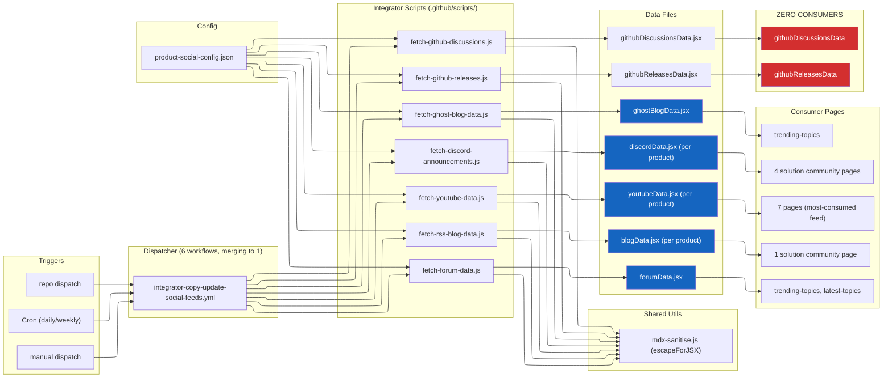
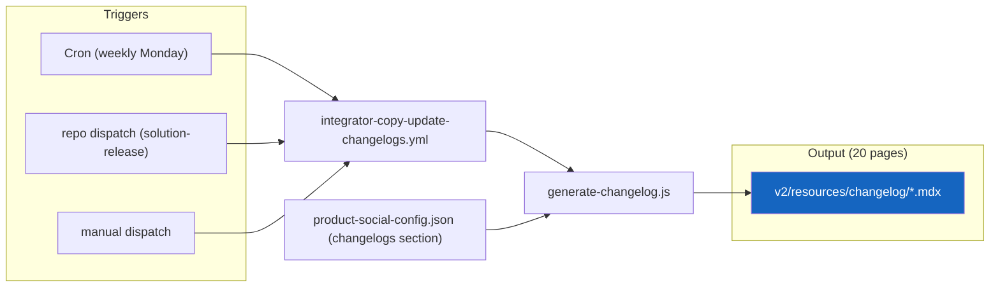
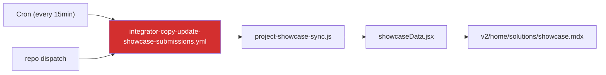
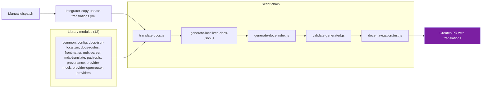
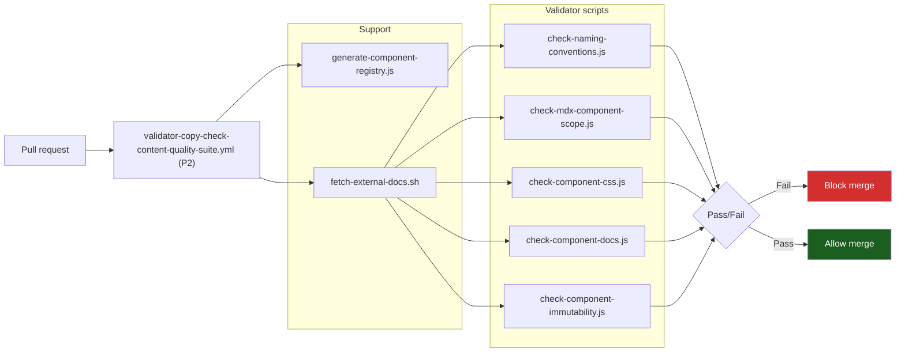
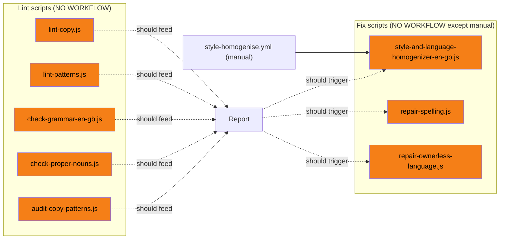

# Concern: Copy

> Pipelines that manage written content users read on pages.
> Status: Reviewing

---

## Pipelines

### 1. Social Feeds

Keeps community pages populated with fresh content from external sources.

**Scripts involved:**

| Script | Location | Type | Governed? | Issues |
|---|---|---|---|---|
| fetch-discord-announcements.js | .github/scripts/ | integrator | Yes (JSDoc) | Not in operations/scripts/ |
| fetch-forum-data.js | .github/scripts/ | integrator | No (@type missing) | Not governed, not in operations/scripts/ |
| fetch-ghost-blog-data.js | .github/scripts/ | integrator | Yes (JSDoc) | Not in operations/scripts/ |
| fetch-github-discussions.js | .github/scripts/ | integrator | Yes (JSDoc) | Not in operations/scripts/. Output has ZERO consumers |
| fetch-github-releases.js | .github/scripts/ | integrator | Yes (JSDoc) | Not in operations/scripts/. Output has ZERO consumers |
| fetch-rss-blog-data.js | .github/scripts/ | integrator | Yes (JSDoc) | Not in operations/scripts/ |
| fetch-youtube-data.js | .github/scripts/ | integrator | No (@type missing) | Not governed, not in operations/scripts/ |
| mdx-sanitise.js | operations/scripts/config/ | utility | Yes | Shared lib, correct location |

**Audit findings:**

| # | Finding | Severity | Type |
|---|---|---|---|
| 1 | 3 workflows missing `permissions: contents: write` (forum, ghost, youtube) | P0 | Bug |
| 2 | All 7 scripts duplicate HTTP client, JSX writer, config loader | P1 | Shared code |
| 3 | githubDiscussionsData + githubReleasesData have ZERO page consumers | P1 | Dead data |
| 4 | 2 scripts missing @type tag (fetch-forum-data, fetch-youtube-data) | P2 | Governance |
| 5 | All 7 scripts in .github/scripts/ not operations/scripts/ | P2 | Placement |
| 6 | No error handling on any workflow | P2 | Gap |
| 7 | No concurrency control | P2 | Gap |
| 8 | youtube workflow has wrong bot identity + inconsistent commit message | P2 | Inconsistency |
| 9 | No verify pair (freshness-monitor is partial) | P2 | Gap |

**Decision:**

---

### 2. Changelogs

Keeps solution changelog pages populated with latest release data.

**Scripts involved:**

| Script | Location | Type | Governed? | Issues |
|---|---|---|---|---|
| generate-changelog.js | .github/scripts/ | integrator | Yes (JSDoc) | Not in operations/scripts/ |

**Audit findings:**

| # | Finding | Severity |
|---|---|---|
| 1 | No concurrency control | P2 |
| 2 | Script in .github/scripts/ not operations/scripts/ | P2 |
| 3 | No verify pair | P2 |

**Decision:**

---

### 3. Showcase

Keeps showcase page populated with community project submissions.

**Scripts involved:**

| Script | Location | Type | Governed? | Issues |
|---|---|---|---|---|
| project-showcase-sync.js | .github/scripts/ | integrator | No (@type missing) | Not governed, not in operations/scripts/, NOT WORKING |

**Audit findings:**

| # | Finding | Severity |
|---|---|---|
| 1 | Pipeline is NOT WORKING | P0 |
| 2 | 15min cron is excessive | P1 |
| 3 | Script not governed | P2 |

**Decision:** Disable. Flag for follow-up.

---

### 4. Translation

Translates pages into other languages via LLM.

**Scripts involved:**

| Script | Location | Type | Governed? | Issues |
|---|---|---|---|---|
| translate-docs.js | operations/scripts/ | automation | Yes | Well-governed, 12 lib modules |
| generate-localized-docs-json.js | operations/scripts/ | automation | Yes | |
| generate-docs-index.js | operations/scripts/ | generator | Yes | Shared with maintenance pipeline |
| validate-generated.js | operations/scripts/ | automation | Yes | |
| 12 lib modules | operations/scripts/.../lib/ | library | N/A | Not standalone scripts |

**Audit findings:**

| # | Finding | Severity |
|---|---|---|
| 1 | PR add-paths hardcodes v2/es,fr,cn but input defaults es,fr,de | P0 |
| 2 | Scripts tagged @type automation, should be @type integrator (D-ACT-07) | P2 |

**Decision:**

---

### 5. Copy Quality Suite (PR gate)

Hard gate that blocks PRs with copy/component issues.

**Scripts involved:**

| Script | Location | Type | Governed? | Issues |
|---|---|---|---|---|
| check-naming-conventions.js | operations/scripts/validators/ | validator | Yes | |
| check-mdx-component-scope.js | operations/scripts/validators/ | validator | Yes | |
| check-component-css.js | operations/scripts/validators/ | validator | Yes | |
| check-component-docs.js | operations/scripts/validators/ | validator | Yes | |
| check-component-immutability.js | operations/scripts/validators/ | validator | Yes | |
| generate-component-registry.js | operations/scripts/generators/ | generator | Yes | Shared with maintenance pipeline |
| fetch-external-docs.sh | operations/scripts/integrators/ | utility | Yes | Shared with health pipelines |

**Audit findings:** None. This is a well-structured pipeline.

**Decision:**

---

### 6. Copy Linting (DISCONNECTED)

Scripts exist for linting and fixing copy patterns, but no PR workflow dispatches them.

**Scripts involved:**

| Script | Location | Type | Governed? | Has workflow? |
|---|---|---|---|---|
| lint-copy.js | operations/scripts/validators/content/copy/ | validator | Yes | NO |
| lint-patterns.js | operations/scripts/validators/content/copy/ | validator | Yes | NO |
| check-grammar-en-gb.js | operations/scripts/validators/content/grammar/ | validator | Yes | NO |
| check-proper-nouns.js | operations/scripts/validators/content/grammar/ | validator | Yes | NO |
| audit-copy-patterns.js | operations/scripts/audits/content/quality/ | audit | Yes | NO |
| style-and-language-homogenizer-en-gb.js | operations/scripts/audits/content/style/ (WRONG) | remediator (tagged audit) | Partial | YES (manual only) |
| repair-spelling.js | operations/scripts/remediators/content/repair/ | remediator | Yes | NO |
| repair-ownerless-language.js | operations/scripts/remediators/content/style/ | remediator | Yes | NO |

**Audit findings:**

| # | Finding | Severity |
|---|---|---|
| 1 | 5 lint scripts have no PR workflow. Completely disconnected from CI | P1 |
| 2 | 2 fix scripts (repair-spelling, repair-ownerless-language) have no workflow | P1 |
| 3 | style-and-language-homogenizer is in audits/ but is a remediator (@mode edit) | P2 |
| 4 | No scan-then-fix chain: lint scripts don't feed into fix scripts | P2 |

**This is a candidate for a new pipeline:** `validator-copy-check-copy-standards.yml` (PR, P3) that runs the lint scripts, and `remediator-brand-repair-en-gb-style.yml` (manual) for fixes. Or a combined scan-then-fix pipeline.

**Decision:**

---

## Summary: Copy Concern

| Pipeline | Actions needed | Scripts | Workflows |
|---|---|---|---|
| Social feeds | Merge 6 workflows to 1 matrix. Fix 3 permission bugs. Extract shared modules. Wire error handling | 7 integrator scripts + 1 shared util | 6 to 1 |
| Changelogs | Add concurrency, migrate script | 1 | 1 |
| Showcase | Disable | 1 | 1 (disabled) |
| Translation | Fix path bug, retag scripts | 5 + 12 lib modules | 1 |
| Quality suite | No changes needed | 5 validators + 2 support | 1 |
| Copy linting | NEW: wire lint scripts to PR workflow. Wire fix scripts to manual/scheduled workflow | 5 validators + 3 remediators | 0 to 1-2 |

**Total copy workflows: currently 10, target 5-6** (social feeds merge, showcase disabled, copy linting adds 1-2 new)
