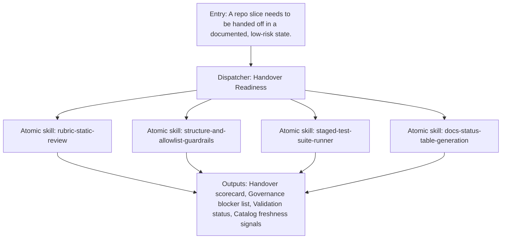

{/*
generated-file-banner: ai-tools-visual-library:v1
Generation Script: operations/scripts/generators/governance/catalogs/generate-ai-tools-visual-library.js
Purpose: AI-tools canonical visual library for workflows and dispatcher actions.
Run when: GitHub workflows, dispatcher definitions, registry coverage, or visual-library contracts change.
Run command: node operations/scripts/generators/governance/catalogs/generate-ai-tools-visual-library.js --write
*/}

<Note>
**Generation Script**: This file is generated from script(s): `operations/scripts/generators/governance/catalogs/generate-ai-tools-visual-library.js`.  
**Purpose**: AI-tools canonical visual library for workflows and dispatcher actions.  
**Run when**: GitHub workflows, dispatcher definitions, registry coverage, or visual-library contracts change.  
**Important**: Do not manually edit this file; run `node operations/scripts/generators/governance/catalogs/generate-ai-tools-visual-library.js --write`.  
</Note>

# Handover Readiness

## Summary

Handover Readiness is a governed dispatcher concept that coordinates 4 child capability surfaces into one named workflow.

## Workflow Intent

Provide a named end-state readiness flow for cleanup and handover work instead of relying on tribal knowledge.

## Child Actions And Skills

- `rubric-static-review`
- `structure-and-allowlist-guardrails`
- `staged-test-suite-runner`
- `docs-status-table-generation`

## Entry Triggers

- A repo slice needs to be handed off in a documented, low-risk state.
- Governance or structure drift needs explicit readiness reporting.

## Required Inputs

- Task intent or shipping goal
- Relevant repo scope
- Known blockers or constraints

## Validation Gates

- Structure and allowlist checks pass.
- Critical catalogs are current.
- Blockers and residual risks are documented.

## Second Pass Assessment

- Cleanup decision: `keep`
- Readiness: `phase-1-design`
- Next move: Bind AI-runtime and governance-readiness workflows to the same handover scorecard contract.

## Dependencies

- skill:rubric-static-review
- skill:structure-and-allowlist-guardrails
- skill:staged-test-suite-runner
- skill:docs-status-table-generation

## Dependants

- agent:Claude
- agent:Codex
- agent:Cursor
- agent:Windsurf

## Mermaid Pipeline

## Downstream Effects

- Feeds repo-cleanup-handover.
- Provides a reusable checklist for handoff threads.

## Risks

- Still depends on multiple governance surfaces outside a single runtime dispatcher.
- Readiness criteria may tighten as consolidation progresses.

## Consolidation Notes

Keep as a dispatcher because handover is a repeated repo-level workflow with clear gates and outputs.

## Cleanup Rationale

- Dispatcher pages are canonical workflow design surfaces and should remain thinner than runtime adapters.
- They exist to reduce chat-only orchestration and make repeated delivery patterns visible.

## Handover Notes

These dispatcher pages are canonical design surfaces now and should later converge with executable adapter entrypoints without duplicating workflow logic.
