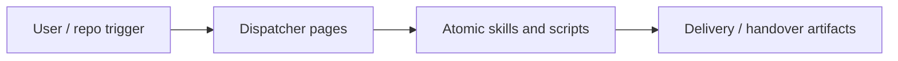

{/*
generated-file-banner: ai-tools-visual-library:v1
Generation Script: operations/scripts/generators/governance/catalogs/generate-ai-tools-visual-library.js
Purpose: AI-tools canonical visual library for workflows and dispatcher actions.
Run when: GitHub workflows, dispatcher definitions, registry coverage, or visual-library contracts change.
Run command: node operations/scripts/generators/governance/catalogs/generate-ai-tools-visual-library.js --write
*/}

<Note>
**Generation Script**: This file is generated from script(s): `operations/scripts/generators/governance/catalogs/generate-ai-tools-visual-library.js`.  
**Purpose**: AI-tools canonical visual library for workflows and dispatcher actions.  
**Run when**: GitHub workflows, dispatcher definitions, registry coverage, or visual-library contracts change.  
**Important**: Do not manually edit this file; run `node operations/scripts/generators/governance/catalogs/generate-ai-tools-visual-library.js --write`.  
</Note>

# Dispatcher Visual Library

Tracks 5 phase-1 dispatcher pages under `ai-tools/registry/dispatchers`.

## Catalog

| Dispatcher | Decision | Readiness | Concern | Child Skills | Declared Outputs |
| --- | --- | --- | --- | --- | --- |
| [Research Review Packet](./research-review-packet.mdx) | `keep` | `phase-1-design` | `research` | 4 | 4 |
| [Review Fix](./review-fix.mdx) | `keep` | `phase-1-design` | `review` | 4 | 4 |
| [Handover Readiness](./handover-readiness.mdx) | `keep` | `phase-1-design` | `repo-ops` | 4 | 4 |
| [Page Ship](./page-ship.mdx) | `keep` | `phase-1-design` | `authoring` | 6 | 4 |
| [Repo Cleanup Handover](./repo-cleanup-handover.mdx) | `keep` | `phase-1-design` | `repo-ops` | 4 | 4 |

## Visual Overview

