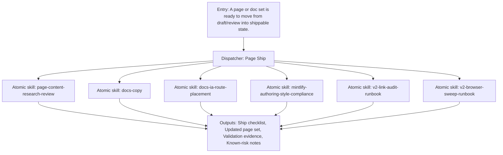

{/*
generated-file-banner: ai-tools-visual-library:v1
Generation Script: operations/scripts/generators/governance/catalogs/generate-ai-tools-visual-library.js
Purpose: AI-tools canonical visual library for workflows and dispatcher actions.
Run when: GitHub workflows, dispatcher definitions, registry coverage, or visual-library contracts change.
Run command: node operations/scripts/generators/governance/catalogs/generate-ai-tools-visual-library.js --write
*/}

<Note>
**Generation Script**: This file is generated from script(s): `operations/scripts/generators/governance/catalogs/generate-ai-tools-visual-library.js`.  
**Purpose**: AI-tools canonical visual library for workflows and dispatcher actions.  
**Run when**: GitHub workflows, dispatcher definitions, registry coverage, or visual-library contracts change.  
**Important**: Do not manually edit this file; run `node operations/scripts/generators/governance/catalogs/generate-ai-tools-visual-library.js --write`.  
</Note>

# Page Ship

## Summary

Page Ship is a governed dispatcher concept that coordinates 6 child capability surfaces into one named workflow.

## Workflow Intent

Make page shipping a first-class governed workflow that can be invoked consistently across AI chats.

## Child Actions And Skills

- `page-content-research-review`
- `docs-copy`
- `docs-ia-route-placement`
- `mintlify-authoring-style-compliance`
- `v2-link-audit-runbook`
- `v2-browser-sweep-runbook`

## Entry Triggers

- A page or doc set is ready to move from draft/review into shippable state.
- A shipping thread needs a standard path from content edits to validation.

## Required Inputs

- Task intent or shipping goal
- Relevant repo scope
- Known blockers or constraints

## Validation Gates

- Content claims reviewed.
- Route placement confirmed.
- Link and browser validation complete.

## Second Pass Assessment

- Cleanup decision: `keep`
- Readiness: `phase-1-design`
- Next move: Use this as the main landing zone for shipping-oriented authoring, validation, and content refresh families.

## Dependencies

- skill:page-content-research-review
- skill:docs-copy
- skill:docs-ia-route-placement
- skill:mintlify-authoring-style-compliance
- skill:v2-link-audit-runbook
- skill:v2-browser-sweep-runbook

## Dependants

- agent:Claude
- agent:Codex
- agent:Cursor
- agent:Windsurf

## Mermaid Pipeline

## Downstream Effects

- Feeds handover-readiness for shipped content.
- Coordinates authoring and validation rather than leaving them disconnected.

## Risks

- Current runtime still spans multiple independent scripts and review steps.
- Shipping criteria vary by page type and route complexity.

## Consolidation Notes

Highest-value dispatcher for delivery work because it directly matches the user’s core shipping process.

## Cleanup Rationale

- Dispatcher pages are canonical workflow design surfaces and should remain thinner than runtime adapters.
- They exist to reduce chat-only orchestration and make repeated delivery patterns visible.

## Handover Notes

These dispatcher pages are canonical design surfaces now and should later converge with executable adapter entrypoints without duplicating workflow logic.
