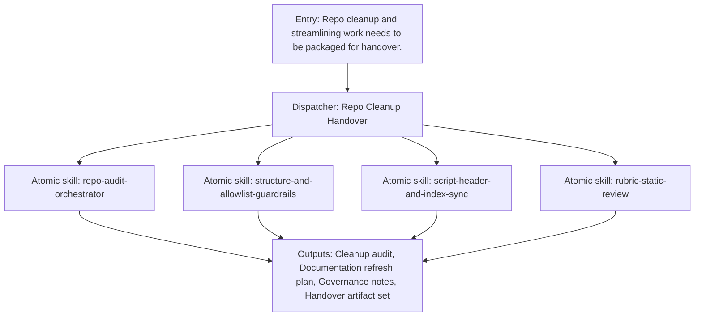

{/*
generated-file-banner: ai-tools-visual-library:v1
Generation Script: operations/scripts/generators/governance/catalogs/generate-ai-tools-visual-library.js
Purpose: AI-tools canonical visual library for workflows and dispatcher actions.
Run when: GitHub workflows, dispatcher definitions, registry coverage, or visual-library contracts change.
Run command: node operations/scripts/generators/governance/catalogs/generate-ai-tools-visual-library.js --write
*/}

<Note>
**Generation Script**: This file is generated from script(s): `operations/scripts/generators/governance/catalogs/generate-ai-tools-visual-library.js`.  
**Purpose**: AI-tools canonical visual library for workflows and dispatcher actions.  
**Run when**: GitHub workflows, dispatcher definitions, registry coverage, or visual-library contracts change.  
**Important**: Do not manually edit this file; run `node operations/scripts/generators/governance/catalogs/generate-ai-tools-visual-library.js --write`.  
</Note>

# Repo Cleanup Handover

## Summary

Repo Cleanup Handover is a governed dispatcher concept that coordinates 4 child capability surfaces into one named workflow.

## Workflow Intent

Orchestrate cleanup, documentation, and governance packaging into one repeatable handover workflow.

## Child Actions And Skills

- `repo-audit-orchestrator`
- `structure-and-allowlist-guardrails`
- `script-header-and-index-sync`
- `rubric-static-review`

## Entry Triggers

- Repo cleanup and streamlining work needs to be packaged for handover.
- Multiple governance or structure fixes need one orchestrated pathway.

## Required Inputs

- Task intent or shipping goal
- Relevant repo scope
- Known blockers or constraints

## Validation Gates

- Root-cause fixes documented.
- Indexes and headers synchronized.
- Residual structure risks recorded.

## Second Pass Assessment

- Cleanup decision: `keep`
- Readiness: `phase-1-design`
- Next move: Use this as the consolidation target for governance-repair, retention, and repo-cleanup workflows.

## Dependencies

- skill:repo-audit-orchestrator
- skill:structure-and-allowlist-guardrails
- skill:script-header-and-index-sync
- skill:rubric-static-review

## Dependants

- agent:Claude
- agent:Codex
- agent:Cursor
- agent:Windsurf

## Mermaid Pipeline

## Downstream Effects

- Provides the repo-ops companion to page-ship.
- Supports final delivery and maintenance transitions.

## Risks

- Still partly conceptual until more repo-ops skills are normalized.
- Some cleanup tasks are broader than the current atomic-skill inventory.

## Consolidation Notes

Keep as a dispatcher because cleanup and handover repeatedly span scripts, governance docs, and human review.

## Cleanup Rationale

- Dispatcher pages are canonical workflow design surfaces and should remain thinner than runtime adapters.
- They exist to reduce chat-only orchestration and make repeated delivery patterns visible.

## Handover Notes

These dispatcher pages are canonical design surfaces now and should later converge with executable adapter entrypoints without duplicating workflow logic.
