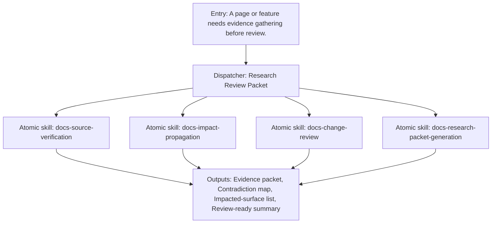

{/*
generated-file-banner: ai-tools-visual-library:v1
Generation Script: operations/scripts/generators/governance/catalogs/generate-ai-tools-visual-library.js
Purpose: AI-tools canonical visual library for workflows and dispatcher actions.
Run when: GitHub workflows, dispatcher definitions, registry coverage, or visual-library contracts change.
Run command: node operations/scripts/generators/governance/catalogs/generate-ai-tools-visual-library.js --write
*/}

<Note>
**Generation Script**: This file is generated from script(s): `operations/scripts/generators/governance/catalogs/generate-ai-tools-visual-library.js`.  
**Purpose**: AI-tools canonical visual library for workflows and dispatcher actions.  
**Run when**: GitHub workflows, dispatcher definitions, registry coverage, or visual-library contracts change.  
**Important**: Do not manually edit this file; run `node operations/scripts/generators/governance/catalogs/generate-ai-tools-visual-library.js --write`.  
</Note>

# Research Review Packet

## Summary

Research Review Packet is a governed dispatcher concept that coordinates 4 child capability surfaces into one named workflow.

## Workflow Intent

Create a governed research packet that turns scattered source-checking into a reusable review input.

## Child Actions And Skills

- `docs-source-verification`
- `docs-impact-propagation`
- `docs-change-review`
- `docs-research-packet-generation`

## Entry Triggers

- A page or feature needs evidence gathering before review.
- A contributor wants source verification before changes ship.

## Required Inputs

- Task intent or shipping goal
- Relevant repo scope
- Known blockers or constraints

## Validation Gates

- Primary-source evidence captured.
- Impact propagation reviewed.
- Unsupported claims downgraded or removed.

## Second Pass Assessment

- Cleanup decision: `keep`
- Readiness: `phase-1-design`
- Next move: Map issue-intake and research-heavy workflows into one explicit dispatcher contract.

## Dependencies

- skill:docs-source-verification
- skill:docs-impact-propagation
- skill:docs-change-review
- skill:docs-research-packet-generation

## Dependants

- agent:Claude
- agent:Codex
- agent:Cursor
- agent:Windsurf

## Mermaid Pipeline

## Downstream Effects

- Feeds review-fix and page-ship workflows.
- Produces evidence for handover and audit trails.

## Risks

- Still a design-time dispatcher rather than a fully executable runtime entrypoint.
- Depends on current skill boundaries remaining accurate during consolidation.

## Consolidation Notes

Keep as a named dispatcher because the repo already performs this work manually across multiple adjacent skills.

## Cleanup Rationale

- Dispatcher pages are canonical workflow design surfaces and should remain thinner than runtime adapters.
- They exist to reduce chat-only orchestration and make repeated delivery patterns visible.

## Handover Notes

These dispatcher pages are canonical design surfaces now and should later converge with executable adapter entrypoints without duplicating workflow logic.
