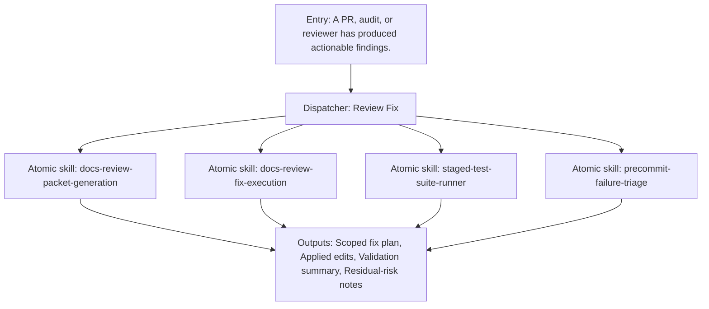

{/*
generated-file-banner: ai-tools-visual-library:v1
Generation Script: operations/scripts/generators/governance/catalogs/generate-ai-tools-visual-library.js
Purpose: AI-tools canonical visual library for workflows and dispatcher actions.
Run when: GitHub workflows, dispatcher definitions, registry coverage, or visual-library contracts change.
Run command: node operations/scripts/generators/governance/catalogs/generate-ai-tools-visual-library.js --write
*/}

<Note>
**Generation Script**: This file is generated from script(s): `operations/scripts/generators/governance/catalogs/generate-ai-tools-visual-library.js`.  
**Purpose**: AI-tools canonical visual library for workflows and dispatcher actions.  
**Run when**: GitHub workflows, dispatcher definitions, registry coverage, or visual-library contracts change.  
**Important**: Do not manually edit this file; run `node operations/scripts/generators/governance/catalogs/generate-ai-tools-visual-library.js --write`.  
</Note>

# Review Fix

## Summary

Review Fix is a governed dispatcher concept that coordinates 4 child capability surfaces into one named workflow.

## Workflow Intent

Turn reviews and failing checks into a disciplined repair workflow instead of ad hoc fix loops.

## Child Actions And Skills

- `docs-review-packet-generation`
- `docs-review-fix-execution`
- `staged-test-suite-runner`
- `precommit-failure-triage`

## Entry Triggers

- A PR, audit, or reviewer has produced actionable findings.
- A content-quality or workflow gate needs guided remediation.

## Required Inputs

- Task intent or shipping goal
- Relevant repo scope
- Known blockers or constraints

## Validation Gates

- Findings triaged by severity.
- Relevant tests or validators rerun.
- Unresolved issues called out explicitly.

## Dependencies

- skill:docs-review-packet-generation
- skill:docs-review-fix-execution
- skill:staged-test-suite-runner
- skill:precommit-failure-triage

## Dependants

- agent:Claude
- agent:Codex
- agent:Cursor
- agent:Windsurf

## Mermaid Pipeline

## Downstream Effects

- Feeds page-ship readiness.
- Reduces repeated triage work in shipping threads.

## Risks

- Different review surfaces still use different evidence formats.
- Not every workflow failure maps cleanly to one existing atomic skill yet.

## Consolidation Notes

Strong dispatcher candidate because the repo already couples review interpretation with validation reruns.

## Handover Notes

These dispatcher pages are canonical design surfaces now and should later converge with executable adapter entrypoints without duplicating workflow logic.
