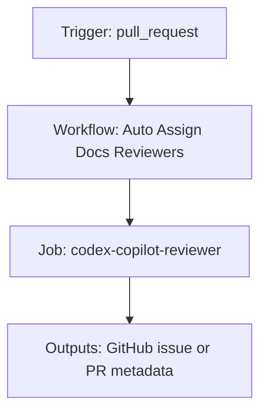

{/*
generated-file-banner: ai-tools-visual-library:v1
Generation Script: operations/scripts/generators/governance/catalogs/generate-ai-tools-visual-library.js
Purpose: AI-tools canonical visual library for workflows and dispatcher actions.
Run when: GitHub workflows, dispatcher definitions, registry coverage, or visual-library contracts change.
Run command: node operations/scripts/generators/governance/catalogs/generate-ai-tools-visual-library.js --write
*/}

<Note>
**Generation Script**: This file is generated from script(s): `operations/scripts/generators/governance/catalogs/generate-ai-tools-visual-library.js`.  
**Purpose**: AI-tools canonical visual library for workflows and dispatcher actions.  
**Run when**: GitHub workflows, dispatcher definitions, registry coverage, or visual-library contracts change.  
**Important**: Do not manually edit this file; run `node operations/scripts/generators/governance/catalogs/generate-ai-tools-visual-library.js --write`.  
</Note>

# Auto Assign Docs Reviewers

## Summary

Auto Assign Docs Reviewers runs on pull_request and primarily produces github issue or pr metadata.

## Why It Exists

Govern the `.github/workflows/auto-assign-docs-reviewers.yml` workflow as a human-readable, visually explorable source-of-truth page inside `ai-tools/registry/workflows`.

## Triggers

- pull_request: types=opened, reopened, ready_for_review, edited, labeled

## Jobs

| Job ID | Name | Runs On | Needs | Step Count |
| --- | --- | --- | --- | --- |
| `codex-copilot-reviewer` | codex-copilot-reviewer | `ubuntu-latest` | none | 5 |

### codex-copilot-reviewer

- `Gate Codex PR eligibility` | uses actions/github-script@v7
- `Request Copilot reviewer (best effort)` | uses actions/github-script@v7
- `Fallback assign Copilot` | runs `set +e`
- `Add fallback marker comment` | uses actions/github-script@v7
- `Skip reason` | runs `echo "Skipping reviewer automation:"`

## Inputs

- No explicit workflow inputs declared.

## Outputs

- GitHub issue or PR metadata

## Dependencies

- action:actions/github-script@v7

## Dependants

- dispatcher:review-fix

## Mermaid Pipeline

## Frailty And Risk

- Current heuristic risk level is `high`; no exceptional frailty markers were detected in the file scan.

## Consolidation Notes

Dispatcher suggestion: `review-fix`. This is a governance hint for consolidation review, not a runtime rewrite instruction.

## Handover Notes

Use this page as the human-facing workflow brief during audits, cleanup, and handover. Promote any missing operational knowledge back into the canonical page rather than leaving it in chat.
