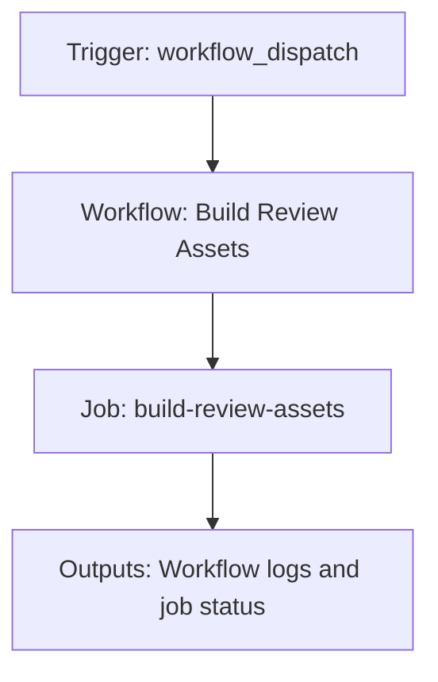

{/*
generated-file-banner: ai-tools-visual-library:v1
Generation Script: operations/scripts/generators/governance/catalogs/generate-ai-tools-visual-library.js
Purpose: AI-tools canonical visual library for workflows and dispatcher actions.
Run when: GitHub workflows, dispatcher definitions, registry coverage, or visual-library contracts change.
Run command: node operations/scripts/generators/governance/catalogs/generate-ai-tools-visual-library.js --write
*/}

<Note>
**Generation Script**: This file is generated from script(s): `operations/scripts/generators/governance/catalogs/generate-ai-tools-visual-library.js`.  
**Purpose**: AI-tools canonical visual library for workflows and dispatcher actions.  
**Run when**: GitHub workflows, dispatcher definitions, registry coverage, or visual-library contracts change.  
**Important**: Do not manually edit this file; run `node operations/scripts/generators/governance/catalogs/generate-ai-tools-visual-library.js --write`.  
</Note>

# Build Review Assets

## Summary

Build Review Assets runs on workflow_dispatch and primarily produces workflow logs and job status.

## Why It Exists

Govern the `.github/workflows/build-review-assets.yml` workflow as a human-readable, visually explorable source-of-truth page inside `ai-tools/registry/workflows`.

## Triggers

- workflow_dispatch: default event configuration

## Jobs

| Job ID | Name | Runs On | Needs | Step Count |
| --- | --- | --- | --- | --- |
| `build-review-assets` | build-review-assets | `ubuntu-latest` | none | 1 |

### build-review-assets

- `Placeholder` | runs `echo "Not yet implemented - see build-review-assets.yml in backlog"`

## Inputs

- No explicit workflow inputs declared.

## Second Pass Assessment

- Workflow family: `placeholder-backlog`
- Usage status: `placeholder`
- Cleanup decision: `retire`
- Process fit: `legacy-or-unclear`
- Consolidation target: `none`
- Recommended engineering action: Retire the placeholder workflow file unless an implemented review-assets pipeline is revived with a real script contract.

## Outputs

- Workflow logs and job status

## Dependencies

- No direct dependencies identified in current repo scan.

## Dependants

- dispatcher:review-fix

## Mermaid Pipeline

## Frailty And Risk

- No local repo dependencies were detected automatically; verify whether this is truly standalone.

## Consolidation Notes

Dispatcher suggestion: `review-fix`. Second-pass target: `none`. This is a governance recommendation, not an automatic rewrite instruction.

## Cleanup Rationale

- Keeping placeholder workflow files at the top level adds noise without delivery value.
- This workflow is explicitly marked as not yet implemented.

## Handover Notes

Use this page as the human-facing workflow brief during audits, cleanup, and handover. Promote any missing operational knowledge back into the canonical page rather than leaving it in chat.
