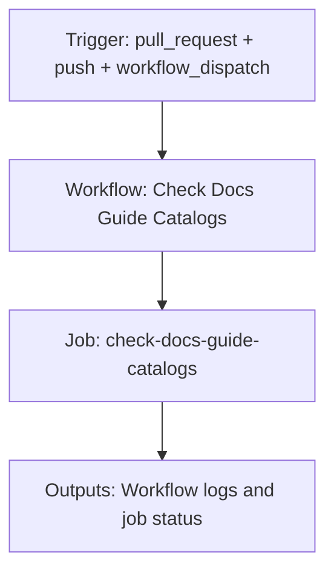

{/*
generated-file-banner: ai-tools-visual-library:v1
Generation Script: operations/scripts/generators/governance/catalogs/generate-ai-tools-visual-library.js
Purpose: AI-tools canonical visual library for workflows and dispatcher actions.
Run when: GitHub workflows, dispatcher definitions, registry coverage, or visual-library contracts change.
Run command: node operations/scripts/generators/governance/catalogs/generate-ai-tools-visual-library.js --write
*/}

<Note>
**Generation Script**: This file is generated from script(s): `operations/scripts/generators/governance/catalogs/generate-ai-tools-visual-library.js`.  
**Purpose**: AI-tools canonical visual library for workflows and dispatcher actions.  
**Run when**: GitHub workflows, dispatcher definitions, registry coverage, or visual-library contracts change.  
**Important**: Do not manually edit this file; run `node operations/scripts/generators/governance/catalogs/generate-ai-tools-visual-library.js --write`.  
</Note>

# Check Docs Guide Catalogs

## Summary

Check Docs Guide Catalogs runs on pull_request, push, workflow_dispatch and primarily produces workflow logs and job status.

## Why It Exists

Govern the `.github/workflows/check-docs-guide-catalogs.yml` workflow as a human-readable, visually explorable source-of-truth page inside `ai-tools/registry/workflows`.

## Triggers

- pull_request: branches=docs-v2
- push: branches=docs-v2
- workflow_dispatch: default event configuration

## Jobs

| Job ID | Name | Runs On | Needs | Step Count |
| --- | --- | --- | --- | --- |
| `check-docs-guide-catalogs` | check-docs-guide-catalogs | `ubuntu-latest` | none | 10 |

### check-docs-guide-catalogs

- `Checkout repository` | uses actions/checkout@v4
- `Setup Node.js` | uses actions/setup-node@v4
- `Install tooling dependencies` | runs `npm --prefix tools ci`
- `Verify component registry is current` | runs `node operations/scripts/generators/components/library/generate-component-registry.js --validate-only`
- `Verify component docs pages are current` | runs `node operations/scripts/generators/components/documentation/generate-component-docs.js --check`
- `Check component library health (stale imports, sync, coverage)` | runs `node operations/scripts/validators/components/library/check-component-health.js --check`
- `Check component example files (stale imports in examples)` | runs `node operations/scripts/generators/components/library/generate-component-examples.js --check`
- `Verify workflows and templates catalogs are current` | runs `node operations/scripts/generators/governance/catalogs/generate-docs-guide-indexes.js --check`
- `Verify pages catalog is current` | runs `node operations/scripts/generators/governance/catalogs/generate-docs-guide-pages-index.js --check`
- `Check frontmatter taxonomy on changed docs pages` | runs `CHANGED=$(git diff --name-only "origin/${{ github.base_ref }}...HEAD" | grep -E '^(v2|docs-guide)/.*\.mdx$' | tr '\n'...`

## Inputs

- No explicit workflow inputs declared.

## Second Pass Assessment

- Workflow family: `docs-catalog-governance`
- Usage status: `active`
- Cleanup decision: `merge`
- Process fit: `core-shipping`
- Consolidation target: `future:docs-catalog-governance-workflow`
- Recommended engineering action: Merge this workflow with its sibling family into `future:docs-catalog-governance-workflow` so one workflow owns both check and write modes.

## Outputs

- Workflow logs and job status

## Dependencies

- action:actions/checkout@v4
- action:actions/setup-node@v4
- operations/scripts/generators/components/documentation/generate-component-docs.js
- operations/scripts/generators/components/library/generate-component-examples.js
- operations/scripts/generators/components/library/generate-component-registry.js
- operations/scripts/generators/governance/catalogs/generate-docs-guide-indexes.js
- operations/scripts/generators/governance/catalogs/generate-docs-guide-pages-index.js
- operations/scripts/validators/components/library/check-component-health.js
- operations/tests/unit/quality.test.js

## Dependants

- dispatcher:review-fix

## Mermaid Pipeline

## Frailty And Risk

- Current heuristic risk level is `low`; no exceptional frailty markers were detected in the file scan.

## Consolidation Notes

Dispatcher suggestion: `review-fix`. Second-pass target: `future:docs-catalog-governance-workflow`. This is a governance recommendation, not an automatic rewrite instruction.

## Cleanup Rationale

- This family already has obvious check/generate pairings that likely want one governed workflow with mode flags.

## Handover Notes

Use this page as the human-facing workflow brief during audits, cleanup, and handover. Promote any missing operational knowledge back into the canonical page rather than leaving it in chat.
