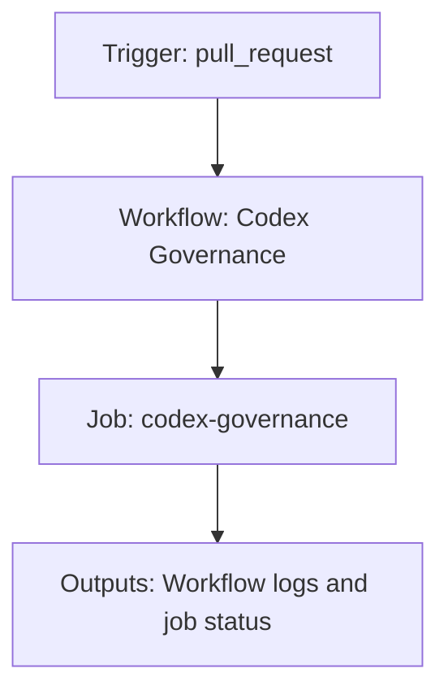

{/*
generated-file-banner: ai-tools-visual-library:v1
Generation Script: operations/scripts/generators/governance/catalogs/generate-ai-tools-visual-library.js
Purpose: AI-tools canonical visual library for workflows and dispatcher actions.
Run when: GitHub workflows, dispatcher definitions, registry coverage, or visual-library contracts change.
Run command: node operations/scripts/generators/governance/catalogs/generate-ai-tools-visual-library.js --write
*/}

<Note>
**Generation Script**: This file is generated from script(s): `operations/scripts/generators/governance/catalogs/generate-ai-tools-visual-library.js`.  
**Purpose**: AI-tools canonical visual library for workflows and dispatcher actions.  
**Run when**: GitHub workflows, dispatcher definitions, registry coverage, or visual-library contracts change.  
**Important**: Do not manually edit this file; run `node operations/scripts/generators/governance/catalogs/generate-ai-tools-visual-library.js --write`.  
</Note>

# Codex Governance

## Summary

Codex Governance runs on pull_request and primarily produces workflow logs and job status.

## Why It Exists

Govern the `.github/workflows/codex-governance.yml` workflow as a human-readable, visually explorable source-of-truth page inside `ai-tools/registry/workflows`.

## Triggers

- pull_request: branches=docs-v2

## Jobs

| Job ID | Name | Runs On | Needs | Step Count |
| --- | --- | --- | --- | --- |
| `codex-governance` | codex-governance | `ubuntu-latest` | none | 6 |

### codex-governance

- `Checkout` | uses actions/checkout@v4
- `Fetch base ref` | runs `git fetch --no-tags --depth=1 origin ${{ github.base_ref }}`
- `Set up Node.js` | uses actions/setup-node@v4
- `Install dependencies (tools)` | runs `npm install`
- `Validate codex task contract + issue readiness + PR body` | runs `node operations/scripts/validators/governance/compliance/validate-codex-task-contract.js \`
- `Check codex PR overlap` | runs `node operations/scripts/check-codex-pr-overlap.js \`

## Inputs

- No explicit workflow inputs declared.

## Second Pass Assessment

- Workflow family: `governance-maintenance`
- Usage status: `active`
- Cleanup decision: `keep`
- Process fit: `handover-support`
- Consolidation target: `dispatcher:handover-readiness`
- Recommended engineering action: Keep this as a standalone workflow because its trigger contract and ownership boundary are distinct enough to justify a top-level entrypoint.

## Outputs

- Workflow logs and job status

## Dependencies

- action:actions/checkout@v4
- action:actions/setup-node@v4
- operations/scripts/check-codex-pr-overlap.js
- operations/scripts/validators/governance/compliance/validate-codex-task-contract.js
- secret:GITHUB_TOKEN

## Dependants

- dispatcher:handover-readiness

## Mermaid Pipeline

## Frailty And Risk

- Depends on secrets, so runtime behavior cannot be fully reasoned about from repo state alone.

## Consolidation Notes

Dispatcher suggestion: `handover-readiness`. Second-pass target: `dispatcher:handover-readiness`. This is a governance recommendation, not an automatic rewrite instruction.

## Cleanup Rationale

- The current trigger contract looks distinct enough to justify keeping a dedicated workflow entrypoint.

## Handover Notes

Use this page as the human-facing workflow brief during audits, cleanup, and handover. Promote any missing operational knowledge back into the canonical page rather than leaving it in chat.
