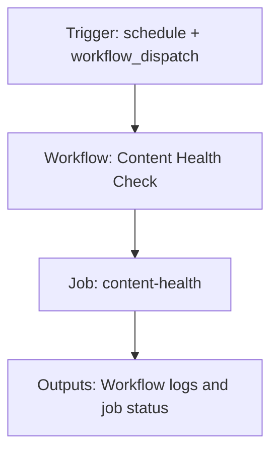

{/*
generated-file-banner: ai-tools-visual-library:v1
Generation Script: operations/scripts/generators/governance/catalogs/generate-ai-tools-visual-library.js
Purpose: AI-tools canonical visual library for workflows and dispatcher actions.
Run when: GitHub workflows, dispatcher definitions, registry coverage, or visual-library contracts change.
Run command: node operations/scripts/generators/governance/catalogs/generate-ai-tools-visual-library.js --write
*/}

<Note>
**Generation Script**: This file is generated from script(s): `operations/scripts/generators/governance/catalogs/generate-ai-tools-visual-library.js`.  
**Purpose**: AI-tools canonical visual library for workflows and dispatcher actions.  
**Run when**: GitHub workflows, dispatcher definitions, registry coverage, or visual-library contracts change.  
**Important**: Do not manually edit this file; run `node operations/scripts/generators/governance/catalogs/generate-ai-tools-visual-library.js --write`.  
</Note>

# Content Health Check

## Summary

Content Health Check runs on schedule, workflow_dispatch and primarily produces workflow logs and job status.

## Why It Exists

Govern the `.github/workflows/content-health.yml` workflow as a human-readable, visually explorable source-of-truth page inside `ai-tools/registry/workflows`.

## Triggers

- schedule: default event configuration
- workflow_dispatch: default event configuration

## Jobs

| Job ID | Name | Runs On | Needs | Step Count |
| --- | --- | --- | --- | --- |
| `content-health` | content-health | `ubuntu-latest` | none | 9 |

### content-health

- `step-1` | uses actions/checkout@v4
- `step-2` | uses actions/setup-node@v4
- `step-3` | runs `cd tools && npm ci`
- `Content quality audit` | runs `node operations/scripts/docs-quality-and-freshness-audit.js --scope full`
- `Component usage audit` | runs `node operations/scripts/audit-component-usage.js`
- `Component registry validation` | runs `node operations/scripts/generators/components/library/generate-component-registry.js --validate-only`
- `Component usage drift check` | runs `node operations/scripts/audits/components/library/scan-component-imports.js --verify`
- `Component metadata drift check` | runs `node operations/scripts/remediators/components/library/repair-component-metadata.js --dry-run`
- `Component layout governance` | runs `node operations/scripts/validators/components/library/component-layout-governance.js`

## Inputs

- No explicit workflow inputs declared.

## Outputs

- Workflow logs and job status

## Dependencies

- action:actions/checkout@v4
- action:actions/setup-node@v4
- operations/scripts/audit-component-usage.js
- operations/scripts/audits/components/library/scan-component-imports.js
- operations/scripts/docs-quality-and-freshness-audit.js
- operations/scripts/generators/components/library/generate-component-registry.js
- operations/scripts/remediators/components/library/repair-component-metadata.js
- operations/scripts/validators/components/library/component-layout-governance.js

## Dependants

- dispatcher:review-fix

## Mermaid Pipeline

## Frailty And Risk

- Contains advisory steps with `continue-on-error`, so failures may be softened rather than fully blocking.
- Scheduled execution can hide drift until the next cron window.

## Consolidation Notes

Dispatcher suggestion: `review-fix`. This is a governance hint for consolidation review, not a runtime rewrite instruction.

## Handover Notes

Use this page as the human-facing workflow brief during audits, cleanup, and handover. Promote any missing operational knowledge back into the canonical page rather than leaving it in chat.
