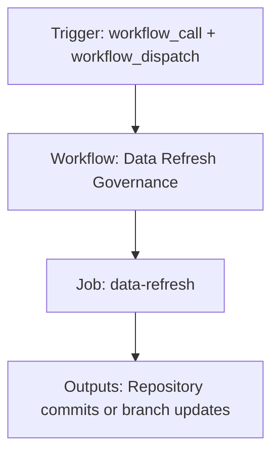

{/*
generated-file-banner: ai-tools-visual-library:v1
Generation Script: operations/scripts/generators/governance/catalogs/generate-ai-tools-visual-library.js
Purpose: AI-tools canonical visual library for workflows and dispatcher actions.
Run when: GitHub workflows, dispatcher definitions, registry coverage, or visual-library contracts change.
Run command: node operations/scripts/generators/governance/catalogs/generate-ai-tools-visual-library.js --write
*/}

<Note>
**Generation Script**: This file is generated from script(s): `operations/scripts/generators/governance/catalogs/generate-ai-tools-visual-library.js`.  
**Purpose**: AI-tools canonical visual library for workflows and dispatcher actions.  
**Run when**: GitHub workflows, dispatcher definitions, registry coverage, or visual-library contracts change.  
**Important**: Do not manually edit this file; run `node operations/scripts/generators/governance/catalogs/generate-ai-tools-visual-library.js --write`.  
</Note>

# Data Refresh Governance

## Summary

Data Refresh Governance runs on workflow_call, workflow_dispatch and primarily produces repository commits or branch updates.

## Why It Exists

Govern the `.github/workflows/data-refresh-governance.yml` workflow as a human-readable, visually explorable source-of-truth page inside `ai-tools/registry/workflows`.

## Triggers

- workflow_call: configured in workflow file
- workflow_dispatch: configured in workflow file

## Jobs

| Job ID | Name | Runs On | Needs | Step Count |
| --- | --- | --- | --- | --- |
| `data-refresh` | data-refresh | `ubuntu-latest` | none | 7 |

### data-refresh

- `Checkout repository` | uses actions/checkout@v4
- `Resolve target branch` | runs `if [ "${{ inputs.use_test_branch }}" = "true" ]; then`
- `Setup Node.js` | uses actions/setup-node@v4
- `Run selected refresh mode` | runs `case "${{ inputs.mode }}" in`
- `Read updated release version` | runs `VERSION=$(grep -oP 'latestVersion = "\K[^"]+' snippets/data/globals/latestRelease.jsx || echo "")`
- `Check for generated changes` | runs `case "${{ inputs.mode }}" in`
- `Commit and push if changed` | runs `git config user.name "github-actions[bot]"`

## Inputs

- workflow_call:mode (required)
- workflow_call:use_test_branch (optional)
- workflow_call:version (optional)
- workflow_dispatch:mode (required)
- workflow_dispatch:use_test_branch (optional)
- workflow_dispatch:version (optional)

## Second Pass Assessment

- Workflow family: `data-refresh`
- Usage status: `active`
- Cleanup decision: `keep`
- Process fit: `core-shipping`
- Consolidation target: `data-refresh-governance`
- Recommended engineering action: Keep this as the canonical reusable workflow for the data-refresh family and collapse future scripted refresh changes into this file instead of duplicating logic.

## Outputs

- Repository commits or branch updates

## Dependencies

- .github/scripts/fetch-discord-announcements.js
- .github/scripts/fetch-forum-data.js
- .github/scripts/fetch-ghost-blog-data.js
- .github/scripts/fetch-github-discussions.js
- .github/scripts/fetch-github-releases.js
- .github/scripts/fetch-rss-blog-data.js
- .github/scripts/fetch-youtube-data.js
- .github/scripts/update-livepeer-release.js
- action:actions/checkout@v4
- action:actions/setup-node@v4
- secret:DISCORD_BOT_TOKEN
- secret:GITHUB_TOKEN
- secret:YOUTUBE_API_KEY
- snippets/data/globals/latestRelease.jsx
- snippets/data/social-feed-solutions
- snippets/data/social-feed-solutions/
- snippets/data/social-feeds/discordAnnouncementsData.jsx
- snippets/data/social-feeds/forumData.jsx
- snippets/data/social-feeds/ghostBlogData.jsx
- snippets/data/social-feeds/youtubeData.jsx

## Dependants

- dispatcher:review-fix
- workflow:.github/workflows/update-discord-data.yml
- workflow:.github/workflows/update-forum-data.yml
- workflow:.github/workflows/update-ghost-blog-data.yml
- workflow:.github/workflows/update-github-data.yml
- workflow:.github/workflows/update-livepeer-release.yml
- workflow:.github/workflows/update-rss-blog-data.yml
- workflow:.github/workflows/update-youtube-data.yml

## Mermaid Pipeline

## Frailty And Risk

- Mutates repository state from CI, which raises coordination and safety risk.
- Depends on secrets, so runtime behavior cannot be fully reasoned about from repo state alone.

## Consolidation Notes

Dispatcher suggestion: `review-fix`. Second-pass target: `data-refresh-governance`. This is a governance recommendation, not an automatic rewrite instruction.

## Cleanup Rationale

- Legacy family members should remain thin wrappers only until they can be retired safely.
- The current trigger contract looks distinct enough to justify keeping a dedicated workflow entrypoint.
- This belongs to a repeating data-refresh pattern and should not stay as an uncoordinated top-level workflow forever.
- This is the consolidated reusable source for the scripted data-refresh family.

## Handover Notes

Use this page as the human-facing workflow brief during audits, cleanup, and handover. Promote any missing operational knowledge back into the canonical page rather than leaving it in chat.
