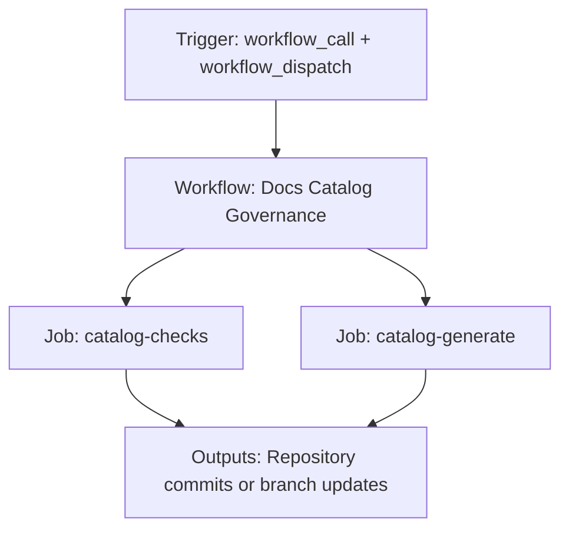

{/*
generated-file-banner: ai-tools-visual-library:v1
Generation Script: operations/scripts/generators/governance/catalogs/generate-ai-tools-visual-library.js
Purpose: AI-tools canonical visual library for workflows and dispatcher actions.
Run when: GitHub workflows, dispatcher definitions, registry coverage, or visual-library contracts change.
Run command: node operations/scripts/generators/governance/catalogs/generate-ai-tools-visual-library.js --write
*/}

<Note>
**Generation Script**: This file is generated from script(s): `operations/scripts/generators/governance/catalogs/generate-ai-tools-visual-library.js`.  
**Purpose**: AI-tools canonical visual library for workflows and dispatcher actions.  
**Run when**: GitHub workflows, dispatcher definitions, registry coverage, or visual-library contracts change.  
**Important**: Do not manually edit this file; run `node operations/scripts/generators/governance/catalogs/generate-ai-tools-visual-library.js --write`.  
</Note>

# Docs Catalog Governance

## Summary

Docs Catalog Governance runs on workflow_call, workflow_dispatch and primarily produces repository commits or branch updates.

## Why It Exists

Govern the `.github/workflows/docs-catalog-governance.yml` workflow as a human-readable, visually explorable source-of-truth page inside `ai-tools/registry/workflows`.

## Triggers

- workflow_call: configured in workflow file
- workflow_dispatch: configured in workflow file

## Jobs

| Job ID | Name | Runs On | Needs | Step Count |
| --- | --- | --- | --- | --- |
| `catalog-checks` | catalog-checks | `ubuntu-latest` | none | 6 |
| `catalog-generate` | catalog-generate | `ubuntu-latest` | none | 7 |

### catalog-checks

- `Checkout repository` | uses actions/checkout@v4
- `Fetch pull request base ref` | runs `git fetch --no-tags --depth=1 origin "${{ inputs.base_ref }}"`
- `Setup Node.js` | uses actions/setup-node@v4
- `Install tooling dependencies` | runs `npm --prefix tools ci`
- `Run selected check mode` | runs `case "${{ inputs.mode }}" in`
- `Check frontmatter taxonomy on changed docs pages` | runs `CHANGED=$(git diff --name-only "origin/${{ inputs.base_ref }}...HEAD" | grep -E '^(v2|docs-guide)/.*\.mdx$' | tr '\n'...`

### catalog-generate

- `Checkout repository` | uses actions/checkout@v4
- `Resolve target branch` | runs `if [ "${{ inputs.use_test_branch }}" = "true" ]; then`
- `Setup Node.js` | uses actions/setup-node@v4
- `Install tooling dependencies` | runs `npm install`
- `Run selected generate mode` | runs `case "${{ inputs.mode }}" in`
- `Check for generated changes` | runs `case "${{ inputs.mode }}" in`
- `Commit and push if changed` | runs `git config user.name "GitHub Actions Bot"`

## Inputs

- workflow_call:base_ref (optional)
- workflow_call:mode (required)
- workflow_call:run_frontmatter_check (optional)
- workflow_call:use_test_branch (optional)
- workflow_dispatch:mode (required)
- workflow_dispatch:use_test_branch (optional)

## Second Pass Assessment

- Workflow family: `docs-catalog-governance`
- Usage status: `active`
- Cleanup decision: `keep`
- Process fit: `core-shipping`
- Consolidation target: `docs-catalog-governance`
- Recommended engineering action: Keep this as the canonical reusable workflow for the docs-catalog-governance family and collapse future changes into this file instead of duplicating logic.

## Outputs

- Repository commits or branch updates

## Dependencies

- action:actions/checkout@v4
- action:actions/setup-node@v4
- docs-guide/catalog/pages-catalog.mdx
- docs-guide/catalog/templates-catalog.mdx
- docs-guide/catalog/workflows-catalog.mdx
- docs-guide/config/component-registry-schema.json
- docs-guide/config/component-registry.json
- operations/scripts/generators/components/documentation/generate-component-docs.js
- operations/scripts/generators/components/library/generate-component-examples.js
- operations/scripts/generators/components/library/generate-component-registry.js
- operations/scripts/generators/content/catalogs/generate-docs-index.js
- operations/scripts/generators/governance/catalogs/generate-docs-guide-indexes.js
- operations/scripts/generators/governance/catalogs/generate-docs-guide-pages-index.js
- operations/scripts/validators/components/library/check-component-health.js
- operations/tests/unit/quality.test.js
- secret:GITHUB_TOKEN

## Dependants

- dispatcher:review-fix
- workflow:.github/workflows/check-docs-guide-catalogs.yml
- workflow:.github/workflows/check-docs-index.yml
- workflow:.github/workflows/generate-component-registry.yml
- workflow:.github/workflows/generate-docs-guide-catalogs.yml
- workflow:.github/workflows/generate-docs-index.yml

## Mermaid Pipeline

## Frailty And Risk

- Mutates repository state from CI, which raises coordination and safety risk.
- Depends on secrets, so runtime behavior cannot be fully reasoned about from repo state alone.

## Consolidation Notes

Dispatcher suggestion: `review-fix`. Second-pass target: `docs-catalog-governance`. This is a governance recommendation, not an automatic rewrite instruction.

## Cleanup Rationale

- Legacy family members should remain thin wrappers only until they can be retired safely.
- The current trigger contract looks distinct enough to justify keeping a dedicated workflow entrypoint.
- This family already has obvious check/generate pairings that likely want one governed workflow with mode flags.
- This is the consolidated reusable source for the docs-catalog-governance family.

## Handover Notes

Use this page as the human-facing workflow brief during audits, cleanup, and handover. Promote any missing operational knowledge back into the canonical page rather than leaving it in chat.
