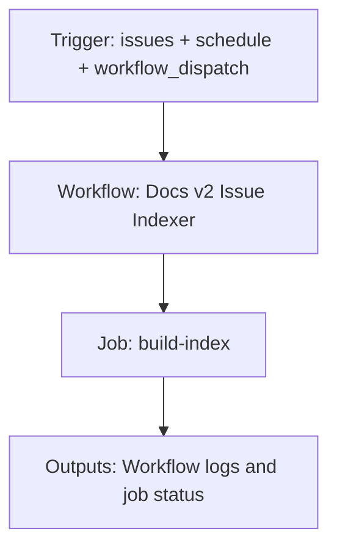

{/*
generated-file-banner: ai-tools-visual-library:v1
Generation Script: operations/scripts/generators/governance/catalogs/generate-ai-tools-visual-library.js
Purpose: AI-tools canonical visual library for workflows and dispatcher actions.
Run when: GitHub workflows, dispatcher definitions, registry coverage, or visual-library contracts change.
Run command: node operations/scripts/generators/governance/catalogs/generate-ai-tools-visual-library.js --write
*/}

<Note>
**Generation Script**: This file is generated from script(s): `operations/scripts/generators/governance/catalogs/generate-ai-tools-visual-library.js`.  
**Purpose**: AI-tools canonical visual library for workflows and dispatcher actions.  
**Run when**: GitHub workflows, dispatcher definitions, registry coverage, or visual-library contracts change.  
**Important**: Do not manually edit this file; run `node operations/scripts/generators/governance/catalogs/generate-ai-tools-visual-library.js --write`.  
</Note>

# Docs v2 Issue Indexer

## Summary

Docs v2 Issue Indexer runs on issues, schedule, workflow_dispatch and primarily produces workflow logs and job status.

## Why It Exists

Govern the `.github/workflows/docs-v2-issue-indexer.yml` workflow as a human-readable, visually explorable source-of-truth page inside `ai-tools/registry/workflows`.

## Triggers

- issues: types=opened, edited, labeled, unlabeled, reopened, closed
- schedule: default event configuration
- workflow_dispatch: default event configuration

## Jobs

| Job ID | Name | Runs On | Needs | Step Count |
| --- | --- | --- | --- | --- |
| `build-index` | build-index | `ubuntu-latest` | none | 1 |

### build-index

- `Create or update docs-v2 top-level issue index` | uses actions/github-script@v7

## Inputs

- No explicit workflow inputs declared.

## Outputs

- Workflow logs and job status

## Dependencies

- action:actions/github-script@v7

## Dependants

- dispatcher:research-review-packet

## Mermaid Pipeline

## Frailty And Risk

- Scheduled execution can hide drift until the next cron window.

## Consolidation Notes

Dispatcher suggestion: `research-review-packet`. This is a governance hint for consolidation review, not a runtime rewrite instruction.

## Handover Notes

Use this page as the human-facing workflow brief during audits, cleanup, and handover. Promote any missing operational knowledge back into the canonical page rather than leaving it in chat.
