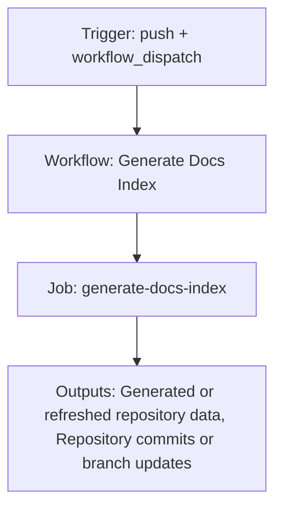

{/*
generated-file-banner: ai-tools-visual-library:v1
Generation Script: operations/scripts/generators/governance/catalogs/generate-ai-tools-visual-library.js
Purpose: AI-tools canonical visual library for workflows and dispatcher actions.
Run when: GitHub workflows, dispatcher definitions, registry coverage, or visual-library contracts change.
Run command: node operations/scripts/generators/governance/catalogs/generate-ai-tools-visual-library.js --write
*/}

<Note>
**Generation Script**: This file is generated from script(s): `operations/scripts/generators/governance/catalogs/generate-ai-tools-visual-library.js`.  
**Purpose**: AI-tools canonical visual library for workflows and dispatcher actions.  
**Run when**: GitHub workflows, dispatcher definitions, registry coverage, or visual-library contracts change.  
**Important**: Do not manually edit this file; run `node operations/scripts/generators/governance/catalogs/generate-ai-tools-visual-library.js --write`.  
</Note>

# Generate Docs Index

## Summary

Generate Docs Index runs on push, workflow_dispatch and primarily produces generated or refreshed repository data.

## Why It Exists

Govern the `.github/workflows/generate-docs-index.yml` workflow as a human-readable, visually explorable source-of-truth page inside `ai-tools/registry/workflows`.

## Triggers

- push: branches=docs-v2
- workflow_dispatch: configured in workflow file

## Jobs

| Job ID | Name | Runs On | Needs | Step Count |
| --- | --- | --- | --- | --- |
| `generate-docs-index` | generate-docs-index | `ubuntu-latest` | none | 7 |

### generate-docs-index

- `Checkout repository` | uses actions/checkout@v4
- `Resolve target branch` | runs `if [ "${{ inputs.use_test_branch }}" = "true" ]; then`
- `Setup Node.js` | uses actions/setup-node@v4
- `Install dependencies` | runs `cd tools && npm install`
- `Generate docs index` | runs `node operations/scripts/generators/content/catalogs/generate-docs-index.js --write`
- `Check for changes` | runs `git diff --exit-code docs-index.json || echo "changed=true" >> $GITHUB_OUTPUT`
- `Commit and push if changed` | runs `git config user.name "GitHub Actions Bot"`

## Inputs

- workflow_dispatch:use_test_branch (optional)

## Outputs

- Generated or refreshed repository data
- Repository commits or branch updates

## Dependencies

- action:actions/checkout@v4
- action:actions/setup-node@v4
- operations/scripts/generators/content/catalogs/generate-docs-index.js
- secret:GITHUB_TOKEN

## Dependants

- dispatcher:page-ship

## Mermaid Pipeline

## Frailty And Risk

- Mutates repository state from CI, which raises coordination and safety risk.
- Depends on secrets, so runtime behavior cannot be fully reasoned about from repo state alone.

## Consolidation Notes

Dispatcher suggestion: `page-ship`. This is a governance hint for consolidation review, not a runtime rewrite instruction.

## Handover Notes

Use this page as the human-facing workflow brief during audits, cleanup, and handover. Promote any missing operational knowledge back into the canonical page rather than leaving it in chat.
