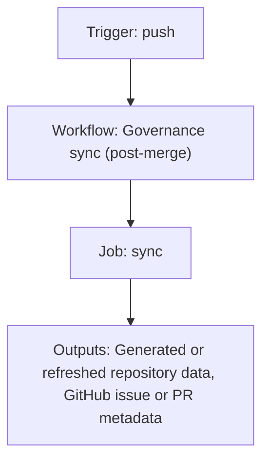

{/*
generated-file-banner: ai-tools-visual-library:v1
Generation Script: operations/scripts/generators/governance/catalogs/generate-ai-tools-visual-library.js
Purpose: AI-tools canonical visual library for workflows and dispatcher actions.
Run when: GitHub workflows, dispatcher definitions, registry coverage, or visual-library contracts change.
Run command: node operations/scripts/generators/governance/catalogs/generate-ai-tools-visual-library.js --write
*/}

<Note>
**Generation Script**: This file is generated from script(s): `operations/scripts/generators/governance/catalogs/generate-ai-tools-visual-library.js`.  
**Purpose**: AI-tools canonical visual library for workflows and dispatcher actions.  
**Run when**: GitHub workflows, dispatcher definitions, registry coverage, or visual-library contracts change.  
**Important**: Do not manually edit this file; run `node operations/scripts/generators/governance/catalogs/generate-ai-tools-visual-library.js --write`.  
</Note>

# Governance sync (post-merge)

## Summary

Governance sync (post-merge) runs on push and primarily produces generated or refreshed repository data.

## Why It Exists

Govern the `.github/workflows/governance-sync.yml` workflow as a human-readable, visually explorable source-of-truth page inside `ai-tools/registry/workflows`.

## Triggers

- push: branches=docs-v2; paths=operations/scripts/**, tools/lib/**, tools/notion/**, tools/config/**, operations/tests/unit/**, operations/tests/integration/**, operations/tests/utils/**, operations/tests/run-all.js, operations/tests/run-pr-checks.js, .githooks/**, .github/scripts/**, .github/workflows/**, workspace/scripts/**, snippets/automations/**, workspace/reports/script-classifications.json

## Jobs

| Job ID | Name | Runs On | Needs | Step Count |
| --- | --- | --- | --- | --- |
| `sync` | sync | `ubuntu-latest` | none | 6 |

### sync

- `step-1` | uses actions/checkout@v4
- `step-2` | uses actions/setup-node@v4
- `step-3` | runs `cd tools && npm ci`
- `step-4` | runs `cd tests && npm ci`
- `Run governance repair` | runs `node operations/scripts/dispatch/governance/pipelines/governance-pipeline.js 2>&1 | tee /tmp/repair.log`
- `Create PR if fixes applied` | uses peter-evans/create-pull-request@v7

## Inputs

- No explicit workflow inputs declared.

## Outputs

- Generated or refreshed repository data
- GitHub issue or PR metadata

## Dependencies

- action:actions/checkout@v4
- action:actions/setup-node@v4
- action:peter-evans/create-pull-request@v7
- operations/scripts/dispatch/governance/pipelines/governance-pipeline.js
- workspace/reports/repo-ops/REPAIR_REPORT_LATEST.json

## Dependants

- dispatcher:repo-cleanup-handover

## Mermaid Pipeline

## Frailty And Risk

- Current heuristic risk level is `high`; no exceptional frailty markers were detected in the file scan.

## Consolidation Notes

Dispatcher suggestion: `repo-cleanup-handover`. This is a governance hint for consolidation review, not a runtime rewrite instruction.

## Handover Notes

Use this page as the human-facing workflow brief during audits, cleanup, and handover. Promote any missing operational knowledge back into the canonical page rather than leaving it in chat.
