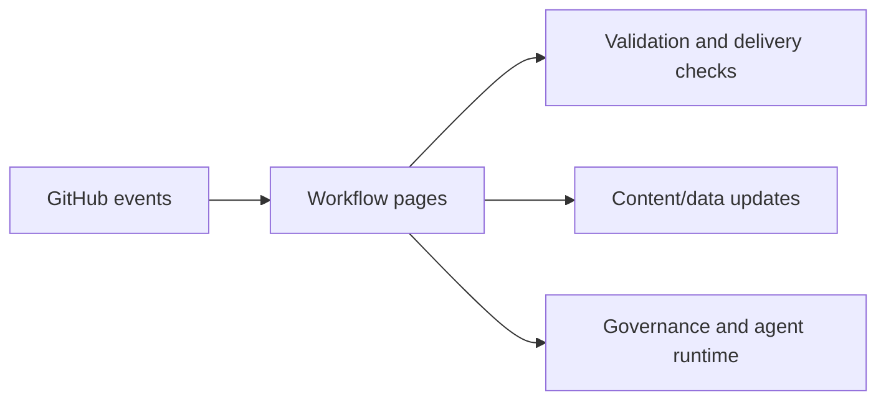

{/*
generated-file-banner: ai-tools-visual-library:v1
Generation Script: operations/scripts/generators/governance/catalogs/generate-ai-tools-visual-library.js
Purpose: AI-tools canonical visual library for workflows and dispatcher actions.
Run when: GitHub workflows, dispatcher definitions, registry coverage, or visual-library contracts change.
Run command: node operations/scripts/generators/governance/catalogs/generate-ai-tools-visual-library.js --write
*/}

<Note>
**Generation Script**: This file is generated from script(s): `operations/scripts/generators/governance/catalogs/generate-ai-tools-visual-library.js`.  
**Purpose**: AI-tools canonical visual library for workflows and dispatcher actions.  
**Run when**: GitHub workflows, dispatcher definitions, registry coverage, or visual-library contracts change.  
**Important**: Do not manually edit this file; run `node operations/scripts/generators/governance/catalogs/generate-ai-tools-visual-library.js --write`.  
</Note>

# Workflow Visual Library

Tracks 46 workflow file pages under `.github/workflows` and keeps the canonical visual source under `ai-tools/registry/workflows`.

## Catalog

| Workflow | Concern | Status | Risk | Dispatcher Candidate | Trigger Mode |
| --- | --- | --- | --- | --- | --- |
| [Auto Assign Docs Reviewers](./auto-assign-docs-reviewers.mdx) | `review` | `active` | `high` | `review-fix` | `pull_request` |
| [Check Broken Links](./broken-links.mdx) | `validation` | `active` | `medium` | `review-fix` | `pull_request + workflow_dispatch` |
| [Build Review Assets](./build-review-assets.mdx) | `review` | `active` | `low` | `review-fix` | `workflow_dispatch` |
| [Check AI Companion Files](./check-ai-companions.mdx) | `agent-runtime` | `active` | `low` | `handover-readiness` | `pull_request + push + workflow_dispatch` |
| [Check Docs Guide Catalogs](./check-docs-guide-catalogs.mdx) | `repo-ops` | `active` | `low` | `review-fix` | `pull_request + push + workflow_dispatch` |
| [Check Docs Index](./check-docs-index.mdx) | `repo-ops` | `active` | `low` | `review-fix` | `pull_request + push + workflow_dispatch` |
| [Close Linked Issues (docs-v2 Merge)](./close-linked-issues-docs-v2.mdx) | `review` | `active` | `low` | `review-fix` | `pull_request` |
| [Codex Governance](./codex-governance.mdx) | `agent-runtime` | `active` | `medium` | `handover-readiness` | `pull_request` |
| [Content Health Check](./content-health.mdx) | `validation` | `active` | `medium` | `review-fix` | `schedule + workflow_dispatch` |
| [Discord Issue Intake](./discord-issue-intake.mdx) | `review` | `active` | `medium` | `research-review-packet` | `repository_dispatch` |
| [Docs v2 Issue Indexer](./docs-v2-issue-indexer.mdx) | `review` | `active` | `medium` | `research-review-packet` | `issues + schedule + workflow_dispatch` |
| [Pipeline Freshness Monitor](./freshness-monitor.mdx) | `validation` | `active` | `medium` | `review-fix` | `schedule + workflow_dispatch` |
| [Generate AI Companion Files](./generate-ai-companions.mdx) | `agent-runtime` | `active` | `high` | `handover-readiness` | `push + workflow_dispatch` |
| [Generate AI Sitemap](./generate-ai-sitemap.mdx) | `agent-runtime` | `active` | `high` | `handover-readiness` | `push + workflow_dispatch` |
| [Generate Component Registry](./generate-component-registry.mdx) | `repo-ops` | `active` | `high` | `review-fix` | `push + workflow_dispatch` |
| [Generate Docs Guide Catalogs](./generate-docs-guide-catalogs.mdx) | `repo-ops` | `active` | `high` | `page-ship` | `push + workflow_dispatch` |
| [Generate Docs Index](./generate-docs-index.mdx) | `repo-ops` | `active` | `high` | `page-ship` | `push + workflow_dispatch` |
| [Generate llms.txt](./generate-llms-files.mdx) | `agent-runtime` | `active` | `high` | `handover-readiness` | `push + workflow_dispatch` |
| [Generate Review Table](./generate-review-table.mdx) | `review` | `active` | `low` | `page-ship` | `workflow_dispatch` |
| [Governance sync (post-merge)](./governance-sync.mdx) | `repo-ops` | `active` | `high` | `repo-cleanup-handover` | `push` |
| [Issue Auto Label](./issue-auto-label.mdx) | `review` | `active` | `low` | `review-fix` | `issues` |
| [OpenAPI Reference Validation](./openapi-reference-validation.mdx) | `repo-ops` | `active` | `high` | `review-fix` | `pull_request + push + schedule + workflow_dispatch` |
| [Project Showcase Sync](./project-showcase-sync.mdx) | `review` | `active` | `high` | `research-review-packet` | `repository_dispatch + schedule + workflow_dispatch` |
| [Governance Repair](./repair-governance.mdx) | `repo-ops` | `active` | `high` | `repo-cleanup-handover` | `schedule + workflow_dispatch` |
| [Generate](./sdk_generation.mdx) | `authoring` | `active` | `high` | `page-ship` | `schedule + workflow_dispatch` |
| [SEO Metadata Refresh](./seo-refresh.mdx) | `authoring` | `active` | `low` | `page-ship` | `workflow_dispatch` |
| [EN-GB Style Homogenisation](./style-homogenise.mdx) | `validation` | `active` | `high` | `review-fix` | `workflow_dispatch` |
| [Sync Large Assets](./sync-large-assets.mdx) | `repo-ops` | `active` | `high` | `repo-cleanup-handover` | `push + schedule + workflow_dispatch` |
| [workspace/ retention enforcement](./tasks-retention.mdx) | `repo-ops` | `active` | `medium` | `repo-cleanup-handover` | `schedule + workflow_dispatch` |
| [Docs CI - Content Quality Suite](./test-suite.mdx) | `validation` | `active` | `high` | `review-fix` | `pull_request + push + workflow_dispatch` |
| [Docs CI - V2 Browser Sweep](./test-v2-pages.mdx) | `validation` | `active` | `high` | `review-fix` | `pull_request + push + workflow_dispatch` |
| [Docs Translation Pipeline](./translate-docs.mdx) | `authoring` | `active` | `high` | `page-ship` | `workflow_dispatch` |
| [Update Blog and Forum Data](./update-blog-data.mdx) | `authoring` | `active` | `high` | `page-ship` | `workflow_dispatch` |
| [Update Changelogs](./update-changelogs.mdx) | `authoring` | `active` | `high` | `page-ship` | `repository_dispatch + schedule + workflow_dispatch` |
| [Update Contract Addresses](./update-contract-addresses.mdx) | `authoring` | `active` | `high` | `page-ship` | `repository_dispatch + schedule + workflow_dispatch` |
| [Update Discord Announcements Data](./update-discord-data.mdx) | `authoring` | `active` | `high` | `page-ship` | `schedule + workflow_dispatch` |
| [Update Forum Data](./update-forum-data.mdx) | `authoring` | `active` | `high` | `page-ship` | `schedule + workflow_dispatch` |
| [Update Ghost Blog Data](./update-ghost-blog-data.mdx) | `authoring` | `active` | `high` | `page-ship` | `schedule + workflow_dispatch` |
| [Update GitHub Discussions & Releases Data](./update-github-data.mdx) | `authoring` | `active` | `high` | `page-ship` | `schedule + workflow_dispatch` |
| [Update Livepeer Release Version](./update-livepeer-release.mdx) | `release` | `active` | `high` | `page-ship` | `repository_dispatch + schedule + workflow_dispatch` |
| [Update Review Template](./update-review-template.mdx) | `review` | `active` | `low` | `page-ship` | `workflow_dispatch` |
| [Update RSS Blog Data](./update-rss-blog-data.mdx) | `authoring` | `active` | `high` | `page-ship` | `schedule + workflow_dispatch` |
| [Update YouTube Data](./update-youtube-data.mdx) | `authoring` | `active` | `high` | `page-ship` | `schedule + workflow_dispatch` |
| [V2 External Link Audit (Advisory)](./v2-external-link-audit.mdx) | `validation` | `active` | `medium` | `review-fix` | `schedule + workflow_dispatch` |
| [Verify AI Sitemap](./verify-ai-sitemap.mdx) | `agent-runtime` | `active` | `low` | `handover-readiness` | `pull_request + push + workflow_dispatch` |
| [Verify llms.txt Files](./verify-llms-files.mdx) | `agent-runtime` | `active` | `low` | `handover-readiness` | `pull_request + push + workflow_dispatch` |

## Visual Overview

