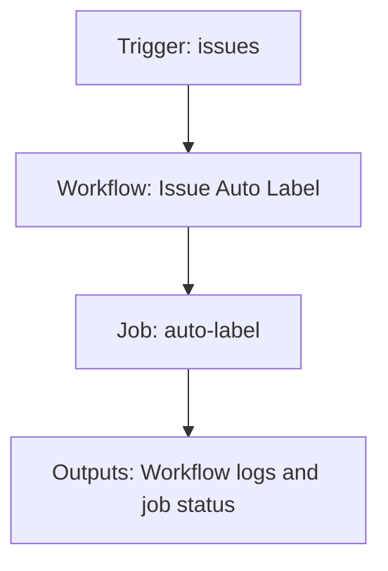

{/*
generated-file-banner: ai-tools-visual-library:v1
Generation Script: operations/scripts/generators/governance/catalogs/generate-ai-tools-visual-library.js
Purpose: AI-tools canonical visual library for workflows and dispatcher actions.
Run when: GitHub workflows, dispatcher definitions, registry coverage, or visual-library contracts change.
Run command: node operations/scripts/generators/governance/catalogs/generate-ai-tools-visual-library.js --write
*/}

<Note>
**Generation Script**: This file is generated from script(s): `operations/scripts/generators/governance/catalogs/generate-ai-tools-visual-library.js`.  
**Purpose**: AI-tools canonical visual library for workflows and dispatcher actions.  
**Run when**: GitHub workflows, dispatcher definitions, registry coverage, or visual-library contracts change.  
**Important**: Do not manually edit this file; run `node operations/scripts/generators/governance/catalogs/generate-ai-tools-visual-library.js --write`.  
</Note>

# Issue Auto Label

## Summary

Issue Auto Label runs on issues and primarily produces workflow logs and job status.

## Why It Exists

Govern the `.github/workflows/issue-auto-label.yml` workflow as a human-readable, visually explorable source-of-truth page inside `ai-tools/registry/workflows`.

## Triggers

- issues: types=opened, edited

## Jobs

| Job ID | Name | Runs On | Needs | Step Count |
| --- | --- | --- | --- | --- |
| `auto-label` | auto-label | `ubuntu-latest` | none | 1 |

### auto-label

- `Parse issue form and apply labels` | uses actions/github-script@v7

## Inputs

- No explicit workflow inputs declared.

## Second Pass Assessment

- Workflow family: `review-event-automation`
- Usage status: `active`
- Cleanup decision: `keep`
- Process fit: `core-shipping`
- Consolidation target: `dispatcher:review-fix`
- Recommended engineering action: Keep this as a standalone workflow because its trigger contract and ownership boundary are distinct enough to justify a top-level entrypoint.

## Outputs

- Workflow logs and job status

## Dependencies

- action:actions/github-script@v7

## Dependants

- dispatcher:review-fix

## Mermaid Pipeline

## Frailty And Risk

- Current heuristic risk level is `low`; no exceptional frailty markers were detected in the file scan.

## Consolidation Notes

Dispatcher suggestion: `review-fix`. Second-pass target: `dispatcher:review-fix`. This is a governance recommendation, not an automatic rewrite instruction.

## Cleanup Rationale

- The current trigger contract looks distinct enough to justify keeping a dedicated workflow entrypoint.

## Handover Notes

Use this page as the human-facing workflow brief during audits, cleanup, and handover. Promote any missing operational knowledge back into the canonical page rather than leaving it in chat.
