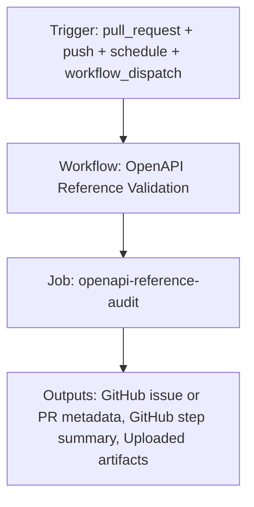

{/*
generated-file-banner: ai-tools-visual-library:v1
Generation Script: operations/scripts/generators/governance/catalogs/generate-ai-tools-visual-library.js
Purpose: AI-tools canonical visual library for workflows and dispatcher actions.
Run when: GitHub workflows, dispatcher definitions, registry coverage, or visual-library contracts change.
Run command: node operations/scripts/generators/governance/catalogs/generate-ai-tools-visual-library.js --write
*/}

<Note>
**Generation Script**: This file is generated from script(s): `operations/scripts/generators/governance/catalogs/generate-ai-tools-visual-library.js`.  
**Purpose**: AI-tools canonical visual library for workflows and dispatcher actions.  
**Run when**: GitHub workflows, dispatcher definitions, registry coverage, or visual-library contracts change.  
**Important**: Do not manually edit this file; run `node operations/scripts/generators/governance/catalogs/generate-ai-tools-visual-library.js --write`.  
</Note>

# OpenAPI Reference Validation

## Summary

OpenAPI Reference Validation runs on pull_request, push, schedule, workflow_dispatch and primarily produces github issue or pr metadata.

## Why It Exists

Govern the `.github/workflows/openapi-reference-validation.yml` workflow as a human-readable, visually explorable source-of-truth page inside `ai-tools/registry/workflows`.

## Triggers

- pull_request: branches=docs-v2
- push: branches=docs-v2
- schedule: default event configuration
- workflow_dispatch: default event configuration

## Jobs

| Job ID | Name | Runs On | Needs | Step Count |
| --- | --- | --- | --- | --- |
| `audit` | openapi-reference-audit | `ubuntu-latest` | none | 13 |

### openapi-reference-audit

- `Checkout repository` | uses actions/checkout@v4
- `Set up Node.js` | uses actions/setup-node@v4
- `Install test dependencies` | runs `set -euo pipefail`
- `Run strict OpenAPI audit (initial)` | runs `set +e`
- `Apply safe autofix (non-PR)` | runs `set +e`
- `Run strict OpenAPI audit (final)` | runs `set +e`
- `Summarize audit results` | runs `node <<'NODE'`
- `Upload OpenAPI audit artifacts` | uses actions/upload-artifact@v4
- `Determine autofix PR base branch` | runs `if [ "${{ github.event_name }}" = "schedule" ]; then`
- `Create or update autofix PR` | uses peter-evans/create-pull-request@v6
- `Ensure OpenAPI audit labels exist` | uses actions/github-script@v7
- `Sync rolling OpenAPI failure issue` | uses actions/github-script@v7
- `Fail workflow when unresolved findings remain` | runs `echo "OpenAPI reference validation failed with unresolved findings."`

## Inputs

- No explicit workflow inputs declared.

## Second Pass Assessment

- Workflow family: `validation-sweeps`
- Usage status: `active-mutating`
- Cleanup decision: `keep`
- Process fit: `core-shipping`
- Consolidation target: `dispatcher:review-fix`
- Recommended engineering action: Keep this as a standalone workflow because its trigger contract and ownership boundary are distinct enough to justify a top-level entrypoint.

## Outputs

- GitHub issue or PR metadata
- GitHub step summary
- Uploaded artifacts

## Dependencies

- action:actions/checkout@v4
- action:actions/github-script@v7
- action:actions/setup-node@v4
- action:actions/upload-artifact@v4
- action:peter-evans/create-pull-request@v6
- operations/tests/integration/openapi-reference-audit.js

## Dependants

- dispatcher:review-fix

## Mermaid Pipeline

## Frailty And Risk

- Scheduled execution can hide drift until the next cron window.

## Consolidation Notes

Dispatcher suggestion: `review-fix`. Second-pass target: `dispatcher:review-fix`. This is a governance recommendation, not an automatic rewrite instruction.

## Cleanup Rationale

- The current trigger contract looks distinct enough to justify keeping a dedicated workflow entrypoint.
- This workflow writes back to the repository, so its blast radius is higher than a read-only validation workflow.

## Handover Notes

Use this page as the human-facing workflow brief during audits, cleanup, and handover. Promote any missing operational knowledge back into the canonical page rather than leaving it in chat.
