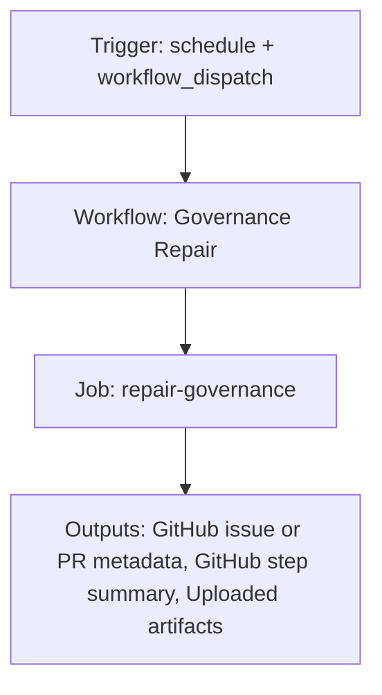

{/*
generated-file-banner: ai-tools-visual-library:v1
Generation Script: operations/scripts/generators/governance/catalogs/generate-ai-tools-visual-library.js
Purpose: AI-tools canonical visual library for workflows and dispatcher actions.
Run when: GitHub workflows, dispatcher definitions, registry coverage, or visual-library contracts change.
Run command: node operations/scripts/generators/governance/catalogs/generate-ai-tools-visual-library.js --write
*/}

<Note>
**Generation Script**: This file is generated from script(s): `operations/scripts/generators/governance/catalogs/generate-ai-tools-visual-library.js`.  
**Purpose**: AI-tools canonical visual library for workflows and dispatcher actions.  
**Run when**: GitHub workflows, dispatcher definitions, registry coverage, or visual-library contracts change.  
**Important**: Do not manually edit this file; run `node operations/scripts/generators/governance/catalogs/generate-ai-tools-visual-library.js --write`.  
</Note>

# Governance Repair

## Summary

Governance Repair runs on schedule, workflow_dispatch and primarily produces github issue or pr metadata.

## Why It Exists

Govern the `.github/workflows/repair-governance.yml` workflow as a human-readable, visually explorable source-of-truth page inside `ai-tools/registry/workflows`.

## Triggers

- schedule: default event configuration
- workflow_dispatch: configured in workflow file

## Jobs

| Job ID | Name | Runs On | Needs | Step Count |
| --- | --- | --- | --- | --- |
| `repair-governance` | repair-governance | `ubuntu-latest` | none | 9 |

### repair-governance

- `Checkout repository` | uses actions/checkout@v4
- `Set up Node.js` | uses actions/setup-node@v4
- `Install tools dependencies` | runs `npm install`
- `Resolve run mode` | runs `if [ "${{ github.event_name }}" = "schedule" ]; then`
- `Run governance repair orchestrator` | runs `set +e`
- `Build repair summary` | runs `node <<'NODE'`
- `Upload governance repair artifacts` | uses actions/upload-artifact@v4
- `Create or update repair PR` | uses peter-evans/create-pull-request@v7
- `Fail on blocking repair error` | runs `echo "Governance repair verification failed."`

## Inputs

- workflow_dispatch:mode (optional)

## Second Pass Assessment

- Workflow family: `governance-maintenance`
- Usage status: `active-mutating`
- Cleanup decision: `merge`
- Process fit: `handover-support`
- Consolidation target: `future:governance-maintenance-workflow`
- Recommended engineering action: Merge this workflow with its sibling family into `future:governance-maintenance-workflow` so one workflow owns both check and write modes.

## Outputs

- GitHub issue or PR metadata
- GitHub step summary
- Uploaded artifacts

## Dependencies

- action:actions/checkout@v4
- action:actions/setup-node@v4
- action:actions/upload-artifact@v4
- action:peter-evans/create-pull-request@v7
- operations/scripts/dispatch/governance/pipelines/governance-pipeline.js
- workspace/reports/repo-ops/REPAIR_REPORT_LATEST.json

## Dependants

- dispatcher:repo-cleanup-handover

## Mermaid Pipeline

## Frailty And Risk

- Scheduled execution can hide drift until the next cron window.

## Consolidation Notes

Dispatcher suggestion: `repo-cleanup-handover`. Second-pass target: `future:governance-maintenance-workflow`. This is a governance recommendation, not an automatic rewrite instruction.

## Cleanup Rationale

- This workflow writes back to the repository, so its blast radius is higher than a read-only validation workflow.

## Handover Notes

Use this page as the human-facing workflow brief during audits, cleanup, and handover. Promote any missing operational knowledge back into the canonical page rather than leaving it in chat.
