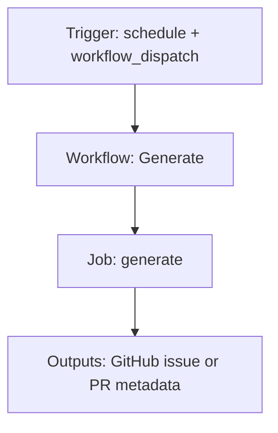

{/*
generated-file-banner: ai-tools-visual-library:v1
Generation Script: operations/scripts/generators/governance/catalogs/generate-ai-tools-visual-library.js
Purpose: AI-tools canonical visual library for workflows and dispatcher actions.
Run when: GitHub workflows, dispatcher definitions, registry coverage, or visual-library contracts change.
Run command: node operations/scripts/generators/governance/catalogs/generate-ai-tools-visual-library.js --write
*/}

<Note>
**Generation Script**: This file is generated from script(s): `operations/scripts/generators/governance/catalogs/generate-ai-tools-visual-library.js`.  
**Purpose**: AI-tools canonical visual library for workflows and dispatcher actions.  
**Run when**: GitHub workflows, dispatcher definitions, registry coverage, or visual-library contracts change.  
**Important**: Do not manually edit this file; run `node operations/scripts/generators/governance/catalogs/generate-ai-tools-visual-library.js --write`.  
</Note>

# Generate

## Summary

Generate runs on schedule, workflow_dispatch and primarily produces github issue or pr metadata.

## Why It Exists

Govern the `.github/workflows/sdk_generation.yaml` workflow as a human-readable, visually explorable source-of-truth page inside `ai-tools/registry/workflows`.

## Triggers

- schedule: default event configuration
- workflow_dispatch: configured in workflow file

## Jobs

| Job ID | Name | Runs On | Needs | Step Count |
| --- | --- | --- | --- | --- |
| `generate` | generate | n/a | none | 0 |

### generate

- No steps parsed.

## Inputs

- workflow_dispatch:force (optional)

## Second Pass Assessment

- Workflow family: `content-publication`
- Usage status: `active-mutating`
- Cleanup decision: `needs-investigation`
- Process fit: `legacy-or-unclear`
- Consolidation target: `dispatcher:page-ship`
- Recommended engineering action: Trace actual runtime use, owner, and downstream dependencies before deciding whether to keep, merge, or retire it. Current nearest dispatcher: `page-ship`.

## Outputs

- GitHub issue or PR metadata

## Dependencies

- secret:GITHUB_TOKEN
- secret:SPEAKEASY_API_KEY

## Dependants

- dispatcher:page-ship

## Mermaid Pipeline

## Frailty And Risk

- Depends on secrets, so runtime behavior cannot be fully reasoned about from repo state alone.
- Scheduled execution can hide drift until the next cron window.

## Consolidation Notes

Dispatcher suggestion: `page-ship`. Second-pass target: `dispatcher:page-ship`. This is a governance recommendation, not an automatic rewrite instruction.

## Cleanup Rationale

- Current repo evidence is not strong enough to justify either deletion or consolidation without tracing real usage first.
- This workflow writes back to the repository, so its blast radius is higher than a read-only validation workflow.

## Handover Notes

Use this page as the human-facing workflow brief during audits, cleanup, and handover. Promote any missing operational knowledge back into the canonical page rather than leaving it in chat.
