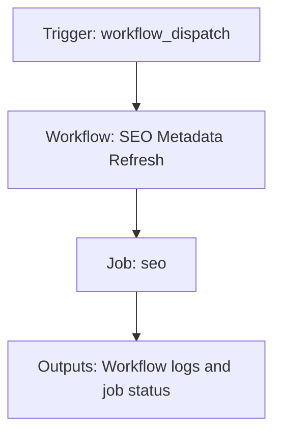

{/*
generated-file-banner: ai-tools-visual-library:v1
Generation Script: operations/scripts/generators/governance/catalogs/generate-ai-tools-visual-library.js
Purpose: AI-tools canonical visual library for workflows and dispatcher actions.
Run when: GitHub workflows, dispatcher definitions, registry coverage, or visual-library contracts change.
Run command: node operations/scripts/generators/governance/catalogs/generate-ai-tools-visual-library.js --write
*/}

<Note>
**Generation Script**: This file is generated from script(s): `operations/scripts/generators/governance/catalogs/generate-ai-tools-visual-library.js`.  
**Purpose**: AI-tools canonical visual library for workflows and dispatcher actions.  
**Run when**: GitHub workflows, dispatcher definitions, registry coverage, or visual-library contracts change.  
**Important**: Do not manually edit this file; run `node operations/scripts/generators/governance/catalogs/generate-ai-tools-visual-library.js --write`.  
</Note>

# SEO Metadata Refresh

## Summary

SEO Metadata Refresh runs on workflow_dispatch and primarily produces workflow logs and job status.

## Why It Exists

Govern the `.github/workflows/seo-refresh.yml` workflow as a human-readable, visually explorable source-of-truth page inside `ai-tools/registry/workflows`.

## Triggers

- workflow_dispatch: configured in workflow file

## Jobs

| Job ID | Name | Runs On | Needs | Step Count |
| --- | --- | --- | --- | --- |
| `seo` | seo | `ubuntu-latest` | none | 4 |

### seo

- `step-1` | uses actions/checkout@v4
- `step-2` | uses actions/setup-node@v4
- `step-3` | runs `cd tools && npm ci`
- `Generate SEO metadata` | runs `if [ "${{ inputs.dry_run }}" = "true" ]; then`

## Inputs

- workflow_dispatch:dry_run (optional)

## Outputs

- Workflow logs and job status

## Dependencies

- action:actions/checkout@v4
- action:actions/setup-node@v4
- operations/scripts/remediators/content/seo/generate-seo.js

## Dependants

- dispatcher:page-ship

## Mermaid Pipeline

## Frailty And Risk

- Current heuristic risk level is `low`; no exceptional frailty markers were detected in the file scan.

## Consolidation Notes

Dispatcher suggestion: `page-ship`. This is a governance hint for consolidation review, not a runtime rewrite instruction.

## Handover Notes

Use this page as the human-facing workflow brief during audits, cleanup, and handover. Promote any missing operational knowledge back into the canonical page rather than leaving it in chat.
