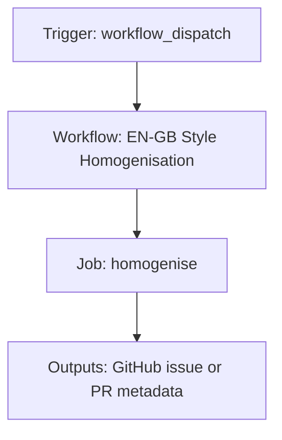

{/*
generated-file-banner: ai-tools-visual-library:v1
Generation Script: operations/scripts/generators/governance/catalogs/generate-ai-tools-visual-library.js
Purpose: AI-tools canonical visual library for workflows and dispatcher actions.
Run when: GitHub workflows, dispatcher definitions, registry coverage, or visual-library contracts change.
Run command: node operations/scripts/generators/governance/catalogs/generate-ai-tools-visual-library.js --write
*/}

<Note>
**Generation Script**: This file is generated from script(s): `operations/scripts/generators/governance/catalogs/generate-ai-tools-visual-library.js`.  
**Purpose**: AI-tools canonical visual library for workflows and dispatcher actions.  
**Run when**: GitHub workflows, dispatcher definitions, registry coverage, or visual-library contracts change.  
**Important**: Do not manually edit this file; run `node operations/scripts/generators/governance/catalogs/generate-ai-tools-visual-library.js --write`.  
</Note>

# EN-GB Style Homogenisation

## Summary

EN-GB Style Homogenisation runs on workflow_dispatch and primarily produces github issue or pr metadata.

## Why It Exists

Govern the `.github/workflows/style-homogenise.yml` workflow as a human-readable, visually explorable source-of-truth page inside `ai-tools/registry/workflows`.

## Triggers

- workflow_dispatch: configured in workflow file

## Jobs

| Job ID | Name | Runs On | Needs | Step Count |
| --- | --- | --- | --- | --- |
| `homogenise` | homogenise | `ubuntu-latest` | none | 5 |

### homogenise

- `step-1` | uses actions/checkout@v4
- `step-2` | uses actions/setup-node@v4
- `step-3` | runs `cd tools && npm ci`
- `Run style homogeniser` | runs `node operations/scripts/style-and-language-homogenizer-en-gb.js --scope ${{ inputs.scope }}`
- `Create PR with changes` | uses peter-evans/create-pull-request@v7

## Inputs

- workflow_dispatch:scope (optional)

## Second Pass Assessment

- Workflow family: `validation-sweeps`
- Usage status: `active-mutating`
- Cleanup decision: `needs-investigation`
- Process fit: `legacy-or-unclear`
- Consolidation target: `dispatcher:review-fix`
- Recommended engineering action: Trace actual runtime use, owner, and downstream dependencies before deciding whether to keep, merge, or retire it. Current nearest dispatcher: `review-fix`.

## Outputs

- GitHub issue or PR metadata

## Dependencies

- action:actions/checkout@v4
- action:actions/setup-node@v4
- action:peter-evans/create-pull-request@v7
- operations/scripts/style-and-language-homogenizer-en-gb.js

## Dependants

- dispatcher:review-fix

## Mermaid Pipeline

## Frailty And Risk

- Current heuristic risk level is `high`; no exceptional frailty markers were detected in the file scan.

## Consolidation Notes

Dispatcher suggestion: `review-fix`. Second-pass target: `dispatcher:review-fix`. This is a governance recommendation, not an automatic rewrite instruction.

## Cleanup Rationale

- Current repo evidence is not strong enough to justify either deletion or consolidation without tracing real usage first.
- This workflow writes back to the repository, so its blast radius is higher than a read-only validation workflow.

## Handover Notes

Use this page as the human-facing workflow brief during audits, cleanup, and handover. Promote any missing operational knowledge back into the canonical page rather than leaving it in chat.
