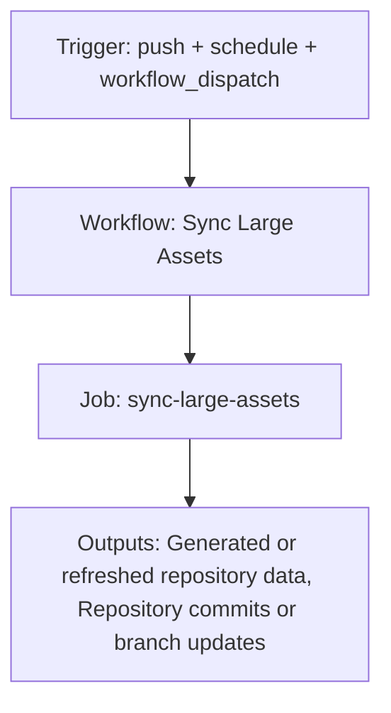

{/*
generated-file-banner: ai-tools-visual-library:v1
Generation Script: operations/scripts/generators/governance/catalogs/generate-ai-tools-visual-library.js
Purpose: AI-tools canonical visual library for workflows and dispatcher actions.
Run when: GitHub workflows, dispatcher definitions, registry coverage, or visual-library contracts change.
Run command: node operations/scripts/generators/governance/catalogs/generate-ai-tools-visual-library.js --write
*/}

<Note>
**Generation Script**: This file is generated from script(s): `operations/scripts/generators/governance/catalogs/generate-ai-tools-visual-library.js`.  
**Purpose**: AI-tools canonical visual library for workflows and dispatcher actions.  
**Run when**: GitHub workflows, dispatcher definitions, registry coverage, or visual-library contracts change.  
**Important**: Do not manually edit this file; run `node operations/scripts/generators/governance/catalogs/generate-ai-tools-visual-library.js --write`.  
</Note>

# Sync Large Assets

## Summary

Sync Large Assets runs on push, schedule, workflow_dispatch and primarily produces generated or refreshed repository data.

## Why It Exists

Govern the `.github/workflows/sync-large-assets.yml` workflow as a human-readable, visually explorable source-of-truth page inside `ai-tools/registry/workflows`.

## Triggers

- push: branches=docs-v2, docs-v2-dev; paths=snippets/assets/**, v2/assets/**
- schedule: default event configuration
- workflow_dispatch: configured in workflow file

## Jobs

| Job ID | Name | Runs On | Needs | Step Count |
| --- | --- | --- | --- | --- |
| `sync-large-assets` | sync-large-assets | `ubuntu-latest` | none | 3 |

### sync-large-assets

- `Checkout source branch` | uses actions/checkout@v4
- `Resolve inputs` | runs `if [ -n "${{ inputs.target_branch }}" ]; then`
- `Sync large assets to target branch` | runs `set -euo pipefail`

## Inputs

- workflow_dispatch:dry_run (optional)
- workflow_dispatch:target_branch (optional)
- workflow_dispatch:threshold_mb (optional)

## Second Pass Assessment

- Workflow family: `governance-maintenance`
- Usage status: `active-mutating`
- Cleanup decision: `needs-investigation`
- Process fit: `legacy-or-unclear`
- Consolidation target: `dispatcher:repo-cleanup-handover`
- Recommended engineering action: Trace actual runtime use, owner, and downstream dependencies before deciding whether to keep, merge, or retire it. Current nearest dispatcher: `repo-cleanup-handover`.

## Outputs

- Generated or refreshed repository data
- Repository commits or branch updates

## Dependencies

- .github/assets-manifest.txt
- .github/README.md
- action:actions/checkout@v4
- snippets/assets
- snippets/assets/
- v2/assets
- v2/assets/

## Dependants

- dispatcher:repo-cleanup-handover

## Mermaid Pipeline

## Frailty And Risk

- Mutates repository state from CI, which raises coordination and safety risk.
- Scheduled execution can hide drift until the next cron window.

## Consolidation Notes

Dispatcher suggestion: `repo-cleanup-handover`. Second-pass target: `dispatcher:repo-cleanup-handover`. This is a governance recommendation, not an automatic rewrite instruction.

## Cleanup Rationale

- Current repo evidence is not strong enough to justify either deletion or consolidation without tracing real usage first.
- This workflow writes back to the repository, so its blast radius is higher than a read-only validation workflow.

## Handover Notes

Use this page as the human-facing workflow brief during audits, cleanup, and handover. Promote any missing operational knowledge back into the canonical page rather than leaving it in chat.
