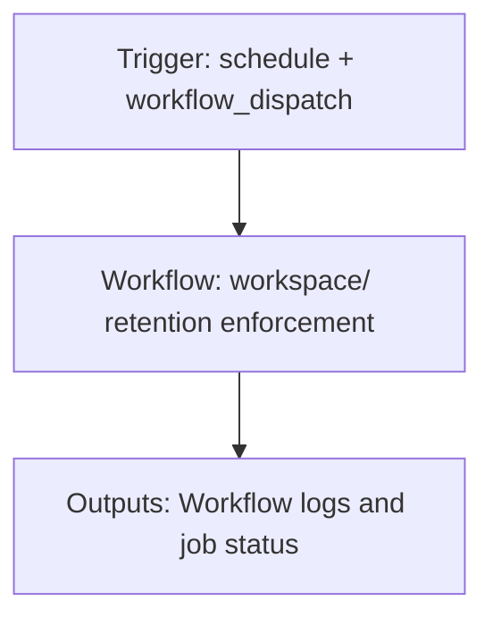

{/*
generated-file-banner: ai-tools-visual-library:v1
Generation Script: operations/scripts/generators/governance/catalogs/generate-ai-tools-visual-library.js
Purpose: AI-tools canonical visual library for workflows and dispatcher actions.
Run when: GitHub workflows, dispatcher definitions, registry coverage, or visual-library contracts change.
Run command: node operations/scripts/generators/governance/catalogs/generate-ai-tools-visual-library.js --write
*/}

<Note>
**Generation Script**: This file is generated from script(s): `operations/scripts/generators/governance/catalogs/generate-ai-tools-visual-library.js`.  
**Purpose**: AI-tools canonical visual library for workflows and dispatcher actions.  
**Run when**: GitHub workflows, dispatcher definitions, registry coverage, or visual-library contracts change.  
**Important**: Do not manually edit this file; run `node operations/scripts/generators/governance/catalogs/generate-ai-tools-visual-library.js --write`.  
</Note>

# workspace/ retention enforcement

## Summary

workspace/ retention enforcement runs on schedule, workflow_dispatch and primarily produces workflow logs and job status.

## Why It Exists

Govern the `.github/workflows/tasks-retention.yml` workflow as a human-readable, visually explorable source-of-truth page inside `ai-tools/registry/workflows`.

## Triggers

- schedule: default event configuration
- workflow_dispatch: default event configuration

## Jobs

| Job ID | Name | Runs On | Needs | Step Count |
| --- | --- | --- | --- | --- |
| none | No jobs parsed | n/a | n/a | 0 |

## Inputs

- No explicit workflow inputs declared.

## Second Pass Assessment

- Workflow family: `governance-maintenance`
- Usage status: `placeholder`
- Cleanup decision: `needs-investigation`
- Process fit: `handover-support`
- Consolidation target: `dispatcher:repo-cleanup-handover`
- Recommended engineering action: Either implement the documented retention policy as a real workflow or remove the placeholder and keep the policy in docs only.

## Outputs

- Workflow logs and job status

## Dependencies

- No direct dependencies identified in current repo scan.

## Dependants

- dispatcher:repo-cleanup-handover

## Mermaid Pipeline

## Frailty And Risk

- No local repo dependencies were detected automatically; verify whether this is truly standalone.
- Scheduled execution can hide drift until the next cron window.

## Consolidation Notes

Dispatcher suggestion: `repo-cleanup-handover`. Second-pass target: `dispatcher:repo-cleanup-handover`. This is a governance recommendation, not an automatic rewrite instruction.

## Cleanup Rationale

- The file is a TODO placeholder, but the retention concern is probably real.
- This needs a concrete owner decision before handover.

## Handover Notes

Use this page as the human-facing workflow brief during audits, cleanup, and handover. Promote any missing operational knowledge back into the canonical page rather than leaving it in chat.
