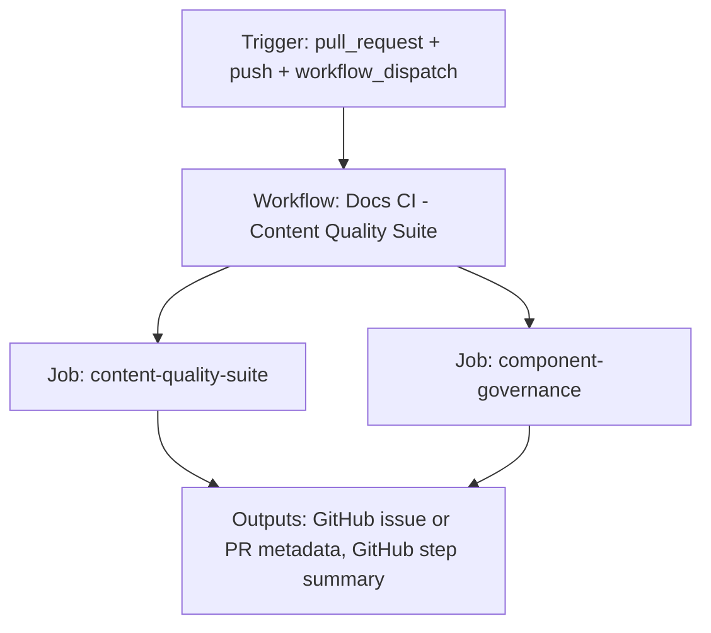

{/*
generated-file-banner: ai-tools-visual-library:v1
Generation Script: operations/scripts/generators/governance/catalogs/generate-ai-tools-visual-library.js
Purpose: AI-tools canonical visual library for workflows and dispatcher actions.
Run when: GitHub workflows, dispatcher definitions, registry coverage, or visual-library contracts change.
Run command: node operations/scripts/generators/governance/catalogs/generate-ai-tools-visual-library.js --write
*/}

<Note>
**Generation Script**: This file is generated from script(s): `operations/scripts/generators/governance/catalogs/generate-ai-tools-visual-library.js`.  
**Purpose**: AI-tools canonical visual library for workflows and dispatcher actions.  
**Run when**: GitHub workflows, dispatcher definitions, registry coverage, or visual-library contracts change.  
**Important**: Do not manually edit this file; run `node operations/scripts/generators/governance/catalogs/generate-ai-tools-visual-library.js --write`.  
</Note>

# Docs CI - Content Quality Suite

## Summary

Docs CI - Content Quality Suite runs on pull_request, push, workflow_dispatch and primarily produces github issue or pr metadata.

## Why It Exists

Govern the `.github/workflows/test-suite.yml` workflow as a human-readable, visually explorable source-of-truth page inside `ai-tools/registry/workflows`.

## Triggers

- pull_request: branches=main, docs-v2
- push: branches=docs-v2
- workflow_dispatch: default event configuration

## Jobs

| Job ID | Name | Runs On | Needs | Step Count |
| --- | --- | --- | --- | --- |
| `test-suite` | content-quality-suite | `ubuntu-latest` | none | 15 |
| `component-enforcement` | component-governance | `ubuntu-latest` | none | 10 |

### content-quality-suite

- `Checkout repository` | uses actions/checkout@v4
- `Fetch pull request base ref` | runs `git fetch --no-tags --depth=1 origin ${{ github.base_ref }}`
- `Set up Node.js` | uses actions/setup-node@v4
- `Install dependencies (tools)` | runs `npm install`
- `Run PR Changed-File Checks` | runs `npm --prefix tests run test:pr`
- `Run Docs-Guide SoT Check (Advisory)` | runs `npm --prefix tests run test:docs-guide`
- `Run Mintlify Canonical Sync Check` | runs `node operations/scripts/validators/governance/compliance/check-mintlify-canonical-sync.js --json`
- `Install Mintlify globally` | runs `npm install -g mintlify`
- `Fetch external snippets` | runs `bash operations/scripts/automations/content/data/fetching/fetch-external-docs.sh`
- `Start Mintlify dev server` | runs `npx mintlify dev > /tmp/mint-dev.log 2>&1 &`
- `Wait for server to be ready` | runs `echo "Waiting for mint dev server to start..."`
- `Run Browser Tests (All Pages)` | runs `# Force test ALL pages from docs.json (ensures complete coverage)`
- `Stop Mintlify dev server` | runs `if [ -f /tmp/mint-dev.pid ]; then`
- `Test Summary` | runs `echo "## Content Quality Suite Results" >> $GITHUB_STEP_SUMMARY`
- `Fail if any test failed` | runs `echo "❌ One or more tests failed"`

### component-governance

- `Checkout repository` | uses actions/checkout@v4
- `Fetch base ref` | runs `git fetch --no-tags --depth=1 origin ${{ github.base_ref }}`
- `Set up Node.js` | uses actions/setup-node@v4
- `Install dependencies` | runs `npm install`
- `Component naming conventions` | runs `node operations/scripts/validators/components/library/check-naming-conventions.js`
- `Component MDX scope isolation` | runs `node operations/scripts/validators/components/library/check-mdx-component-scope.js`
- `Component CSS standards` | runs `node operations/scripts/validators/components/library/check-component-css.js`
- `Component documentation` | runs `node operations/scripts/validators/components/documentation/check-component-docs.js`
- `Component immutability` | runs `node operations/scripts/validators/governance/pr/check-component-immutability.js --base-ref origin/${{ github.base_re...`
- `Validate component registry` | runs `node operations/scripts/generators/components/library/generate-component-registry.js --validate-only`

## Inputs

- No explicit workflow inputs declared.

## Second Pass Assessment

- Workflow family: `validation-sweeps`
- Usage status: `active-advisory`
- Cleanup decision: `keep`
- Process fit: `core-shipping`
- Consolidation target: `dispatcher:review-fix`
- Recommended engineering action: Keep this as a standalone workflow because its trigger contract and ownership boundary are distinct enough to justify a top-level entrypoint.

## Outputs

- GitHub issue or PR metadata
- GitHub step summary

## Dependencies

- action:actions/checkout@v4
- action:actions/setup-node@v4
- operations/scripts/automations/content/data/fetching/fetch-external-docs.sh
- operations/scripts/generators/components/library/generate-component-registry.js
- operations/scripts/validators/components/documentation/check-component-docs.js
- operations/scripts/validators/components/library/check-component-css.js
- operations/scripts/validators/components/library/check-mdx-component-scope.js
- operations/scripts/validators/components/library/check-naming-conventions.js
- operations/scripts/validators/governance/compliance/check-mintlify-canonical-sync.js
- operations/scripts/validators/governance/pr/check-component-immutability.js
- secret:GITHUB_TOKEN

## Dependants

- dispatcher:review-fix

## Mermaid Pipeline

## Frailty And Risk

- Uses `localhost:3000`, which conflicts with the repo baseline that forbids port 3000 for local Mintlify sessions.
- Contains advisory steps with `continue-on-error`, so failures may be softened rather than fully blocking.
- Depends on secrets, so runtime behavior cannot be fully reasoned about from repo state alone.

## Consolidation Notes

Dispatcher suggestion: `review-fix`. Second-pass target: `dispatcher:review-fix`. This is a governance recommendation, not an automatic rewrite instruction.

## Cleanup Rationale

- The current trigger contract looks distinct enough to justify keeping a dedicated workflow entrypoint.
- This workflow is advisory-shaped, which is useful for audits but can also hide unresolved failures.

## Handover Notes

Use this page as the human-facing workflow brief during audits, cleanup, and handover. Promote any missing operational knowledge back into the canonical page rather than leaving it in chat.
