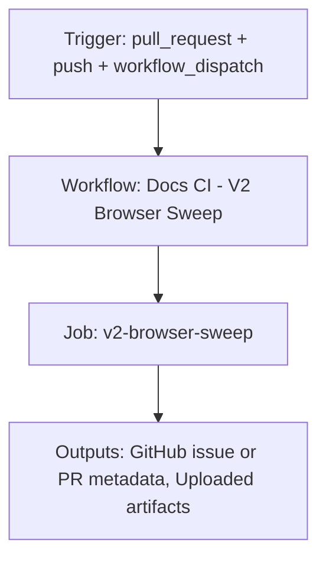

{/*
generated-file-banner: ai-tools-visual-library:v1
Generation Script: operations/scripts/generators/governance/catalogs/generate-ai-tools-visual-library.js
Purpose: AI-tools canonical visual library for workflows and dispatcher actions.
Run when: GitHub workflows, dispatcher definitions, registry coverage, or visual-library contracts change.
Run command: node operations/scripts/generators/governance/catalogs/generate-ai-tools-visual-library.js --write
*/}

<Note>
**Generation Script**: This file is generated from script(s): `operations/scripts/generators/governance/catalogs/generate-ai-tools-visual-library.js`.  
**Purpose**: AI-tools canonical visual library for workflows and dispatcher actions.  
**Run when**: GitHub workflows, dispatcher definitions, registry coverage, or visual-library contracts change.  
**Important**: Do not manually edit this file; run `node operations/scripts/generators/governance/catalogs/generate-ai-tools-visual-library.js --write`.  
</Note>

# Docs CI - V2 Browser Sweep

## Summary

Docs CI - V2 Browser Sweep runs on pull_request, push, workflow_dispatch and primarily produces github issue or pr metadata.

## Why It Exists

Govern the `.github/workflows/test-v2-pages.yml` workflow as a human-readable, visually explorable source-of-truth page inside `ai-tools/registry/workflows`.

## Triggers

- pull_request: branches=docs-v2
- push: branches=docs-v2
- workflow_dispatch: default event configuration

## Jobs

| Job ID | Name | Runs On | Needs | Step Count |
| --- | --- | --- | --- | --- |
| `test-pages` | v2-browser-sweep | `ubuntu-latest` | none | 14 |

### v2-browser-sweep

- `Checkout repository` | uses actions/checkout@v4
- `Set up Node.js` | uses actions/setup-node@v4
- `Install Mintlify globally` | runs `npm install -g mintlify`
- `Install dependencies` | runs `cd tools && npm install`
- `Install jq (for JSON parsing)` | runs `sudo apt-get update && sudo apt-get install -y jq`
- `Fetch external snippets` | runs `bash operations/scripts/integrators/content/data/fetching/fetch-external-docs.sh`
- `Start Mintlify dev server` | runs `npx mintlify dev > /tmp/mint-dev.log 2>&1 &`
- `Wait for server to be ready` | runs `echo "Waiting for mint dev server to start..."`
- `Run V2 pages test` | runs `cd tools && npm run test:v2-pages`
- `Upload test report` | uses actions/upload-artifact@v4
- `Parse test results` | runs `if [ -f tools/v2-page-test-report.json ]; then`
- `Comment on PR` | uses actions/github-script@v7
- `Stop Mintlify dev server` | runs `if [ -f /tmp/mint-dev.pid ]; then`
- `Fail job if tests failed` | runs `echo "❌ Test failed with exit code ${{ steps.test-pages.outputs.test_exit_code }}"`

## Inputs

- No explicit workflow inputs declared.

## Second Pass Assessment

- Workflow family: `validation-sweeps`
- Usage status: `active-advisory`
- Cleanup decision: `keep`
- Process fit: `core-shipping`
- Consolidation target: `dispatcher:review-fix`
- Recommended engineering action: Keep this as a standalone workflow because its trigger contract and ownership boundary are distinct enough to justify a top-level entrypoint.

## Outputs

- GitHub issue or PR metadata
- Uploaded artifacts

## Dependencies

- action:actions/checkout@v4
- action:actions/github-script@v7
- action:actions/setup-node@v4
- action:actions/upload-artifact@v4
- operations/scripts/integrators/content/data/fetching/fetch-external-docs.sh
- tools/v2-page-test-report.json

## Dependants

- dispatcher:review-fix

## Mermaid Pipeline

## Frailty And Risk

- Uses `localhost:3000`, which conflicts with the repo baseline that forbids port 3000 for local Mintlify sessions.
- Contains advisory steps with `continue-on-error`, so failures may be softened rather than fully blocking.

## Consolidation Notes

Dispatcher suggestion: `review-fix`. Second-pass target: `dispatcher:review-fix`. This is a governance recommendation, not an automatic rewrite instruction.

## Cleanup Rationale

- The current trigger contract looks distinct enough to justify keeping a dedicated workflow entrypoint.
- This workflow is advisory-shaped, which is useful for audits but can also hide unresolved failures.

## Handover Notes

Use this page as the human-facing workflow brief during audits, cleanup, and handover. Promote any missing operational knowledge back into the canonical page rather than leaving it in chat.
