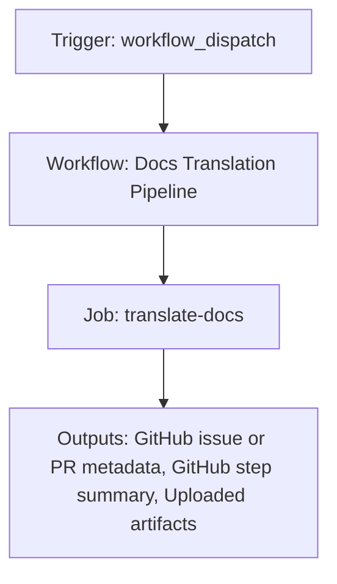

{/*
generated-file-banner: ai-tools-visual-library:v1
Generation Script: operations/scripts/generators/governance/catalogs/generate-ai-tools-visual-library.js
Purpose: AI-tools canonical visual library for workflows and dispatcher actions.
Run when: GitHub workflows, dispatcher definitions, registry coverage, or visual-library contracts change.
Run command: node operations/scripts/generators/governance/catalogs/generate-ai-tools-visual-library.js --write
*/}

<Note>
**Generation Script**: This file is generated from script(s): `operations/scripts/generators/governance/catalogs/generate-ai-tools-visual-library.js`.  
**Purpose**: AI-tools canonical visual library for workflows and dispatcher actions.  
**Run when**: GitHub workflows, dispatcher definitions, registry coverage, or visual-library contracts change.  
**Important**: Do not manually edit this file; run `node operations/scripts/generators/governance/catalogs/generate-ai-tools-visual-library.js --write`.  
</Note>

# Docs Translation Pipeline

## Summary

Docs Translation Pipeline runs on workflow_dispatch and primarily produces github issue or pr metadata.

## Why It Exists

Govern the `.github/workflows/translate-docs.yml` workflow as a human-readable, visually explorable source-of-truth page inside `ai-tools/registry/workflows`.

## Triggers

- workflow_dispatch: configured in workflow file

## Jobs

| Job ID | Name | Runs On | Needs | Step Count |
| --- | --- | --- | --- | --- |
| `translate-docs` | translate-docs | `ubuntu-latest` | none | 17 |

### translate-docs

- `Checkout repository` | uses actions/checkout@v4
- `Fetch base ref (changed_since_ref mode)` | runs `git fetch --no-tags --depth=1 origin ${{ github.event.inputs.base_ref }}`
- `Setup Node.js` | uses actions/setup-node@v4
- `Install tools dependencies` | runs `npm install`
- `Run i18n unit tests (pipeline integrity)` | runs `npm run test:i18n`
- `Prepare artifact directory` | runs `mkdir -p "$I18N_ARTIFACT_DIR"`
- `Preflight provider safety (non-dry runs)` | runs `node - <<'NODE'`
- `Run translation generation` | runs `set -euo pipefail`
- `Update docs.json localized language nodes` | runs `set -euo pipefail`
- `Regenerate docs-index.json` | runs `node operations/scripts/generators/content/catalogs/generate-docs-index.js --write`
- `Validate generated localized MDX` | runs `set -euo pipefail`
- `Validate docs.json navigation` | runs `node operations/tests/unit/docs-navigation.test.js`
- `Detect generated changes` | runs `if git diff --quiet -- docs.json docs-index.json v2/es v2/fr v2/cn; then`
- `Build workflow summary` | runs `node - <<'NODE'`
- `Upload i18n artifacts` | uses actions/upload-artifact@v4
- `Create PR with generated translations` | uses peter-evans/create-pull-request@v7
- `No generated diff summary` | runs `echo "No docs.json/docs-index/v2 localized changes detected after translation run."`

## Inputs

- workflow_dispatch:base_ref (required)
- workflow_dispatch:create_pr (required)
- workflow_dispatch:dry_run (required)
- workflow_dispatch:force_retranslate (required)
- workflow_dispatch:languages (required)
- workflow_dispatch:max_pages (required)
- workflow_dispatch:paths_file (optional)
- workflow_dispatch:prefixes (optional)
- workflow_dispatch:scope_mode (required)
- workflow_dispatch:target_branch (required)

## Second Pass Assessment

- Workflow family: `content-publication`
- Usage status: `active-mutating`
- Cleanup decision: `needs-investigation`
- Process fit: `legacy-or-unclear`
- Consolidation target: `dispatcher:page-ship`
- Recommended engineering action: Trace actual runtime use, owner, and downstream dependencies before deciding whether to keep, merge, or retire it. Current nearest dispatcher: `page-ship`.

## Outputs

- GitHub issue or PR metadata
- GitHub step summary
- Uploaded artifacts

## Dependencies

- action:actions/checkout@v4
- action:actions/setup-node@v4
- action:actions/upload-artifact@v4
- action:peter-evans/create-pull-request@v7
- operations/scripts/integrators/content/language-translation/config.json
- operations/scripts/integrators/content/language-translation/generate-localized-docs-json.js
- operations/scripts/integrators/content/language-translation/translate-docs.js
- operations/scripts/integrators/content/language-translation/validate-generated.js
- operations/scripts/generators/content/catalogs/generate-docs-index.js
- operations/tests/unit/docs-navigation.test.js
- secret:OPENROUTER_API_KEY
- v2/cn
- v2/es
- v2/fr

## Dependants

- dispatcher:page-ship

## Mermaid Pipeline

## Frailty And Risk

- Depends on secrets, so runtime behavior cannot be fully reasoned about from repo state alone.

## Consolidation Notes

Dispatcher suggestion: `page-ship`. Second-pass target: `dispatcher:page-ship`. This is a governance recommendation, not an automatic rewrite instruction.

## Cleanup Rationale

- Current repo evidence is not strong enough to justify either deletion or consolidation without tracing real usage first.
- This workflow writes back to the repository, so its blast radius is higher than a read-only validation workflow.

## Handover Notes

Use this page as the human-facing workflow brief during audits, cleanup, and handover. Promote any missing operational knowledge back into the canonical page rather than leaving it in chat.
