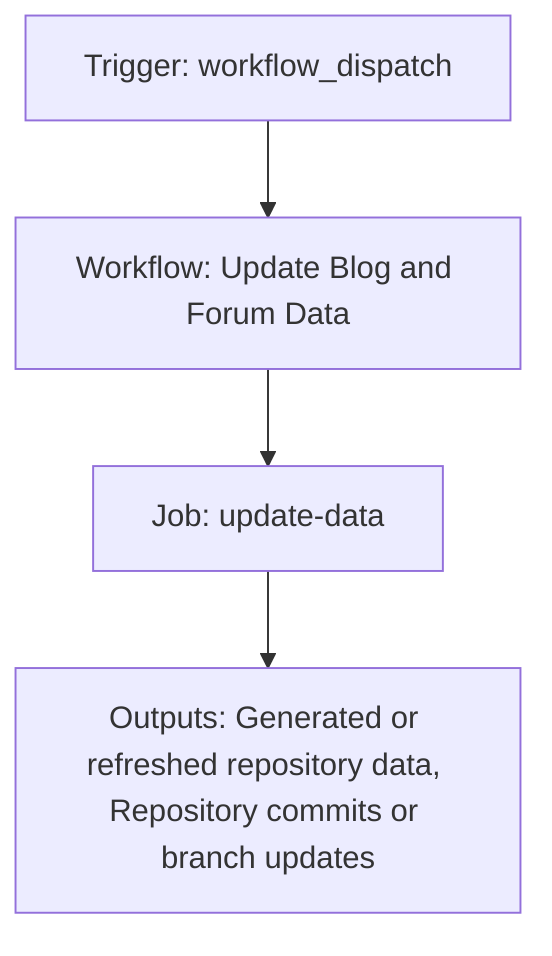

{/*
generated-file-banner: ai-tools-visual-library:v1
Generation Script: operations/scripts/generators/governance/catalogs/generate-ai-tools-visual-library.js
Purpose: AI-tools canonical visual library for workflows and dispatcher actions.
Run when: GitHub workflows, dispatcher definitions, registry coverage, or visual-library contracts change.
Run command: node operations/scripts/generators/governance/catalogs/generate-ai-tools-visual-library.js --write
*/}

<Note>
**Generation Script**: This file is generated from script(s): `operations/scripts/generators/governance/catalogs/generate-ai-tools-visual-library.js`.  
**Purpose**: AI-tools canonical visual library for workflows and dispatcher actions.  
**Run when**: GitHub workflows, dispatcher definitions, registry coverage, or visual-library contracts change.  
**Important**: Do not manually edit this file; run `node operations/scripts/generators/governance/catalogs/generate-ai-tools-visual-library.js --write`.  
</Note>

# Update Blog and Forum Data

## Summary

Update Blog and Forum Data runs on workflow_dispatch and primarily produces generated or refreshed repository data.

## Why It Exists

Govern the `.github/workflows/update-blog-data.yml` workflow as a human-readable, visually explorable source-of-truth page inside `ai-tools/registry/workflows`.

## Triggers

- workflow_dispatch: default event configuration

## Jobs

| Job ID | Name | Runs On | Needs | Step Count |
| --- | --- | --- | --- | --- |
| `update-data` | update-data | `ubuntu-latest` | none | 8 |

### update-data

- `Checkout repository` | uses actions/checkout@v4
- `Fetch Ghost blog data` | runs `curl -f -o ghost-data.json "https://livepeer.org/ghost/api/content/posts/?key=YOUR_CONTENT_API_KEY&limit=all&include=...`
- `Fetch Forum data` | runs `curl -f -o forum-data.json "https://forum.livepeer.org/latest.json" || echo "[]" > forum-data.json`
- `Update Ghost data file` | runs `echo "export const ghostData = " > snippets/automations/blog/ghostBlogData.jsx`
- `Update Forum data file` | runs `echo "export const forumData = " > snippets/automations/forum/forumData.jsx`
- `Check for changes` | runs `git diff --exit-code snippets/automations/ || echo "changed=true" >> $GITHUB_OUTPUT`
- `Commit and push if changed` | runs `git config --global user.name 'github-actions[bot]'`
- `Cleanup` | runs `rm -f ghost-data.json forum-data.json`

## Inputs

- No explicit workflow inputs declared.

## Second Pass Assessment

- Workflow family: `data-refresh`
- Usage status: `active-advisory`
- Cleanup decision: `consolidate`
- Process fit: `core-shipping`
- Consolidation target: `future:data-refresh-dispatcher`
- Recommended engineering action: Consolidate this workflow under `future:data-refresh-dispatcher` and keep the script or validator layer as the reusable implementation boundary.

## Outputs

- Generated or refreshed repository data
- Repository commits or branch updates

## Dependencies

- action:actions/checkout@v4
- secret:GITHUB_TOKEN
- snippets/automations/
- snippets/automations/blog/ghostBlogData.jsx
- snippets/automations/forum/forumData.jsx

## Dependants

- dispatcher:page-ship

## Mermaid Pipeline

## Frailty And Risk

- Contains advisory steps with `continue-on-error`, so failures may be softened rather than fully blocking.
- Mutates repository state from CI, which raises coordination and safety risk.
- Depends on secrets, so runtime behavior cannot be fully reasoned about from repo state alone.

## Consolidation Notes

Dispatcher suggestion: `page-ship`. Second-pass target: `future:data-refresh-dispatcher`. This is a governance recommendation, not an automatic rewrite instruction.

## Cleanup Rationale

- This belongs to a repeating data-refresh pattern and should not stay as an uncoordinated top-level workflow forever.
- This workflow is advisory-shaped, which is useful for audits but can also hide unresolved failures.

## Handover Notes

Use this page as the human-facing workflow brief during audits, cleanup, and handover. Promote any missing operational knowledge back into the canonical page rather than leaving it in chat.
